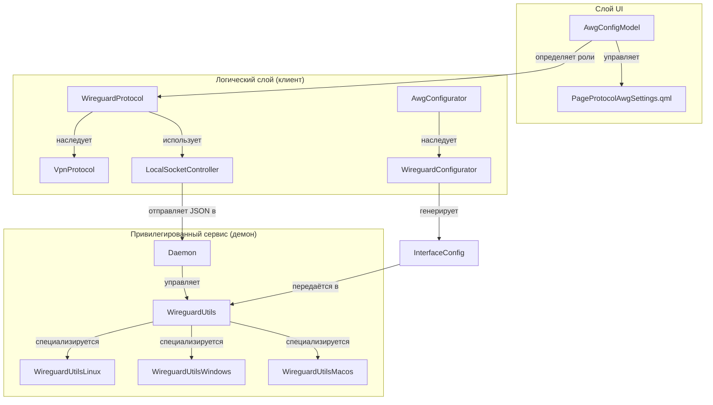
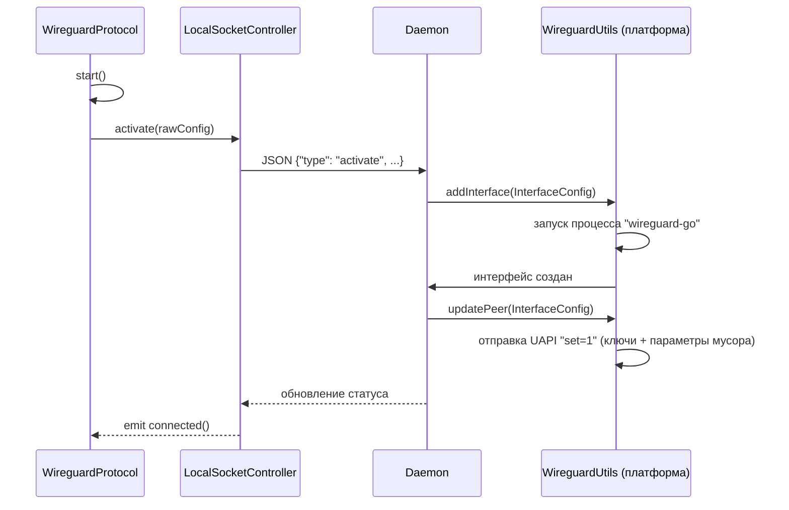

# AmneziaWG (AWG) и WireGuard

Соответствующие исходные файлы

Следующие файлы были использованы в качестве контекста для создания этой wiki-страницы:

- [client/configurators/awg_configurator.cpp](client/configurators/awg_configurator.cpp)
- [client/configurators/awg_configurator.h](client/configurators/awg_configurator.h)
- [client/configurators/openvpn_configurator.cpp](client/configurators/openvpn_configurator.cpp)
- [client/configurators/openvpn_configurator.h](client/configurators/openvpn_configurator.h)
- [client/configurators/wireguard_configurator.cpp](client/configurators/wireguard_configurator.cpp)
- [client/configurators/wireguard_configurator.h](client/configurators/wireguard_configurator.h)
- [client/core/controllers/vpnConfigurationController.cpp](client/core/controllers/vpnConfigurationController.cpp)
- [client/core/controllers/vpnConfigurationController.h](client/core/controllers/vpnConfigurationController.h)
- [client/daemon/daemon.cpp](client/daemon/daemon.cpp)
- [client/daemon/interfaceconfig.cpp](client/daemon/interfaceconfig.cpp)
- [client/daemon/interfaceconfig.h](client/daemon/interfaceconfig.h)
- [client/mozilla/localsocketcontroller.cpp](client/mozilla/localsocketcontroller.cpp)
- [client/platforms/linux/daemon/wireguardutilslinux.cpp](client/platforms/linux/daemon/wireguardutilslinux.cpp)
- [client/platforms/macos/daemon/wireguardutilsmacos.cpp](client/platforms/macos/daemon/wireguardutilsmacos.cpp)
- [client/platforms/windows/daemon/wireguardutilswindows.cpp](client/platforms/windows/daemon/wireguardutilswindows.cpp)
- [client/protocols/wireguardprotocol.cpp](client/protocols/wireguardprotocol.cpp)
- [client/protocols/wireguardprotocol.h](client/protocols/wireguardprotocol.h)
- [client/server_scripts/awg/configure_container.sh](client/server_scripts/awg/configure_container.sh)
- [client/ui/models/protocols/awgConfigModel.cpp](client/ui/models/protocols/awgConfigModel.cpp)
- [client/ui/models/protocols/awgConfigModel.h](client/ui/models/protocols/awgConfigModel.h)
- [client/ui/models/protocols/wireguardConfigModel.cpp](client/ui/models/protocols/wireguardConfigModel.cpp)
- [client/ui/models/protocols/wireguardConfigModel.h](client/ui/models/protocols/wireguardConfigModel.h)
- [client/ui/qml/Pages2/PageProtocolAwgClientSettings.qml](client/ui/qml/Pages2/PageProtocolAwgClientSettings.qml)
- [client/ui/qml/Pages2/PageProtocolAwgSettings.qml](client/ui/qml/Pages2/PageProtocolAwgSettings.qml)
- [client/ui/qml/Pages2/PageProtocolWireGuardClientSettings.qml](client/ui/qml/Pages2/PageProtocolWireGuardClientSettings.qml)
- [client/ui/qml/Pages2/PageProtocolWireGuardSettings.qml](client/ui/qml/Pages2/PageProtocolWireGuardSettings.qml)
- [client/ui/qml/Pages2/PageProtocolXraySettings.qml](client/ui/qml/Pages2/PageProtocolXraySettings.qml)
- [ipc/ipc.h](ipc/ipc.h)
- [ipc/ipcserverprocess.cpp](ipc/ipcserverprocess.cpp)
- [ipc/ipcserverprocess.h](ipc/ipcserverprocess.h)

На этой странице описана реализация протоколов WireGuard и AmneziaWG (AWG) в FBLink VPN. Рассматриваются параметры обфускации, различия между версиями AWG и AWG2, а также кроссплатформенная реализация с использованием архитектуры привилегированного демона.

## Обзор протокола

FBLink VPN поддерживает стандартный WireGuard и его обфусцированный вариант — AmneziaWG. AWG разработан для противодействия глубокой инспекции пакетов (DPI) путём модификации заголовков пакетов и внедрения мусорных данных в процесс рукопожатия.

### Параметры обфускации
Реализация AWG использует несколько параметров для изменения отпечатка протокола:

| Параметр | Описание | Ключ в коде |
| :--- | :--- | :--- |
| **Jc** | Количество мусорных пакетов | `junkPacketCount` |
| **Jmin** | Минимальный размер мусорного пакета | `junkPacketMinSize` |
| **Jmax** | Максимальный размер мусорного пакета | `junkPacketMaxSize` |
| **S1** | Размер мусора в init-пакете | `initPacketJunkSize` |
| **S2** | Размер мусора в ответном пакете | `serverResponsePacketJunkSize` |
| **H1-H4** | Магические заголовки для пакетов Init, Response, Underload и Transport | `initPacketMagicHeader` и др. |

Источники: `[client/configurators/awg_configurator.cpp:34-42]()`, `[client/ui/qml/Pages2/PageProtocolAwgSettings.qml:133-213]()`

### AWG vs AWG2
Кодовая база различает оригинальный AmneziaWG и более новую версию, называемую AWG2. AWG2 вводит дополнительные параметры для пакетов cookie reply и transport:
*   **S3**: Размер мусора в пакете cookie reply (`cookieReplyPacketJunkSize`).
*   **S4**: Размер мусора в транспортном пакете (`transportPacketJunkSize`).

Источники: `[client/configurators/awg_configurator.cpp:44-47]()`, `[client/ui/models/protocols/awgConfigModel.cpp:43-48]()`

## Архитектура и поток данных

Реализация WireGuard следует архитектуре с разделением клиент-сервис. UI взаимодействует с объектом `WireguardProtocol`, который, в свою очередь, общается с платформенно-специфичным привилегированным демоном через локальный сокет.

### Сопоставление системных сущностей

Следующая диаграмма связывает высокоуровневые концепции протокола с конкретными классами и файлами C++, реализующими их.

**Диаграмма: Сопоставление реализации протокола**

Источники: `[client/protocols/wireguardprotocol.h:12-15]()`, `[client/configurators/awg_configurator.h:7-10]()`, `[client/daemon/daemon.h:29-35]()`, `[client/mozilla/localsocketcontroller.h:40-45]()`

### Жизненный цикл подключения

Когда пользователь инициирует подключение, класс `WireguardProtocol` запускает `LocalSocketController` для отправки команды `activate` демону.

**Диаграмма: Последовательность подключения**

Источники: `[client/protocols/wireguardprotocol.cpp:59-69]()`, `[client/mozilla/localsocketcontroller.cpp:122-143]()`, `[client/daemon/daemon.cpp:131-173]()`, `[client/platforms/linux/daemon/wireguardutilslinux.cpp:61-141]()`

## Конфигурация и провизионирование

### Конфигураторы
Классы `WireguardConfigurator` и `AwgConfigurator` отвечают за генерацию конфигураций и управление ключами.
*   **Генерация ключей**: Использует OpenSSL (`EVP_PKEY_X25519`) для генерации ключей Ed25519 для клиента.
*   **Взаимодействие с сервером**: Использует `ServerController` для загрузки конфигураций пиров на удалённый сервер и синхронизации интерфейса `wg0` или `awg0` с помощью `syncconf`.

Источники: `[client/configurators/wireguard_configurator.cpp:40-69]()`, `[client/configurators/wireguard_configurator.cpp:161-182]()`

### Платформенно-специфичные утилиты
Каждая платформа реализует подкласс `WireguardUtils` для обработки низкоуровневого создания туннеля:

*   **Linux**: Запускает `wireguard-go` с флагом `-f amn0` для поддержки AWG и настраивает интерфейс через UAPI-команды, записываемые в сокет.
*   **Windows**: Использует `WindowsTunnelService` для управления процессом `wireguard-go` и `WindowsFirewall` для реализации Kill Switch.
*   **macOS**: Использует интерфейсы `utun` и `MacosRouteMonitor` для управления таблицами маршрутизации.

Источники: `[client/platforms/linux/daemon/wireguardutilslinux.cpp:82-84]()`, `[client/platforms/windows/daemon/wireguardutilswindows.cpp:166-172]()`, `[client/platforms/macos/daemon/wireguardutilsmacos.cpp:81-83]()`

## Развёртывание на стороне сервера
Настройка серверной стороны управляется через скрипты контейнеров. Скрипт `configure_container.sh` для AWG обрабатывает установку модуля ядра `amneziawg` или Go-реализации внутри Docker-контейнера, обеспечивая корректное применение магических заголовков и параметров мусора к интерфейсу сервера.

Источники: `[client/server_scripts/awg/configure_container.sh:1-20]()`, `[client/configurators/wireguard_configurator.cpp:175-180]()`

---
