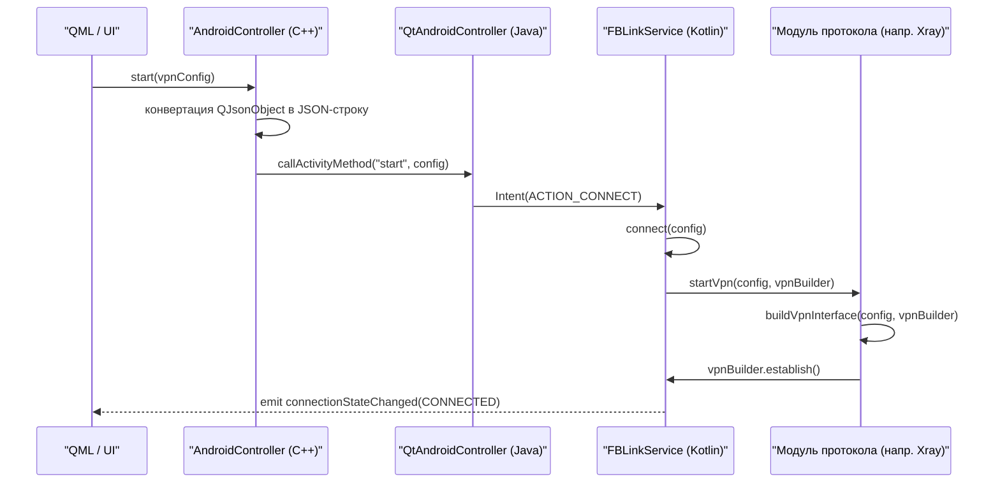

# Платформа Android

<details>
<summary>Соответствующие исходные файлы</summary>

Следующие файлы были использованы в качестве контекста для создания этой wiki-страницы:

- [.claude/settings.local.json](.claude/settings.local.json)
- [client/android/AndroidManifest.xml](client/android/AndroidManifest.xml)
- [client/android/awg/src/main/kotlin/Awg.kt](client/android/awg/src/main/kotlin/Awg.kt)
- [client/android/build.gradle.kts](client/android/build.gradle.kts)
- [client/android/cloak/src/main/kotlin/Cloak.kt](client/android/cloak/src/main/kotlin/Cloak.kt)
- [client/android/gradle/libs.versions.toml](client/android/gradle/libs.versions.toml)
- [client/android/gradle/plugins/build.gradle.kts](client/android/gradle/plugins/build.gradle.kts)
- [client/android/gradle/plugins/src/main/kotlin/PropertyDelegate.kt](client/android/gradle/plugins/src/main/kotlin/PropertyDelegate.kt)
- [client/android/protocolApi/build.gradle.kts](client/android/protocolApi/build.gradle.kts)
- [client/android/protocolApi/src/main/kotlin/Exceptions.kt](client/android/protocolApi/src/main/kotlin/Exceptions.kt)
- [client/android/protocolApi/src/main/kotlin/Protocol.kt](client/android/protocolApi/src/main/kotlin/Protocol.kt)
- [client/android/protocolApi/src/main/kotlin/ProtocolConfig.kt](client/android/protocolApi/src/main/kotlin/ProtocolConfig.kt)
- [client/android/protocolApi/src/main/kotlin/ProtocolState.kt](client/android/protocolApi/src/main/kotlin/ProtocolState.kt)
- [client/android/protocolApi/src/main/kotlin/Status.kt](client/android/protocolApi/src/main/kotlin/Status.kt)
- [client/android/res/values/libs.xml](client/android/res/values/libs.xml)
- [client/android/settings.gradle.kts](client/android/settings.gradle.kts)
- [client/android/src/com/fblink/vpn/AppListProvider.kt](client/android/src/com/fblink/vpn/AppListProvider.kt)
- [client/android/src/com/fblink/vpn/FBLinkService.kt](client/android/src/com/fblink/vpn/FBLinkService.kt)
- [client/android/src/com/fblink/vpn/IpcMessenger.kt](client/android/src/com/fblink/vpn/IpcMessenger.kt)
- [client/android/utils/src/main/kotlin/net/InetEndpoint.kt](client/android/utils/src/main/kotlin/net/InetEndpoint.kt)
- [client/android/utils/src/main/kotlin/net/InetNetwork.kt](client/android/utils/src/main/kotlin/net/InetNetwork.kt)
- [client/android/utils/src/main/kotlin/net/IpAddress.kt](client/android/utils/src/main/kotlin/net/IpAddress.kt)
- [client/android/utils/src/main/kotlin/net/IpRange.kt](client/android/utils/src/main/kotlin/net/IpRange.kt)
- [client/android/utils/src/main/kotlin/net/IpRangeSet.kt](client/android/utils/src/main/kotlin/net/IpRangeSet.kt)
- [client/android/utils/src/main/kotlin/net/NetworkUtils.kt](client/android/utils/src/main/kotlin/net/NetworkUtils.kt)
- [client/android/xray/src/main/kotlin/Xray.kt](client/android/xray/src/main/kotlin/Xray.kt)
- [client/platforms/android/android_controller.cpp](client/platforms/android/android_controller.cpp)
- [client/platforms/android/android_controller.h](client/platforms/android/android_controller.h)
- [client/protocols/android_vpnprotocol.cpp](client/protocols/android_vpnprotocol.cpp)
- [client/protocols/android_vpnprotocol.h](client/protocols/android_vpnprotocol.h)
- [client/ui/qml/Controls2/ListViewWithRadioButtonType.qml](client/ui/qml/Controls2/ListViewWithRadioButtonType.qml)
- [client/ui/qml/Controls2/PageType.qml](client/ui/qml/Controls2/PageType.qml)
- [client/ui/qml/Pages2/PageFBLinkLogin.qml](client/ui/qml/Pages2/PageFBLinkLogin.qml)
- [client/ui/qml/Pages2/PageFBLinkRegister.qml](client/ui/qml/Pages2/PageFBLinkRegister.qml)
- [service/src/qtservice.h](service/src/qtservice.h)

</details>


Реализация FBLink VPN для Android использует нативный фреймворк `VpnService` для управления сетевым туннелированием. Архитектура разделена на C++-слой (Qt/QML) для UI и высокоуровневой логики и Kotlin-сервисный слой для выполнения протоколов и интеграции с платформой.

## Обзор архитектуры

Архитектура Android-платформы следует паттерну «мост», где `AndroidController` (C++) взаимодействует через JNI с `QtAndroidController` (Java/Kotlin), который, в свою очередь, управляет `FBLinkService`.

### Системные компоненты

*   **FBLinkService**: Подкласс `android.net.VpnService`. Управляет жизненным циклом VPN-подключения, уведомлениями фонового сервиса и статистикой трафика [client/android/src/com/fblink/vpn/FBLinkService.kt:80-81]().
*   **AndroidController**: C++-синглтон, обеспечивающий мост между Qt-приложением и Android-специфичной функциональностью [client/platforms/android/android_controller.h:11-17]().
*   **Модули протоколов**: Специализированные Kotlin-модули (`awg`, `xray`, `openvpn`, `cloak`), реализующие логику туннелирования [client/android/build.gradle.kts:128-133]().
*   **ProtocolApi**: Общий интерфейс, определяющий взаимодействие протоколов с `VpnService.Builder` [client/android/protocolApi/src/main/kotlin/Protocol.kt:23-24]().

### Поток данных: Последовательность подключения

Следующая диаграмма иллюстрирует поток от пользовательского взаимодействия в UI до установки TUN-интерфейса.

**Поток установки подключения**

*Источники: [client/platforms/android/android_controller.cpp:135-143](), [client/android/src/com/fblink/vpn/FBLinkService.kt:164-166](), [client/android/protocolApi/src/main/kotlin/Protocol.kt:41-42]()*

---

## FBLinkService (VpnService)

`FBLinkService` — основной фоновый компонент. Он обрабатывает жизненный цикл `VpnService` и взаимодействует с UI-процессом через `IpcMessenger` [client/android/src/com/fblink/vpn/FBLinkService.kt:116-117]().

### Ключевые обязанности
1.  **Управление жизненным циклом**: Реагирует на интенты `ACTION_CONNECT` и `ACTION_DISCONNECT` [client/android/src/com/fblink/vpn/FBLinkService.kt:62-63]().
2.  **Отслеживание состояния**: Поддерживает `MutableStateFlow<ProtocolState>` для отслеживания переходов между `CONNECTING`, `CONNECTED` и `DISCONNECTED` [client/android/src/com/fblink/vpn/FBLinkService.kt:86]().
3.  **Фоновый сервис**: Обеспечивает активность VPN путём перевода себя в фоновый сервис переднего плана с `FOREGROUND_SERVICE_TYPE_MANIFEST` [client/android/src/com/fblink/vpn/FBLinkService.kt:10-11]().
4.  **Статистика**: Периодически обновляет счётчики байтов RX/TX через `TrafficStats` [client/android/src/com/fblink/vpn/FBLinkService.kt:111]().

*Источники: [client/android/src/com/fblink/vpn/FBLinkService.kt:1-120]()*

---

## AndroidController и мост JNI

`AndroidController` обеспечивает коммуникацию между средой Qt/C++ и Android OS. Он регистрирует нативные методы, которые Java-сторона вызывает для сообщения об изменениях состояния.

### Регистрация нативных методов
Контроллер инициализирует среду JNI и связывает Java-обратные вызовы с C++-функциями:
*   `onStatus`: Обновляет C++-состояние подключения [client/platforms/android/android_controller.cpp:92]().
*   `onVpnStateChanged`: Синхронизирует `Vpn::ConnectionState` [client/platforms/android/android_controller.cpp:97]().
*   `onStatisticsUpdate`: Передаёт данные трафика в UI [client/platforms/android/android_controller.cpp:98]().

### Диаграмма JNI-сопоставления
```mermaid
classDiagram
    class "AndroidController (C++)" {
        +start(QJsonObject)
        +stop()
        +onStatus(int)
        +onStatisticsUpdate(long, long)
    }
    class "QtAndroidController (Java)" {
        +start(String)
        +stop()
        +native onStatus(int)
        +native onStatisticsUpdate(long, long)
    }
    "AndroidController (C++)" --|> "QtAndroidController (Java)" : JNI CallActivityMethod
    "QtAndroidController (Java)" --|> "AndroidController (C++)" : JNI Native Callback
```
*Источники: [client/platforms/android/android_controller.cpp:87-116](), [client/platforms/android/android_controller.h:95-108]()*

---

## Модули протоколов и API

Все VPN-протоколы (AWG, Xray и др.) должны наследовать базовый класс `Protocol`, определённый в модуле `protocolApi`.

### Интерфейс Protocol
Класс `Protocol` определяет контракт для запуска и остановки туннелей:
*   `startVpn(config, vpnBuilder, protect)`: Настраивает `VpnService.Builder` и запускает нижележащий бинарник или библиотеку [client/android/protocolApi/src/main/kotlin/Protocol.kt:41]().
*   `buildVpnInterface(config, vpnBuilder)`: Применяет DNS, IP-адреса, MTU и правила маршрутизации к Android TUN-интерфейсу [client/android/protocolApi/src/main/kotlin/Protocol.kt:86-157]().

### Реализации протоколов

| Протокол | Класс реализации | Ключевая логика |
| :--- | :--- | :--- |
| **AmneziaWG** | `Awg` | Наследует `Wireguard` и добавляет параметры обфускации (`Jc`, `Jmin`, `Jmax` и др.) [client/android/awg/src/main/kotlin/Awg.kt:7-21](). |
| **Xray** | `Xray` | Интегрирует `libXray` через Go-mobile, управляет мостом `tun2socks` и обрабатывает конфигурации VLESS/REALITY [client/android/xray/src/main/kotlin/Xray.kt:27-147](). |
| **Cloak** | `Cloak` | Реализует слой обфускации Cloak [client/android/build.gradle.kts:132](). |

*Источники: [client/android/protocolApi/src/main/kotlin/Protocol.kt:23-157](), [client/android/xray/src/main/kotlin/Xray.kt:1-150](), [client/android/awg/src/main/kotlin/Awg.kt:1-21]()*

---

## Логика раздельного туннелирования

Раздельное туннелирование на Android реализовано на уровне `ProtocolConfig`, поддерживая фильтрацию как по приложениям, так и по IP-адресам.

1.  **Раздельное туннелирование по приложениям**: Использует `vpnBuilder.addAllowedApplication()` или `addDisallowedApplication()` [client/android/protocolApi/src/main/kotlin/Protocol.kt:125-133]().
2.  **Раздельное туннелирование по сайтам**: 
    *   На Android 13+ (Tiramisu) используется `vpnBuilder.excludeRoute()` [client/android/protocolApi/src/main/kotlin/Protocol.kt:116-118]().
    *   На более старых версиях вручную рассчитываются подсети для включения/исключения через `IpRangeSet` [client/android/protocolApi/src/main/kotlin/ProtocolConfig.kt:148-158]().

*Источники: [client/android/protocolApi/src/main/kotlin/Protocol.kt:47-84](), [client/android/protocolApi/src/main/kotlin/ProtocolConfig.kt:116-167]()*

---

## Структура сборки и манифест

Сборка Android использует Gradle с Kotlin DSL и интегрирована в систему сборки Qt.

### Модули Gradle
Проект разделён на несколько подпроектов для поддержания чётких границ:
*   `:qt`: Содержит специфичные для Qt точки входа Android.
*   `:protocolApi`: Общие интерфейсы для всех VPN-протоколов.
*   `:utils`: Общие сетевые утилиты и утилиты логирования.
*   `:awg`, `:xray`, `:openvpn`, `:cloak`: Специфичные для протоколов реализации.

### AndroidManifest.xml
Ключевые конфигурации в манифесте:
*   **Разрешения**: `INTERNET`, `FOREGROUND_SERVICE` и `QUERY_ALL_PACKAGES` (для раздельного туннелирования по приложениям) [client/android/AndroidManifest.xml:21-29]().
*   **Сервисы**: `AwgService`, `XrayService` и др., каждый работает в собственном процессе для обеспечения стабильности [client/android/AndroidManifest.xml:156-158]().
*   **Intent-фильтры**: Поддержка импорта конфигураций через ссылки `vpn://` и файлы `.conf`/`.vpn` [client/android/AndroidManifest.xml:119-153]().

*Источники: [client/android/build.gradle.kts:125-143](), [client/android/settings.gradle.kts:32-40](), [client/android/AndroidManifest.xml:1-160]()*

---
