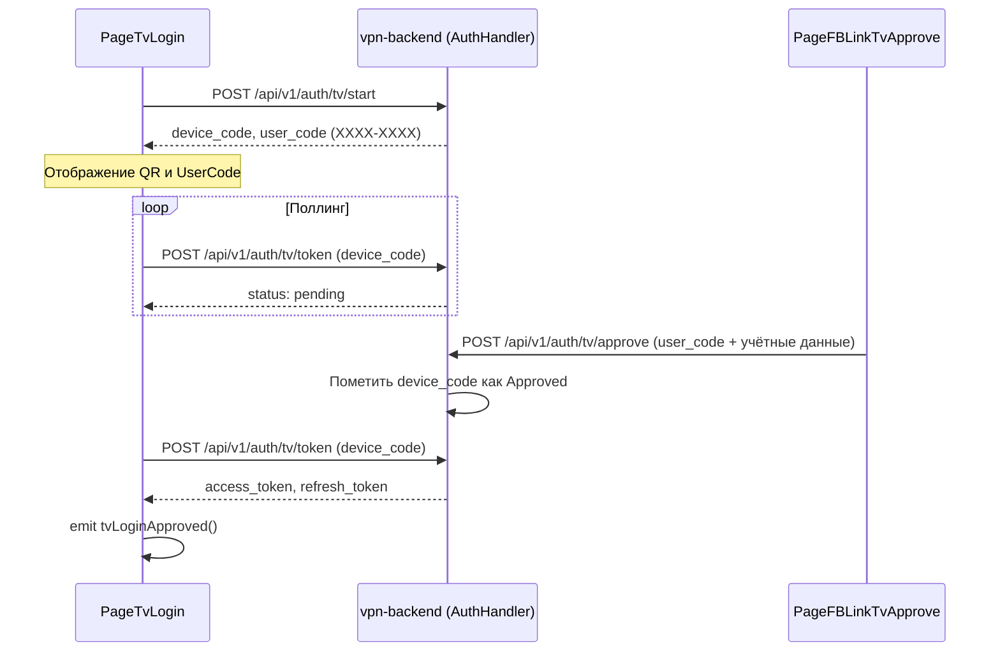
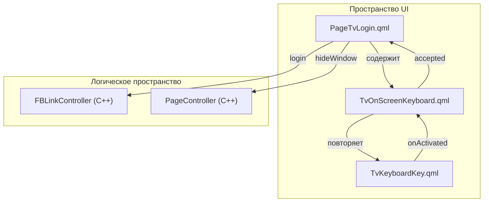

# Интерфейс Android TV

Соответствующие исходные файлы

Следующие файлы были использованы в качестве контекста для создания этой wiki-страницы:

- [client/android/src/com/fblink/vpn/FBLinkActivity.kt](client/android/src/com/fblink/vpn/FBLinkActivity.kt)
- [client/android/utils/src/main/kotlin/LibraryLoader.kt](client/android/utils/src/main/kotlin/LibraryLoader.kt)
- [client/resources.qrc](client/resources.qrc)
- [client/ui/controllers/pageController.cpp](client/ui/controllers/pageController.cpp)
- [client/ui/controllers/pageController.h](client/ui/controllers/pageController.h)
- [client/ui/pages.h](client/ui/pages.h)
- [client/ui/qml/Components/TvButton.qml](client/ui/qml/Components/TvButton.qml)
- [client/ui/qml/Components/TvKeyboardKey.qml](client/ui/qml/Components/TvKeyboardKey.qml)
- [client/ui/qml/Components/TvLoginRow.qml](client/ui/qml/Components/TvLoginRow.qml)
- [client/ui/qml/Components/TvOnScreenKeyboard.qml](client/ui/qml/Components/TvOnScreenKeyboard.qml)
- [client/ui/qml/Pages2/PageFBLinkTvApprove.qml](client/ui/qml/Pages2/PageFBLinkTvApprove.qml)
- [client/ui/qml/Pages2/PageFBLinkTvScan.qml](client/ui/qml/Pages2/PageFBLinkTvScan.qml)
- [client/ui/qml/Pages2/PageSettings.qml](client/ui/qml/Pages2/PageSettings.qml)
- [client/ui/qml/Pages2/PageTvHome.qml](client/ui/qml/Pages2/PageTvHome.qml)
- [client/ui/qml/Pages2/PageTvLogin.qml](client/ui/qml/Pages2/PageTvLogin.qml)
- [client/ui/qml/Pages2/PageTvRoot.qml](client/ui/qml/Pages2/PageTvRoot.qml)
- [client/ui/qml/Pages2/PageTvServers.qml](client/ui/qml/Pages2/PageTvServers.qml)
- [client/ui/qml/Pages2/PageTvSubscription.qml](client/ui/qml/Pages2/PageTvSubscription.qml)
- [service/server/killswitch.cpp](service/server/killswitch.cpp)
- [vpn-backend/internal/handlers/auth.go](vpn-backend/internal/handlers/auth.go)

Интерфейс Android TV — специализированный UI-слой клиента FBLink VPN, предназначенный для работы на расстоянии от экрана. Он заменяет стандартную мобильную/десктопную навигацию архитектурой, удобной для D-pad, пользовательскими методами ввода и механизмом авторизации «Device Flow» (в стиле OAuth2) для исключения сложного текстового ввода с помощью пульта дистанционного управления.

## TV-навигация и корневая архитектура

TV UI управляется через `PageTvRoot.qml`, выступающий в качестве навигационного стека верхнего уровня. В отличие от стандартного потока `PageController`, используемого на мобильных устройствах, TV-интерфейс использует выделенный `StackView` для обработки переходов между экранами входа, главного экрана и выбора серверов.

### Навигационный поток
1. **Запуск**: `PageTvRoot` проверяет `FBLinkController.isLoggedIn` [client/ui/qml/Pages2/PageTvRoot.qml:27-27]().
2. **Состояние входа**: Если не авторизован — помещает в стек `PageTvLogin.qml`. Если авторизован — `PageTvHome.qml`.
3. **Глобальная обработка «Назад»**: `PageTvRoot` перехватывает `Qt.Key_Back` и `Qt.Key_Escape` для извлечения из стека или сворачивания приложения [client/ui/qml/Pages2/PageTvRoot.qml:96-105]().

### Структура TV-навигации
| Компонент | Роль | Файл |
| :--- | :--- | :--- |
| `PageTvRoot` | Навигационный контейнер и наблюдатель за состоянием. | [client/ui/qml/Pages2/PageTvRoot.qml:16-16]() |
| `PageTvHome` | Главная панель (Подключение/Отключение, статус). | [client/ui/qml/Pages2/PageTvHome.qml:16-16]() |
| `PageTvServers` | Список серверов с прокруткой D-pad. | [client/ui/qml/Pages2/PageTvServers.qml:6-6]() |
| `PageTvLogin` | QR-код Device Flow и ручной вход как запасной вариант. | [client/ui/qml/Pages2/PageTvLogin.qml:21-21]() |

**Источники:** [client/ui/qml/Pages2/PageTvRoot.qml:1-108](), [client/ui/qml/Pages2/PageTvHome.qml:1-160](), [client/ui/qml/Pages2/PageTvServers.qml:1-132]()

## Авторизация Device Flow

Для избежания ввода паролей на TV FBLink реализует авторизацию Device Flow, при которой TV генерирует код, а пользователь подтверждает его на мобильном устройстве.

### Логика реализации
- **Инициализация**: При загрузке `PageTvLogin` вызывается `FBLinkController.startTvLogin()` [client/ui/qml/Pages2/PageTvLogin.qml:50-50]().
- **Коммуникация с бэкендом**: Обработчик бэкенда `TVStart` генерирует `DeviceCode` и `UserCode` (например, `XXXX-XXXX`) [vpn-backend/internal/handlers/auth.go:162-197]().
- **Поллинг**: Таймер `Timer` в `PageTvLogin` вызывает `FBLinkController.pollTvLogin()` каждые несколько секунд [client/ui/qml/Pages2/PageTvLogin.qml:139-147]().
- **Подтверждение**: Пользователь вводит код на мобильном устройстве через `PageFBLinkTvApprove.qml` [client/ui/qml/Pages2/PageFBLinkTvApprove.qml:158-166](), который вызывает эндпоинт бэкенда `TVApprove` [vpn-backend/internal/handlers/auth.go:200-243]().
- **Успех**: После подтверждения TV-клиент получает токен, и `PageTvRoot` реагирует на сигнал `tvLoginApproved` для перехода на главный экран [client/ui/qml/Pages2/PageTvRoot.qml:38-41]().

### Последовательность данных Device Flow

**Источники:** [vpn-backend/internal/handlers/auth.go:162-243](), [client/ui/qml/Pages2/PageTvLogin.qml:119-147](), [client/ui/qml/Pages2/PageFBLinkTvApprove.qml:14-20]()

## Пользовательский ввод: TvOnScreenKeyboard

Стандартные Android-редакторы ввода (IME) часто конфликтуют с управлением фокусом QML на TV. FBLink использует пользовательский компонент `TvOnScreenKeyboard` для надёжного набора текста с помощью D-pad.

### Ключевые особенности
- **Сетка**: 5-рядная сетка компонентов `TvKeyboardKey` [client/ui/qml/Components/TvOnScreenKeyboard.qml:145-175]().
- **Явная навигация**: Каждая клавиша использует `KeyNavigation` для точного определения перемещения фокуса (напр., `KeyNavigation.down: row1.itemAt(index)`) [client/ui/qml/Components/TvOnScreenKeyboard.qml:171-171]().
- **Раскладки**: Поддерживает английскую, русскую раскладки и символы через QtObject `layouts` [client/ui/qml/Components/TvOnScreenKeyboard.qml:59-91]().
- **Интеграция**: В `PageTvLogin` клавиатура загружается через `Loader` и привязывается к `emailValue` или `passwordValue` [client/ui/qml/Pages2/PageTvLogin.qml:53-63]().

### Связи сущностей клавиатуры

**Источники:** [client/ui/qml/Components/TvOnScreenKeyboard.qml:1-180](), [client/ui/qml/Pages2/PageTvLogin.qml:15-20]()

## D-Pad навигация (KeyNavigation)

TV-навигация опирается на явные цепочки фокуса с использованием прикреплённого свойства `KeyNavigation`.

- **PageTvHome**: Кнопка подключения, кнопка серверов и кнопки заголовка связаны так, чтобы фокус не мог быть потерян. `KeyNavigation.down` от заголовка ведёт к основным кнопкам действий [client/ui/qml/Pages2/PageTvHome.qml:132-132]().
- **PageTvServers**: Использует `ListView`, где `currentIndex` управляется через `Keys.onPressed`. Если пользователь нажимает «Вверх» в начале списка, фокус перемещается на кнопку «Назад» [client/ui/qml/Pages2/PageTvServers.qml:107-113]().
- **Визуальная обратная связь**: Кнопки типа `TvButton` и делегаты списка изменяют `border.color` или `opacity` при `activeFocus` равном true для индикации текущего выбора [client/ui/qml/Pages2/PageTvServers.qml:149-151]().

**Источники:** [client/ui/qml/Pages2/PageTvHome.qml:125-158](), [client/ui/qml/Pages2/PageTvServers.qml:91-121]()

---
