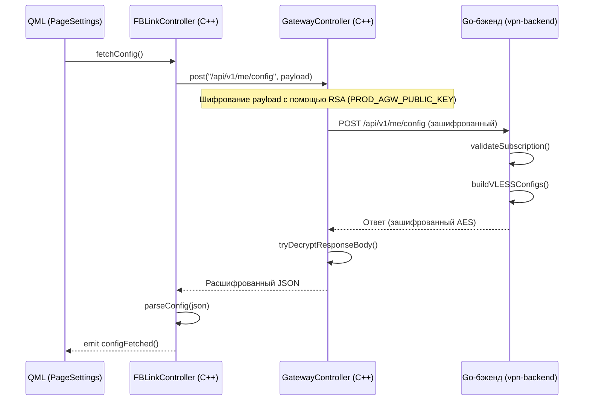
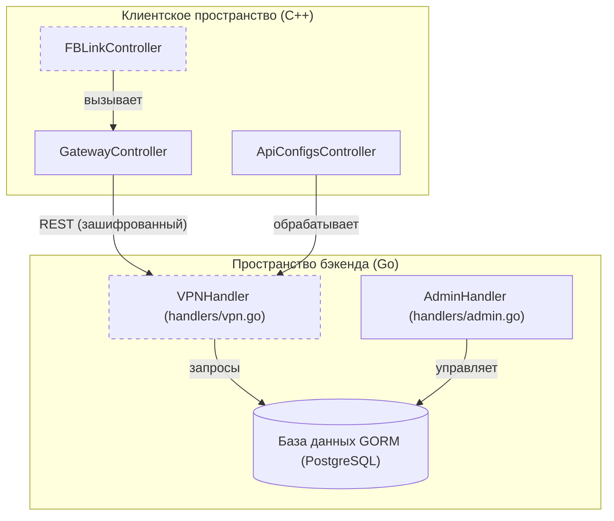

# Backend API и аутентификация

Соответствующие исходные файлы

Следующие файлы были использованы в качестве контекста для создания этой wiki-страницы:

- [client/core/api/apiDefs.h](client/core/api/apiDefs.h)
- [client/core/api/apiUtils.cpp](client/core/api/apiUtils.cpp)
- [client/core/api/apiUtils.h](client/core/api/apiUtils.h)
- [client/core/controllers/gatewayController.cpp](client/core/controllers/gatewayController.cpp)
- [client/resources.qrc](client/resources.qrc)
- [client/ui/controllers/api/apiConfigsController.cpp](client/ui/controllers/api/apiConfigsController.cpp)
- [client/ui/controllers/api/apiConfigsController.h](client/ui/controllers/api/apiConfigsController.h)
- [client/ui/controllers/api/apiSettingsController.cpp](client/ui/controllers/api/apiSettingsController.cpp)
- [client/ui/controllers/api/fblink_controller.cpp](client/ui/controllers/api/fblink_controller.cpp)
- [client/ui/controllers/api/fblink_controller.h](client/ui/controllers/api/fblink_controller.h)
- [client/ui/controllers/pageController.cpp](client/ui/controllers/pageController.cpp)
- [client/ui/controllers/pageController.h](client/ui/controllers/pageController.h)
- [client/ui/models/api/apiAccountInfoModel.cpp](client/ui/models/api/apiAccountInfoModel.cpp)
- [client/ui/models/api/apiAccountInfoModel.h](client/ui/models/api/apiAccountInfoModel.h)
- [client/ui/pages.h](client/ui/pages.h)
- [client/ui/qml/Components/TvKeyboardKey.qml](client/ui/qml/Components/TvKeyboardKey.qml)
- [client/ui/qml/Components/TvLoginRow.qml](client/ui/qml/Components/TvLoginRow.qml)
- [client/ui/qml/Components/TvOnScreenKeyboard.qml](client/ui/qml/Components/TvOnScreenKeyboard.qml)
- [client/ui/qml/Pages2/PageFBLinkTvApprove.qml](client/ui/qml/Pages2/PageFBLinkTvApprove.qml)
- [client/ui/qml/Pages2/PageFBLinkTvScan.qml](client/ui/qml/Pages2/PageFBLinkTvScan.qml)
- [client/ui/qml/Pages2/PageSettings.qml](client/ui/qml/Pages2/PageSettings.qml)
- [client/ui/qml/Pages2/PageSettingsApiAvailableCountries.qml](client/ui/qml/Pages2/PageSettingsApiAvailableCountries.qml)
- [client/ui/qml/Pages2/PageSettingsApiNativeConfigs.qml](client/ui/qml/Pages2/PageSettingsApiNativeConfigs.qml)
- [client/ui/qml/Pages2/PageSettingsApiServerInfo.qml](client/ui/qml/Pages2/PageSettingsApiServerInfo.qml)
- [client/ui/qml/Pages2/PageSettingsApiSupport.qml](client/ui/qml/Pages2/PageSettingsApiSupport.qml)
- [client/ui/qml/Pages2/PageSettingsKillSwitchExceptions.qml](client/ui/qml/Pages2/PageSettingsKillSwitchExceptions.qml)
- [vpn-backend/admin/index.html](vpn-backend/admin/index.html)
- [vpn-backend/internal/handlers/admin.go](vpn-backend/internal/handlers/admin.go)
- [vpn-backend/internal/handlers/auth.go](vpn-backend/internal/handlers/auth.go)
- [vpn-backend/internal/handlers/promo_codes.go](vpn-backend/internal/handlers/promo_codes.go)
- [vpn-backend/internal/handlers/vip_features.go](vpn-backend/internal/handlers/vip_features.go)
- [vpn-backend/internal/handlers/vpn.go](vpn-backend/internal/handlers/vpn.go)
- [vpn-backend/internal/handlers/xray_vip.go](vpn-backend/internal/handlers/xray_vip.go)
- [vpn-backend/internal/models/models.go](vpn-backend/internal/models/models.go)
- [vpn-backend/internal/router/router.go](vpn-backend/internal/router/router.go)

Бэкенд FBLink VPN — это REST-сервис на Go, управляющий жизненным циклом пользователей, подписками и оркестрацией VPN-узлов. Клиент взаимодействует с этим бэкендом преимущественно через классы `FBLinkController` и `GatewayController` для обработки аутентификации, синхронизации конфигураций и управления подписками.

## Аутентификация и жизненный цикл JWT

Аутентификация управляется через JSON Web Tokens (JWT). Клиентское приложение сохраняет `authToken` в локальном постоянном хранилище для поддержания сессий между перезапусками [client/ui/controllers/pageController.cpp:49-52]().

### Потоки аутентификации
1.  **Стандартный вход/регистрация**: Пользователи могут зарегистрироваться или войти, используя email и пароль. Регистрация требует код верификации, отправляемый по email [client/ui/controllers/api/fblink_controller.h:61-64]().
2.  **Device Flow для TV**: Для Android TV и аналогичных устройств реализован «Device Flow». Устройство генерирует `userCode` и `verificationUrl`, которые пользователь подтверждает на другом устройстве (напр., смартфоне) [client/ui/controllers/api/fblink_controller.cpp:57-59]().
3.  **Вход по токену**: Клиент может возобновить сессию или войти через прямой токен (напр., из deep-ссылки или magic-ссылки) [client/ui/controllers/api/fblink_controller.h:65-65]().

### Клиентское управление JWT
`FBLinkController` выступает основным менеджером состояния аутентификации. Он отслеживает `authToken` и предоставляет свойства, такие как `isLoggedIn`, в QML UI [client/ui/controllers/api/fblink_controller.h:22-22](). Чувствительные токены очищаются в логах с помощью регулярных выражений для предотвращения утечки учётных данных в отладочных выводах [client/ui/controllers/api/fblink_controller.cpp:181-194]().

**Источники:**
- [client/ui/controllers/api/fblink_controller.h:18-83]()
- [client/ui/controllers/api/fblink_controller.cpp:181-194]()
- [client/ui/controllers/pageController.cpp:46-53]()

## Конечные точки REST API бэкенда

Бэкенд предоставляет структурированный API как для клиентских операций, так и для административного управления.

### Конечные точки пользователей и аутентификации
| Конечная точка | Метод | Описание |
| :--- | :--- | :--- |
| `/api/v1/auth/login` | POST | Аутентификация пользователя и возврат JWT. |
| `/api/v1/auth/register` | POST | Создание нового аккаунта. |
| `/api/v1/me/config` | GET | Получение сгенерированных VPN-конфигураций (AWG2/VLESS). |
| `/api/v1/me/subscription` | GET | Получение текущего тарифа и даты окончания. |

### Генерация VPN-конфигураций
Конечная точка `/api/v1/me/config` — ядро системы провизионирования. Она выполняет следующие шаги:
1.  **Проверка подписки**: Верифицирует наличие активного тарифа у пользователя [vpn-backend/internal/handlers/vpn.go:95-108]().
2.  **Выбор сервера**: Фильтрует активные серверы по уровню пользователя (Free vs. VIP) [vpn-backend/internal/handlers/vpn.go:117-127]().
3.  **Провизионирование учётных данных**: Если у пользователя нет учётных данных для сервера, бэкенд генерирует их (напр., VLESS UUID или AWG-ключи) [vpn-backend/internal/handlers/vpn.go:189-203]().
4.  **Параллельная генерация**: Конфигурации для всех доступных серверов генерируются параллельно для минимизации задержки [vpn-backend/internal/handlers/vpn.go:167-175]().

### Административные конечные точки
Административные задачи обрабатываются через защищённую API-поверхность:
- **Управление пользователями**: `GET /api/v1/admin/users` выводит список всех пользователей и статус их подписок [vpn-backend/internal/handlers/admin.go:44-68]().
- **Оркестрация серверов**: `GET /api/v1/admin/servers` предоставляет статистику в реальном времени о количестве пиров и состоянии контейнеров [vpn-backend/internal/handlers/admin.go:71-162]().
- **Резервное копирование**: `POST /api/v1/admin/backup/send` запускает ручное резервное копирование базы данных с отправкой на email администратора [vpn-backend/internal/handlers/admin.go:31-41]().

**Источники:**
- [vpn-backend/internal/handlers/vpn.go:84-206]()
- [vpn-backend/internal/handlers/admin.go:31-162]()

## Поток данных: от запроса конфигурации к подключению

Следующая диаграмма иллюстрирует взаимодействие между QML UI, C++-контроллером и Go-бэкендом при получении VPN-конфигураций.

### Последовательность синхронизации конфигурации

**Источники:**
- [client/ui/controllers/api/fblink_controller.cpp:197-203]()
- [client/core/controllers/gatewayController.cpp:61-136]()
- [vpn-backend/internal/handlers/vpn.go:84-129]()

## Безопасность запросов и шифрование

Коммуникация с бэкендом защищена гибридной схемой шифрования, реализованной в `GatewayController`.

1.  **Обмен ключами**: Клиент генерирует случайный AES-ключ, IV и соль для каждого запроса [client/core/controllers/gatewayController.cpp:91-94]().
2.  **Асимметричное шифрование**: Метаданные AES (`key_payload`) шифруются с использованием захардкоженного публичного RSA-ключа (`PROD_AGW_PUBLIC_KEY`) [client/core/controllers/gatewayController.cpp:108-119]().
3.  **Симметричное шифрование**: Фактические данные API-запроса (`api_payload`) шифруются с использованием AES-256 в режиме CBC [client/core/controllers/gatewayController.cpp:121-122]().
4.  **Ответ**: Бэкенд отвечает данными, зашифрованными с теми же AES-параметрами, которые клиент расшифровывает при получении [client/core/controllers/gatewayController.cpp:138-156]().

**Источники:**
- [client/core/controllers/gatewayController.cpp:61-156]()

## Карта архитектуры бэкенда

Эта диаграмма связывает концепции естественного языка с конкретными программными сущностями бэкенда и клиента.

### Карта программных сущностей

**Источники:**
- [client/ui/controllers/api/fblink_controller.h:18-54]()
- [client/core/controllers/gatewayController.cpp:51-59]()
- [vpn-backend/internal/handlers/vpn.go:23-25]()
- [vpn-backend/internal/handlers/admin.go:21-24]()

## Реализация TV Device Flow

Поток входа для TV специализирован для устройств без удобного текстового ввода. Он использует механизм поллинга.

1.  **Инициация**: `startTvLogin()` запрашивает короткий код у бэкенда [client/ui/controllers/api/fblink_controller.h:57-57]().
2.  **Отображение**: UI показывает `tvLoginUserCode` и QR-код, сгенерированный через `qrCodeUtils` [client/ui/controllers/api/fblink_controller.h:45-47]().
3.  **Поллинг**: `pollTvLogin()` вызывается по таймеру (интервал определяется `tvLoginPollIntervalMs`) до тех пор, пока бэкенд не сигнализирует об одобрении кода пользователем на другом устройстве [client/ui/controllers/api/fblink_controller.h:50-58]().

**Источники:**
- [client/ui/controllers/api/fblink_controller.h:45-60]()
- [client/ui/controllers/api/fblink_controller.cpp:57-59]()

---
