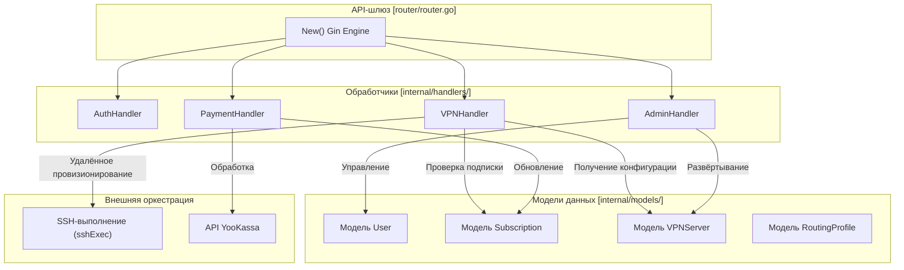
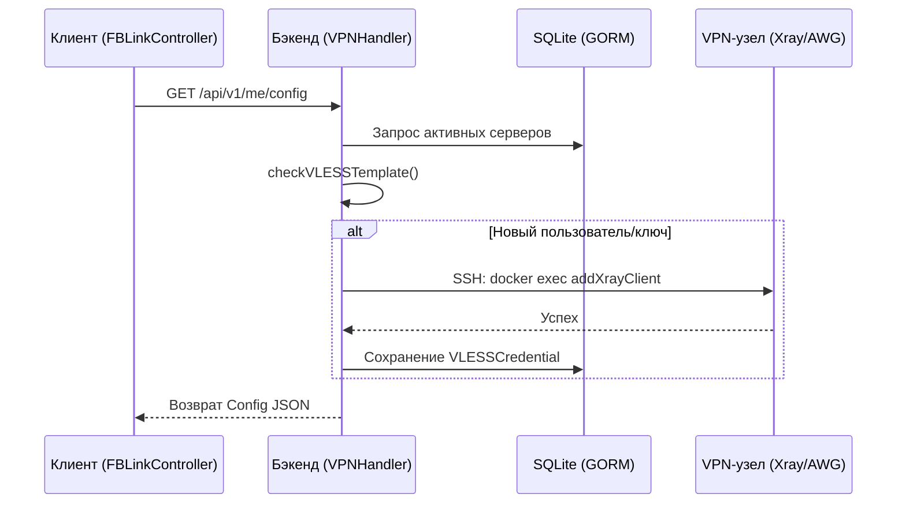

# Серверный сервис (vpn-backend)

Соответствующие исходные файлы

Следующие файлы были использованы в качестве контекста для создания этой wiki-страницы:

- [client/ui/controllers/api/fblink_controller.cpp](client/ui/controllers/api/fblink_controller.cpp)
- [client/ui/controllers/api/fblink_controller.h](client/ui/controllers/api/fblink_controller.h)
- [vpn-backend/admin/index.html](vpn-backend/admin/index.html)
- [vpn-backend/go.mod](vpn-backend/go.mod)
- [vpn-backend/go.sum](vpn-backend/go.sum)
- [vpn-backend/internal/handlers/admin.go](vpn-backend/internal/handlers/admin.go)
- [vpn-backend/internal/handlers/promo_codes.go](vpn-backend/internal/handlers/promo_codes.go)
- [vpn-backend/internal/handlers/vip_features.go](vpn-backend/internal/handlers/vip_features.go)
- [vpn-backend/internal/handlers/vpn.go](vpn-backend/internal/handlers/vpn.go)
- [vpn-backend/internal/handlers/xray_vip.go](vpn-backend/internal/handlers/xray_vip.go)
- [vpn-backend/internal/models/models.go](vpn-backend/internal/models/models.go)
- [vpn-backend/internal/router/router.go](vpn-backend/internal/router/router.go)

`vpn-backend` — это коммерческий сервис оркестрации на Go, управляющий жизненным циклом VPN-пользователей, подписок и серверных узлов. Он выступает центральным авторитетом экосистемы FBLink VPN, предоставляя REST API для клиентских приложений и административный интерфейс для управления инфраструктурой.

### Роль в системе и архитектура
Бэкенд построен с использованием веб-фреймворка **Gin Gonic** [vpn-backend/go.mod:6-6]() и использует **GORM** [vpn-backend/go.mod:12-12]() для хранения данных, обычно с базой данных SQLite [vpn-backend/go.mod:7-7](). Он служит мостом между запросом клиента на подключение и физическими VPN-серверами, распределёнными по всему миру.

**Основные обязанности:**
*   **Управление пользователями:** Обработка регистрации, JWT-аутентификации и потока авторизации TV-устройств.
*   **Управляемая генерация конфигураций:** Динамическая генерация конфигураций AmneziaWG (AWG2) и VLESS на основе уровня подписки пользователя.
*   **SSH-оркестрация:** Удалённое управление VPN-узлами (добавление/отзыв пиров, обновление конфигураций Xray) через SSH-команды, выполняемые из Go-сервиса.
*   **Логика подписок:** Интеграция с YooKassa для платежей и управление правами на VIP-функции, такие как AdBlock и профили раздельного туннелирования.

### Карта программных сущностей
Следующая диаграмма иллюстрирует связь между высокоуровневыми ролями бэкенда и конкретными Go-сущностями и обработчиками, их реализующими.

**Карта архитектуры бэкенда**

Источники: [vpn-backend/internal/router/router.go:41-84](), [vpn-backend/internal/models/models.go:16-210](), [vpn-backend/internal/handlers/vpn.go:84-129]()

---

### Поверхность REST API
Бэкенд предоставляет структурированный API в пространстве `/api/v1`. Доступ контролируется через JWT-middleware [vpn-backend/internal/router/router.go:82-82](), с определёнными маршрутами, зарезервированными для административных ролей [vpn-backend/internal/router/router.go:83-83]().

| Группа | Конечная точка | Назначение |
| :--- | :--- | :--- |
| **Auth** | `/auth/login`, `/tv/start` | Аутентификация пользователей и привязка TV-устройств [vpn-backend/internal/router/router.go:88-99](). |
| **User** | `/me/config` | Получение сгенерированных конфигураций AWG2 или VLESS [vpn-backend/internal/router/router.go:138-138](). |
| **VIP** | `/me/routing-profiles` | Управление пресетами раздельного туннелирования для VIP-пользователей [vpn-backend/internal/router/router.go:132-136](). |
| **Admin** | `/admin/servers` | Управление инфраструктурой и провизионирование серверов [vpn-backend/internal/router/router.go:158-163](). |

Полный список конечных точек и жизненный цикл JWT см. в **[Backend API и аутентификация](#6.1)**.

---

### Подписки и VIP-функции
Сервис реализует многоуровневую модель подписок: `Trial`, `Basic` и `VIP` [vpn-backend/internal/models/models.go:29-36](). Подписки определяют доступ к протоколам (напр., VIP получают VLESS/REALITY, остальные используют AWG) и доступность функций.

**Ключевые VIP-возможности:**
*   **Профили маршрутизации:** Предварительно настроенные списки доменов для прямой или проксированной маршрутизации (напр., «RU без VPN», «AI через VPN») [vpn-backend/internal/handlers/vip_features.go:79-205]().
*   **VIP AdBlock:** Интеграция с Pi-hole на стороне сервера, управляемая флагом `vip_ad_block_enabled` [vpn-backend/internal/models/models.go:54-54]().

Подробнее о платежах и логике тарифов см. **[Подписки, платежи и VIP-функции](#6.2)**.

---

### Оркестрация серверов
В отличие от традиционных VPN, где клиент подключается к статической конфигурации, `vpn-backend` активно управляет состоянием сервера. Когда пользователь запрашивает конфигурацию через `GetConfig` [vpn-backend/internal/handlers/vpn.go:84-84](), бэкенд может выполнять SSH-операции для обеспечения регистрации пользователя на узле.

**Рабочий процесс оркестрации**

Источники: [vpn-backend/internal/handlers/vpn.go:174-206](), [vpn-backend/internal/handlers/xray_vip.go:154-176]()

Бэкенд также поддерживает начальную настройку новых узлов, включая автоматизированную установку Pi-hole и конфигурацию Xray [vpn-backend/internal/handlers/admin.go:212-220]().

Подробнее о SSH-слое и моделях серверов см. **[Провизионирование серверов и SSH-оркестрация](#6.3)**.

---

### Административный интерфейс
Бэкенд включает встроенную веб-панель администрирования, доступную по адресу `/admin` [vpn-backend/internal/router/router.go:182-182](). Это одностраничное приложение (SPA) позволяет администраторам:
*   Отслеживать рост числа пользователей и статистику активных подписок [vpn-backend/admin/index.html:133-137]().
*   Добавлять и настраивать новые VPN-узлы [vpn-backend/internal/handlers/admin.go:164-221]().
*   Управлять промокодами и ручным подтверждением платежей [vpn-backend/internal/handlers/promo_codes.go:232-241]().

Источники: [vpn-backend/admin/index.html:1-182](), [vpn-backend/internal/handlers/admin.go:70-162]()

---
