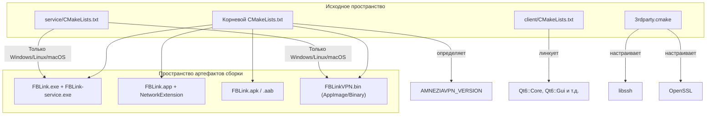
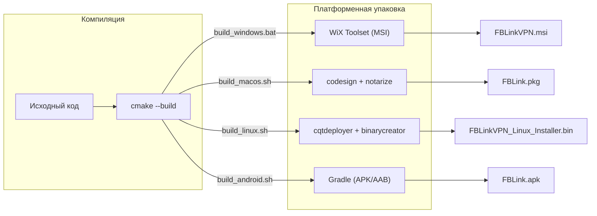

# Система сборки и CI/CD

Соответствующие исходные файлы

Следующие файлы были использованы в качестве контекста для создания этой wiki-страницы:

- [.github/workflows/deploy.yml](.github/workflows/deploy.yml)
- [CMakeLists.txt](CMakeLists.txt)
- [client/CMakeLists.txt](client/CMakeLists.txt)
- [client/android/build.gradle](client/android/build.gradle)
- [client/android/res/mipmap-hdpi/ic_banner.png](client/android/res/mipmap-hdpi/ic_banner.png)
- [client/android/res/mipmap-mdpi/ic_banner.png](client/android/res/mipmap-mdpi/ic_banner.png)
- [client/android/res/mipmap-xhdpi/ic_banner.png](client/android/res/mipmap-xhdpi/ic_banner.png)
- [client/android/src/com/fblink/vpn/VpnProto.kt](client/android/src/com/fblink/vpn/VpnProto.kt)
- [client/cmake/3rdparty.cmake](client/cmake/3rdparty.cmake)
- [client/core/sshclient.cpp](client/core/sshclient.cpp)
- [client/core/sshclient.h](client/core/sshclient.h)
- [client/ui/models/languageModel.cpp](client/ui/models/languageModel.cpp)
- [client/ui/models/languageModel.h](client/ui/models/languageModel.h)
- [deploy/build_android.sh](deploy/build_android.sh)
- [deploy/build_linux.sh](deploy/build_linux.sh)
- [deploy/build_macos.sh](deploy/build_macos.sh)
- [deploy/install_ios_deps.sh](deploy/install_ios_deps.sh)
- [deploy/verify_windows_runtime.ps1](deploy/verify_windows_runtime.ps1)
- [service/CMakeLists.txt](service/CMakeLists.txt)
- [service/common.cmake](service/common.cmake)
- [service/server/CMakeLists.txt](service/server/CMakeLists.txt)
- [service/src/qtservice.cmake](service/src/qtservice.cmake)

Этот раздел предоставляет обзор мультиплатформенной инфраструктуры сборки FBLink VPN. Проект использует единую систему сборки **CMake**, интегрированную с **Qt Framework**, для поддержки Windows, macOS, Linux, Android и iOS. Автоматизация осуществляется через **GitHub Actions**, которые оркестрируют кросс-платформенную компиляцию, подписание и генерацию инсталляторов.

## Мультиплатформенная инфраструктура сборки

Система сборки основана на корневом `CMakeLists.txt`, который управляет глобальным версионированием и определением платформы [CMakeLists.txt:1-29](). Он делегирует компонентно-специфичные сборки в поддиректории `client/` и `service/` [CMakeLists.txt:51-54]().

### Основные технологии сборки
- **CMake**: Используется для конфигурации проекта и управления зависимостями на всех платформах.
- **Qt 6**: Основной фреймворк для UI (`Quick`, `QuickControls2`) и системной логики (`Network`, `RemoteObjects`, `Sql`) [client/CMakeLists.txt:11-15]().
- **Qt Remote Objects (repc)**: Автоматически генерирует IPC-реплики и исходный код из `.rep` файлов в процессе сборки [client/CMakeLists.txt:100-103]().
- **LinguistTools**: Управляет интернационализацией путём компиляции `.ts` файлов переводов в `.qm` ресурсы [client/CMakeLists.txt:110-134]().

### Карта системы сборки: от кода к платформе

Следующая диаграмма иллюстрирует, как система сборки отображает обобщённые исходные сущности в платформенно-специфичные выходные артефакты.

**Карта сущностей системы сборки**

**Источники:** [CMakeLists.txt:4-9](), [client/CMakeLists.txt:11-15](), [client/cmake/3rdparty.cmake:11-12](), [service/server/CMakeLists.txt:3-4]().

---

## Конвейер CI/CD (GitHub Actions)

Рабочий процесс развёртывания [`.github/workflows/deploy.yml`]() автоматизирует весь цикл выпуска. Он запускается при push в любую ветку или через ручной запуск [`.github/workflows/deploy.yml:3-8]().

### Задачи рабочего процесса
- **Build-Linux-Ubuntu**: Компилирует Linux-клиент и сервис, использует `cqtdeployer` для сборки зависимостей и генерирует `.bin` инсталлятор [`.github/workflows/deploy.yml:13-90]().
- **Build-Windows**: Настраивает MSVC, импортирует сертификаты подписи кода, собирает бинарные файлы и использует **WiX Toolset** для создания MSI-инсталлятора [`.github/workflows/deploy.yml:93-185]().
- **Android/iOS**: (Подробнее на дочерних страницах) Обрабатывает NDK/SDK-окружения и платформенно-специфичное подписание.

### Конфигурация окружения
Конвейер внедряет критичные продакшн-конечные точки и публичные ключи через переменные окружения, гарантируя, что конфиденциальные детали инфраструктуры не захардкожены в исходном коде [`.github/workflows/deploy.yml:19-25]().

Подробнее см. **[Конфигурация сборки CMake](#7.1)**.

---

## Платформенно-специфичная сборка и упаковка

Каждая платформа требует уникальных шагов постобработки для создания распространяемого артефакта.

### Поток процесса развёртывания
Диаграмма ниже показывает переход от компиляции сырых бинарных файлов до финального пакета инсталлятора для различных операционных систем.

**Жизненный цикл от кода до пакета**

**Источники:** [deploy/build_linux.sh:83-100](), [deploy/build_macos.sh:142-167](), [deploy/build_android.sh:37-51](), [CMakeLists.txt:64-91]().

### Сводная таблица по платформам

| Платформа | Инструмент сборки | Инструмент упаковки | Ключевые артефакты |
| :--- | :--- | :--- | :--- |
| **Windows** | MSVC / CMake | WiX / QIF | `.msi`, `.exe` |
| **macOS** | Clang / CMake | `macdeployqt` / `pkgbuild` | `.app`, `.pkg` |
| **Linux** | GCC / CMake | `cqtdeployer` / `binarycreator` | инсталлятор `.bin` |
| **Android** | NDK / Gradle | `androiddeployqt` | `.apk`, `.aab` |
| **iOS** | Xcode / CMake | `xcodebuild` | `.ipa` |

Подробнее см. **[Платформенные скрипты сборки и упаковка](#7.2)** и **[Windows-инсталлятор и регистрация сервиса](#7.3)**.

---

## Дочерние страницы
- **[Конфигурация сборки CMake](#7.1)**: Подробный разбор `3rdparty.cmake`, флагов функций (напр., `FBLINK_ANDROID_TV`) и платформенно-специфичной CMake-логики.
- **[Платформенные скрипты сборки и упаковка](#7.2)**: Технические детали `build_android.sh`, `build_macos.sh` и `build_linux.sh`.
- **[Windows-инсталлятор и регистрация сервиса](#7.3)**: Генерация MSI, патчи WiX и жизненный цикл установки сервиса в Windows.

**Источники:**
- [CMakeLists.txt:1-91]()
- [client/CMakeLists.txt:1-213]()
- [.github/workflows/deploy.yml:1-185]()
- [deploy/build_linux.sh:1-101]()
- [deploy/build_macos.sh:1-177]()
- [deploy/build_android.sh:1-240]()
- [client/cmake/3rdparty.cmake:1-162]()

---
