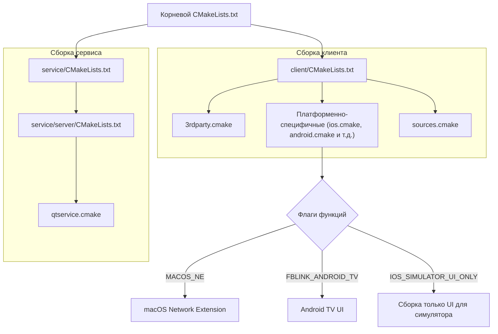
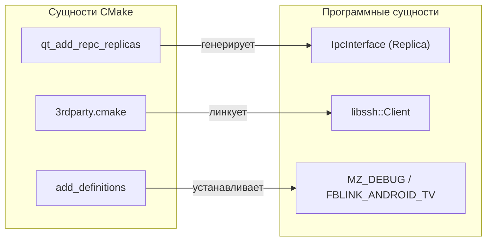

# Конфигурация сборки CMake

Соответствующие исходные файлы

Следующие файлы были использованы в качестве контекста для создания этой wiki-страницы:

- [.gitmodules](.gitmodules)
- [CMakeLists.txt](CMakeLists.txt)
- [client/CMakeLists.txt](client/CMakeLists.txt)
- [client/FBLink_application.cpp](client/FBLink_application.cpp)
- [client/android/build.gradle](client/android/build.gradle)
- [client/cmake/3rdparty.cmake](client/cmake/3rdparty.cmake)
- [client/cmake/android.cmake](client/cmake/android.cmake)
- [client/cmake/ios.cmake](client/cmake/ios.cmake)
- [client/cmake/macos.cmake](client/cmake/macos.cmake)
- [client/cmake/macos_ne.cmake](client/cmake/macos_ne.cmake)
- [client/cmake/osxtools.cmake](client/cmake/osxtools.cmake)
- [client/cmake/sources.cmake](client/cmake/sources.cmake)
- [client/core/osSignalHandler.cpp](client/core/osSignalHandler.cpp)
- [client/core/osSignalHandler.h](client/core/osSignalHandler.h)
- [client/core/sshclient.cpp](client/core/sshclient.cpp)
- [client/core/sshclient.h](client/core/sshclient.h)
- [client/ios/networkextension/CMakeLists.txt](client/ios/networkextension/CMakeLists.txt)
- [client/ios/networkextension/WireGuardNetworkExtension-Bridging-Header.h](client/ios/networkextension/WireGuardNetworkExtension-Bridging-Header.h)
- [client/macos/networkextension/CMakeLists.txt](client/macos/networkextension/CMakeLists.txt)
- [client/macos/networkextension/WireGuardNetworkExtension-Bridging-Header.h](client/macos/networkextension/WireGuardNetworkExtension-Bridging-Header.h)
- [client/platforms/ios/StoreKitController.h](client/platforms/ios/StoreKitController.h)
- [client/platforms/ios/StoreKitController.mm](client/platforms/ios/StoreKitController.mm)
- [client/platforms/ios/WireGuard-Bridging-Header.h](client/platforms/ios/WireGuard-Bridging-Header.h)
- [client/ui/models/languageModel.cpp](client/ui/models/languageModel.cpp)
- [client/ui/models/languageModel.h](client/ui/models/languageModel.h)
- [client/ui/qml/Modules/Style/qmldir](client/ui/qml/Modules/Style/qmldir)
- [deploy/install_ios_deps.sh](deploy/install_ios_deps.sh)
- [deploy/verify_windows_runtime.ps1](deploy/verify_windows_runtime.ps1)
- [service/CMakeLists.txt](service/CMakeLists.txt)
- [service/common.cmake](service/common.cmake)
- [service/server/CMakeLists.txt](service/server/CMakeLists.txt)
- [service/src/qtservice.cmake](service/src/qtservice.cmake)

Система сборки FBLink VPN основана на CMake 3.25+, предоставляя кросс-платформенную инфраструктуру, управляющую компиляцией Qt-клиентского приложения, привилегированного фонового сервиса и интеграцией множества сторонних протоколов безопасности. Система разработана для обработки разнообразных платформенных требований — от Windows MSI-инсталляторов до iOS Network Extension и вариантов Android TV.

## Иерархия сборки и точки входа

Система сборки следует модульной структуре, где корневой `CMakeLists.txt` оркестрирует версионирование проекта и включение подпроектов.

### Корневая конфигурация
Корневой `CMakeLists.txt` определяет глобальные метаданные проекта, включая версию приложения `1.0.0.3` [CMakeLists.txt:4-9](). Он устанавливает стандарт C++ на C++17 [CMakeLists.txt:32-33]() и определяет имя целевой платформы (напр., `windows`, `macos`, `android`, `ios`) [CMakeLists.txt:17-29]().

### Разделение клиента и сервиса
Проект разделён на две основные поддиректории:
*   `client/`: Содержит QML-интерфейс и логику VPN.
*   `service/`: Содержит привилегированный демон/сервис (собирается только для десктопных платформ: Windows, Linux и macOS без Network Extension) [CMakeLists.txt:53-57]().

### Диаграмма потока сборки

Заголовок: Оркестрация сборки FBLink VPN

Источники: [CMakeLists.txt:51-57](), [client/CMakeLists.txt:145-146](), [client/CMakeLists.txt:155-159]()

---

## Конфигурация сборки клиента

`client/CMakeLists.txt` — наиболее сложная часть системы сборки, управляющая зависимостями Qt, генерацией IPC-реплик и платформенно-специфичной инъекцией исходных файлов.

### Зависимости Qt и IPC
Клиент требует широкий набор модулей Qt, включая `Quick`, `Svg`, `Concurrent` и `LinguistTools` [client/CMakeLists.txt:11-15](). Для десктопных платформ подключается `RemoteObjects` для обеспечения IPC с фоновым сервисом [client/CMakeLists.txt:46-48]().

Система сборки автоматически генерирует C++-реплики из `.rep` файлов определений с помощью `qt_add_repc_replicas` [client/CMakeLists.txt:101-103]():
*   `ipc_interface.rep`: Основной интерфейс управления VPN.
*   `ipc_process_interface.rep`: Интерфейс управления процессами.

### Система переводов
Переводы обрабатываются через `qt_create_translation`, нацеленные на языки: русский, китайский, персидский и арабский [client/CMakeLists.txt:110-123](). Система генерирует `.qm` файлы и упаковывает их в сгенерированный файл ресурсов `translations.qrc` [client/CMakeLists.txt:132-133]().

Источники: [client/CMakeLists.txt:11-15](), [client/CMakeLists.txt:46-48](), [client/CMakeLists.txt:101-103](), [client/CMakeLists.txt:110-123]()

---

## Управление сторонними зависимостями

Файл `client/cmake/3rdparty.cmake` управляет интеграцией внешних библиотек, преимущественно используя предварительно собранные бинарные файлы из подмодуля `client/3rd-prebuilt`.

### Ключевые зависимости
| Зависимость | Метод интеграции | Назначение |
| :--- | :--- | :--- |
| **libssh** | Предварительно собранная статическая/динамическая | SSH-оркестрация для провизионирования серверов [client/cmake/3rdparty.cmake:11]() |
| **OpenSSL** | Предварительно собранная статическая | Криптография и защищённая коммуникация [client/cmake/3rdparty.cmake:12]() |
| **qtkeychain** | Сборка из поддиректории | Безопасное хранение учётных данных [client/cmake/3rdparty.cmake:122]() |
| **QSimpleCrypto** | Включённый скрипт | AES-256-CBC шифрование для локальных настроек [client/cmake/3rdparty.cmake:7]() |
| **AmneziaWG** | Предварительно собранный бинарный файл | Реализация обфусцированного протокола WireGuard [client/cmake/android.cmake:52]() |

### Логика линковки зависимостей
Система сборки выбирает подходящий бинарный файл на основе целевой архитектуры и ОС. Например, на Android она перебирает `QT_ANDROID_ABIS` для линковки правильных `libwg-go.so` и `libovpn3.so` для каждой архитектуры [client/cmake/android.cmake:50-61]().

Источники: [client/cmake/3rdparty.cmake:1-20](), [client/cmake/3rdparty.cmake:122-143](), [client/cmake/android.cmake:50-61]()

---

## Платформенно-специфичные конфигурации

### iOS и Network Extension
Сборка iOS настраивается через `client/cmake/ios.cmake`. Этот файл включает языки `Swift` и `Objective-C` [client/cmake/ios.cmake:16-18]() и линкует необходимые Apple-фреймворки, такие как `NetworkExtension` и `StoreKit` [client/cmake/ios.cmake:25-32]().

Критический компонент — цель `networkextension`, определённая в `client/ios/networkextension/CMakeLists.txt`. Она создаёт `appex`-бандл, необходимый для VPN-операций на iOS [client/ios/networkextension/CMakeLists.txt:6-9]().

### Android и Android TV
Конфигурация Android в `client/cmake/android.cmake` устанавливает `minSdkVersion` равным 30 [client/cmake/android.cmake:6]().
*   **FBLINK_ANDROID_TV**: Флаг функции, включающий определение компиляции `FBLINK_ANDROID_TV=1`, активирующее TV-специфичные UI-макеты и логику навигации D-pad [client/CMakeLists.txt:92-95]().

### Флаги функций и опции сборки
| Флаг | Файл | Эффект |
| :--- | :--- | :--- |
| `MACOS_NE` | `client/CMakeLists.txt` | Собирает macOS-версию как Network Extension вместо использования привилегированного вспомогательного демона [client/CMakeLists.txt:155-159](). |
| `IOS_SIMULATOR_UI_ONLY` | `client/cmake/3rdparty.cmake` | Отключает предварительно собранные `libssh` и WireGuard для тестирования UI в iOS-симуляторе [client/cmake/3rdparty.cmake:51-60](). |
| `FBLINK_ANDROID_TV` | `client/CMakeLists.txt` | Включает вариант интерфейса Android TV [client/CMakeLists.txt:92-95](). |

Источники: [client/cmake/ios.cmake:16-32](), [client/ios/networkextension/CMakeLists.txt:6-9](), [client/cmake/android.cmake:6-20](), [client/CMakeLists.txt:155-159](), [client/cmake/3rdparty.cmake:51-60]()

---

## Сопоставление программных сущностей

Заголовок: Связь CMake с программными сущностями

Источники: [client/CMakeLists.txt:101-103](), [client/CMakeLists.txt:92-95](), [client/cmake/3rdparty.cmake:103-110]()

## Конфигурация сборки сервиса

`service/server/CMakeLists.txt` настраивает привилегированный `FBLink-service`. Он нацелен на C++20 [service/server/CMakeLists.txt:6]() и включает компоненты для:
*   **Управление Xray**: Линкует библиотеки `amnezia_xray` для поддержки протокола Xray [service/server/CMakeLists.txt:15-30]().
*   **Системная интеграция**: Включает заголовки для `router.h`, `killswitch.h` и `systemservice.h` для управления сетью на уровне ОС [service/server/CMakeLists.txt:93-95]().
*   **IPC-хостинг**: Реализует `IpcServer` и `IpcServerProcess` для приёма клиентских запросов [service/server/CMakeLists.txt:89-90]().

Источники: [service/server/CMakeLists.txt:6-30](), [service/server/CMakeLists.txt:89-95]()

---
