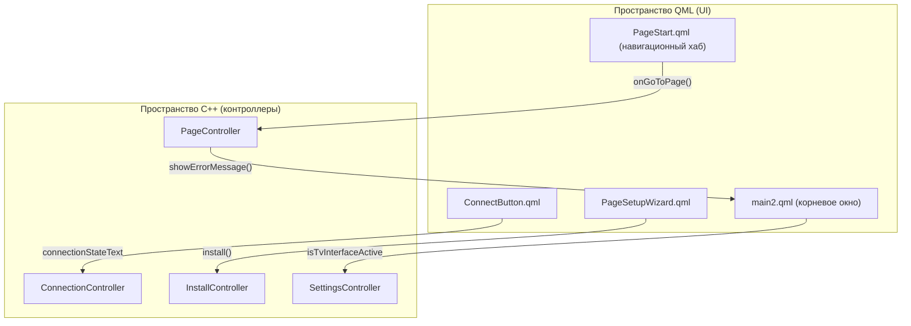

# Клиентское приложение

Соответствующие исходные файлы

Следующие файлы были использованы в качестве контекста для создания этой wiki-страницы:

- [client/resources.qrc](client/resources.qrc)
- [client/ui/controllers/pageController.cpp](client/ui/controllers/pageController.cpp)
- [client/ui/controllers/pageController.h](client/ui/controllers/pageController.h)
- [client/ui/pages.h](client/ui/pages.h)
- [client/ui/qml/Components/ConnectButton.qml](client/ui/qml/Components/ConnectButton.qml)
- [client/ui/qml/Components/TvKeyboardKey.qml](client/ui/qml/Components/TvKeyboardKey.qml)
- [client/ui/qml/Components/TvLoginRow.qml](client/ui/qml/Components/TvLoginRow.qml)
- [client/ui/qml/Components/TvOnScreenKeyboard.qml](client/ui/qml/Components/TvOnScreenKeyboard.qml)
- [client/ui/qml/Pages2/PageFBLinkTvApprove.qml](client/ui/qml/Pages2/PageFBLinkTvApprove.qml)
- [client/ui/qml/Pages2/PageFBLinkTvScan.qml](client/ui/qml/Pages2/PageFBLinkTvScan.qml)
- [client/ui/qml/Pages2/PageSettings.qml](client/ui/qml/Pages2/PageSettings.qml)
- [client/ui/qml/Pages2/PageSetupWizardConfigSource.qml](client/ui/qml/Pages2/PageSetupWizardConfigSource.qml)
- [client/ui/qml/Pages2/PageSetupWizardCredentials.qml](client/ui/qml/Pages2/PageSetupWizardCredentials.qml)
- [client/ui/qml/Pages2/PageSetupWizardEasy.qml](client/ui/qml/Pages2/PageSetupWizardEasy.qml)
- [client/ui/qml/Pages2/PageSetupWizardProtocols.qml](client/ui/qml/Pages2/PageSetupWizardProtocols.qml)
- [client/ui/qml/Pages2/PageSetupWizardStart.qml](client/ui/qml/Pages2/PageSetupWizardStart.qml)
- [client/ui/qml/Pages2/PageStart.qml](client/ui/qml/Pages2/PageStart.qml)
- [client/ui/qml/main2.qml](client/ui/qml/main2.qml)
- [vpn-backend/internal/handlers/auth.go](vpn-backend/internal/handlers/auth.go)

Клиент FBLink VPN — кроссплатформенное приложение, построенное на **Qt 6** и **QML**. Оно следует архитектуре с разделением, где UI-слой (QML) взаимодействует с C++-контроллерным слоем, который, в свою очередь, общается с привилегированным фоновым сервисом через IPC.

Приложение предназначено для масштабирования между десктопом (Windows, Linux, macOS), мобильными устройствами (Android, iOS) и Android TV, используя единую кодовую базу с платформенно-специфичными адаптациями.

## Архитектура UI и навигация

UI основан на `main2.qml`, который служит основным контейнером окна [client/ui/qml/main2.qml:15-18](). Он использует `Loader` для внедрения `PageStart.qml` — центрального навигационного хаба [client/ui/qml/main2.qml:158-166]().

### Основные компоненты
*   **PageController**: C++-синглтон, управляющий навигационным стеком, состояниями окна и глобальными UI-сигналами [client/ui/controllers/pageController.h:99-104](). Он определяет `PageEnum`, используемый для идентификации всех навигируемых представлений [client/ui/controllers/pageController.h:13-90]().
*   **Навигационный стек**: Управляется через `StackView` (часто называемый `tabBarStackView` в QML) внутри `PageStart.qml`. Обрабатывает переходы между главным экраном, настройками и мастером настройки [client/ui/qml/Pages2/PageStart.qml:74-138]().
*   **Управление фокусом**: Пользовательский `FocusController` обрабатывает навигацию клавиатурой и D-pad, обеспечивая доступность на десктопных и TV-интерфейсах [client/ui/qml/main2.qml:64-96]().

Подробнее см. **[Архитектура UI и навигация](#4.1)**.

### Сопоставление UI с контроллерами
Следующая диаграмма иллюстрирует взаимодействие QML UI-сущностей с соответствующими C++-контроллерами.

Источники: [client/ui/qml/main2.qml:107-146](), [client/ui/controllers/pageController.h:132-153](), [client/ui/qml/Pages2/PageStart.qml:69-154](), [client/ui/qml/Components/ConnectButton.qml:61-73]()

## Управление серверами и контейнерами

Клиент управляет удалёнными VPN-узлами через взаимодействие с `ServersModel` и `ContainersModel`. Он поддерживает «Мастер настройки», позволяющий пользователям провизионировать новые серверы через SSH или импортировать существующие конфигурации.

*   **Провизионирование**: `InstallController` обрабатывает SSH-рукопожатие и развёртывание Docker-контейнеров на удалённом VPS [client/ui/qml/Pages2/PageSetupWizardCredentials.qml:107-122]().
*   **Модели**: `ServersModel` отслеживает список настроенных серверов, а `ContainersModel` определяет доступные протоколы (AWG, Xray и др.) и их состояния установки [client/ui/qml/Pages2/PageSetupWizardEasy.qml:21-35]().

Подробнее см. **[Управление серверами и контейнерами](#4.2)**.

## Настройки и контроллеры функций

Интерфейс настроек организован в модульные страницы под `PageSettings.qml` [client/ui/qml/Pages2/PageSettings.qml:15-16](). Эти страницы поддерживаются специализированными контроллерами:

*   **SettingsController**: Управляет общеприложенческими параметрами, такими как логирование, автозапуск и UI-темы [client/ui/qml/Pages2/PageSetupWizardConfigSource.qml:88-93]().
*   **SystemController**: Предоставляет платформенно-специфичные утилиты, например, нативные диалоги выбора файлов для экспорта логов [client/ui/qml/Pages2/PageSetupWizardConfigSource.qml:109-113]().
*   **Раздельное туннелирование**: Управляется через `SitesController` и страницы `AppSplitTunneling` для маршрутизации определённого трафика вне VPN.

Подробнее см. **[Страницы настроек и контроллеры функций](#4.3)**.

## Конфигурация и общий доступ для клиентов

FBLink поддерживает продвинутый общий доступ к конфигурации и управление множеством клиентов.
*   **Импорт/Экспорт**: Пользователи могут импортировать конфигурации через ссылки `vpn://`, QR-коды или текстовые ключи [client/ui/qml/Pages2/PageSetupWizardConfigSource.qml:162-195]().
*   **Общий доступ**: Представление `PageShareConnection` позволяет генерировать доступ для других устройств, предоставляя QR-коды и файлы конфигурации [client/ui/qml/Pages2/PageStart.qml:95-106]().

Подробнее см. **[Экспорт конфигурации и управление клиентами](#4.4)**.

## Интерфейс Android TV

Приложение включает специализированный режим TV UI, активируемый через `SettingsController.isTvInterfaceActive` [client/ui/qml/Pages2/PageStart.qml:21]().

*   **TV-навигация**: Использует `PageTvRoot.qml` и пользовательскую логику управления фокусом, заменяющую стандартные мобильные сенсорные взаимодействия навигацией D-pad [client/ui/qml/main2.qml:73-79]().
*   **Ввод**: Включает `TvOnScreenKeyboard.qml` для удобного ввода текста с помощью пульта при авторизации и настройке [client/ui/qml/Components/TvOnScreenKeyboard.qml:1-10]().
*   **Device Flow**: Реализует авторизацию устройств в стиле OAuth2, при которой TV отображает код для подтверждения пользователем в мобильном/веб-браузере [vpn-backend/internal/handlers/auth.go:162-197]().

Подробнее см. **[Интерфейс Android TV](#4.5)**.

### Обзор навигационного потока
Следующая таблица суммирует основные навигационные маршруты, управляемые `PageController`.

| PageEnum | QML-файл | Назначение |
| :--- | :--- | :--- |
| `PageStart` | `PageStart.qml` | Корневой контейнер стека и навигационный хаб [client/ui/controllers/pageController.cpp:69]() |
| `PageHome` | `PageHome.qml` | Главная панель подключения с `ConnectButton` [client/ui/controllers/pageController.h:15]() |
| `PageSetupWizardStart` | `PageSetupWizardStart.qml` | Точка входа для добавления новых серверов или авторизации [client/ui/qml/Pages2/PageSetupWizardStart.qml:14]() |
| `PageFBLinkLogin` | `PageFBLinkLogin.qml` | Аутентификация через бэкенд FBLink [client/ui/controllers/pageController.h:54]() |
| `PageSettings` | `PageSettings.qml` | Главное меню настроек [client/ui/qml/Pages2/PageSettings.qml:15]() |

Источники: [client/ui/controllers/pageController.h:13-90](), [client/ui/controllers/pageController.cpp:65-70]()

---
