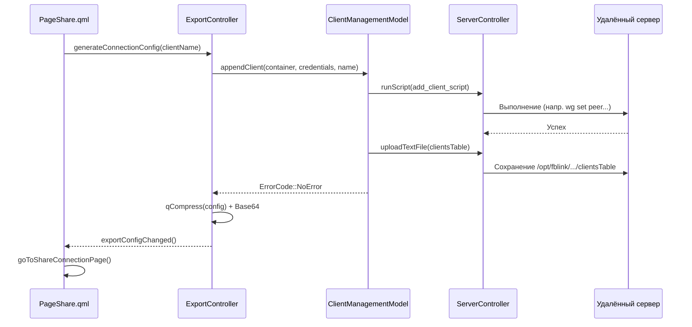
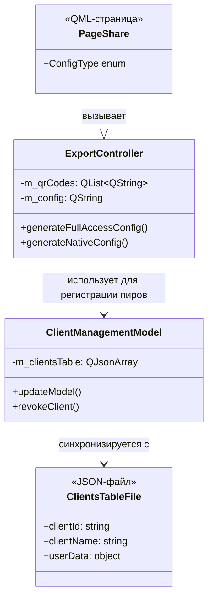

# Экспорт конфигурации и управление клиентами

Соответствующие исходные файлы

Следующие файлы были использованы в качестве контекста для создания этой wiki-страницы:

- [client/ui/controllers/exportController.cpp](client/ui/controllers/exportController.cpp)
- [client/ui/controllers/exportController.h](client/ui/controllers/exportController.h)
- [client/ui/models/clientManagementModel.cpp](client/ui/models/clientManagementModel.cpp)
- [client/ui/models/clientManagementModel.h](client/ui/models/clientManagementModel.h)
- [client/ui/qml/Pages2/PageSettingsApiSubscriptionKey.qml](client/ui/qml/Pages2/PageSettingsApiSubscriptionKey.qml)
- [client/ui/qml/Pages2/PageShare.qml](client/ui/qml/Pages2/PageShare.qml)
- [client/ui/qml/Pages2/PageShareConnection.qml](client/ui/qml/Pages2/PageShareConnection.qml)
- [client/ui/qml/Pages2/PageShareFullAccess.qml](client/ui/qml/Pages2/PageShareFullAccess.qml)

Система экспорта конфигурации и управления клиентами отвечает за генерацию, распространение и управление жизненным циклом учётных данных VPN-доступа. Она включает создание глубоких ссылок `vpn://` для приложения FBLink, генерацию нативных конфигураций для сторонних клиентов (OpenVPN, WireGuard, Xray) и управление серверными таблицами клиентов для мониторинга и отзыва.

## ExportController

Класс `ExportController` — центральная сущность для генерации строк подключения и файлов. Он взаимодействует с `ServersModel` и `ContainersModel` для получения деталей окружения и использует `VpnConfigurationsController` для создания блобов конфигурации, специфичных для протокола [client/ui/controllers/exportController.cpp:18-26]().

### Поток генерации конфигурации
Контроллер поддерживает два основных режима экспорта:
1.  **Полный доступ**: Генерирует ссылку `vpn://`, содержащую все метаданные сервера и конфигурации протоколов. Предназначена для дополнительных устройств владельца [client/ui/controllers/exportController.cpp:29-58]().
2.  **Ограниченное подключение**: Генерирует конфигурацию для конкретного контейнера/протокола, часто создавая новый уникальный ID клиента на сервере через `ClientManagementModel::appendClient` [client/ui/controllers/exportController.cpp:60-80]().

### Поддерживаемые форматы экспорта
UI `PageShare.qml` определяет несколько нативных и внутренних форматов для экспорта [client/ui/qml/Pages2/PageShare.qml:22-30]():

| Формат | Расширение | Функция реализации |
| :--- | :--- | :--- |
| FBLink VPN | `.vpn` | `generateConnectionConfig` [client/ui/controllers/exportController.cpp:60]() |
| OpenVPN | `.ovpn` | `generateOpenVpnConfig` [client/ui/controllers/exportController.cpp:133]() |
| WireGuard | `.conf` | `generateWireGuardConfig` [client/ui/controllers/exportController.cpp:159]() |
| AmneziaWG | `.conf` | `generateAwgConfig` [client/ui/controllers/exportController.cpp:185]() |
| Xray (VLESS) | `.json` | `generateXrayConfig` [client/ui/controllers/exportController.cpp:211]() |

### Генерация QR-кодов
Для передачи на мобильные устройства контроллер использует `qrCodeUtils::generateQrCodeImageSeries` для преобразования сжатых строк конфигурации в серию QR-кодов в формате base64 [client/ui/controllers/exportController.cpp:56-57]().

## Модель управления клиентами

`ClientManagementModel` управляет жизненным циклом VPN-клиентов (пиров) на конкретном сервере. Он синхронизирует локальный `QJsonArray` с файлом `clientsTable`, хранящимся на удалённом сервере по пути `/opt/fblink/[container]/clientsTable` [client/ui/models/clientManagementModel.cpp:84-91]().

### Жизненный цикл получения и синхронизации
При вызове `updateModel` система выполняет следующие шаги:
1.  **Получение**: Скачивает `clientsTable` с сервера с помощью `ServerController::getTextFileFromContainer` [client/ui/models/clientManagementModel.cpp:91]().
2.  **Миграция**: Если файл в старом формате, выполняется миграция к текущей схеме [client/ui/models/clientManagementModel.cpp:59-73]().
3.  **Статистика в реальном времени**: Выполняет команды, специфичные для протокола (например, `wg show` для WireGuard), для заполнения полей `latestHandshake`, `dataReceived` и `dataSent` [client/ui/models/clientManagementModel.cpp:126-160]().

### Отзыв по протоколам
Логика отзыва специализирована для каждого протокола, чтобы немедленно обновить серверный сервис:
*   **WireGuard/AWG**: Удаляет пира с помощью `wg set [interface] peer [pubkey] remove` и удаляет конкретный файл конфигурации пира [client/ui/models/clientManagementModel.cpp:295-305]().
*   **OpenVPN**: Отзывает сертификат через PKI-инфраструктуру и обновляет CRL [client/ui/models/clientManagementModel.cpp:258-270]().
*   **Xray**: Удаляет UUID клиента из `config.json` и перезапускает сервис Xray [client/ui/models/clientManagementModel.cpp:328-340]().

## Поток данных: Экспорт и общий доступ

Следующая диаграмма иллюстрирует взаимодействие между UI, ExportController и ClientManagementModel, когда пользователь предоставляет общий доступ к подключению.

**Последовательность экспорта и создания клиента**

*Источники: [client/ui/controllers/exportController.cpp:60-100](), [client/ui/models/clientManagementModel.cpp:193-210](), [client/ui/qml/Pages2/PageShare.qml:40-104]()*

## UI-компоненты для общего доступа

### PageShare
Основная точка входа для общего доступа. Позволяет пользователю выбрать сервер и формат протокола. Включает `DrawerType2` для выбора «Полный доступ» vs «Ограниченный доступ» [client/ui/qml/Pages2/PageShare.qml:173-186]().

### PageShareConnection
Отображает сгенерированную конфигурацию пользователю. Ключевые возможности:
*   **Отображение QR-кода**: Использует `ListView` для показа последовательности QR-кодов, сгенерированных `ExportController` [client/ui/qml/Pages2/PageShareConnection.qml:248-265]().
*   **Экспорт в файл**: Запускает платформенно-специфичные диалоги «Сохранить как» через `SystemController::getFileName` [client/ui/qml/Pages2/PageShareConnection.qml:102-107]().
*   **Копирование в буфер обмена**: Предоставляет кнопки для копирования необработанной ссылки `vpn://` или нативных строк конфигурации [client/ui/qml/Pages2/PageShareConnection.qml:116-135]().

## Сопоставление программных сущностей

Следующая диаграмма связывает высокоуровневые концепции «Управления» с их классами реализации и структурами данных.

**Связи сущностей управления**

*Источники: [client/ui/controllers/exportController.h:10-69](), [client/ui/models/clientManagementModel.h:10-87](), [client/ui/qml/Pages2/PageShare.qml:19-30](), [client/ui/models/clientManagementModel.cpp:13-24]()*

### Ключевые ссылки на функции
*   **Отзыв клиента**: `ClientManagementModel::revokeClient` обрабатывает логику удаления доступа и обновления серверного UI [client/ui/models/clientManagementModel.cpp:342-365]().
*   **Обновление модели**: `ClientManagementModel::updateModel` вызывается при открытии пользователем UI управления клиентами для обеспечения актуальности статистики [client/ui/models/clientManagementModel.cpp:75-164]().
*   **Генерация нативной конфигурации**: `ExportController::generateNativeConfig` абстрагирует сложность создания файлов `.ovpn` или `.conf` для различных типов контейнеров [client/ui/controllers/exportController.cpp:102-131]().

**Источники:**
*   [client/ui/controllers/exportController.cpp:1-211]()
*   [client/ui/controllers/exportController.h:1-71]()
*   [client/ui/models/clientManagementModel.cpp:1-365]()
*   [client/ui/models/clientManagementModel.h:1-89]()
*   [client/ui/qml/Pages2/PageShare.qml:1-152]()
*   [client/ui/qml/Pages2/PageShareConnection.qml:20-172]()

---
