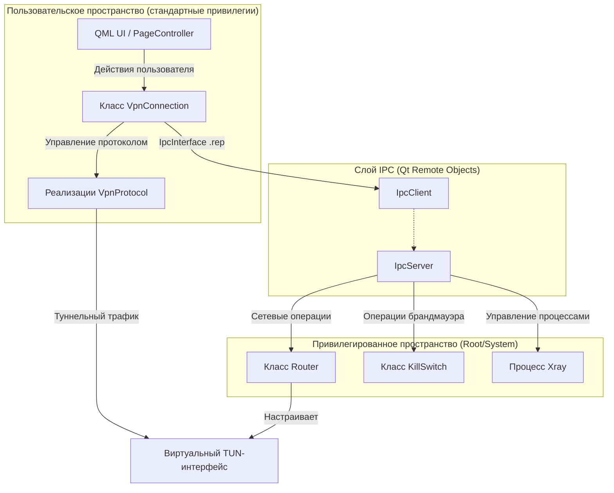
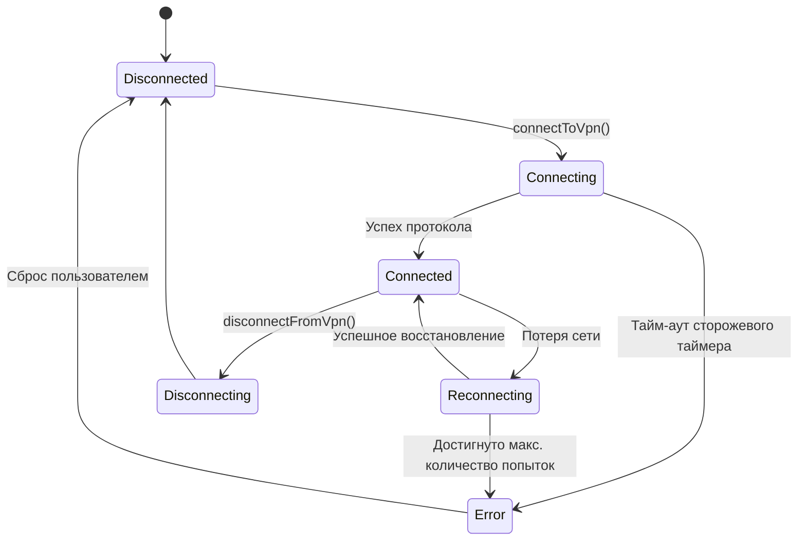

# Базовая архитектура

Соответствующие исходные файлы

Следующие файлы были использованы в качестве контекста для создания этой wiki-страницы:

- [CMakeLists.txt](CMakeLists.txt)
- [client/android/build.gradle](client/android/build.gradle)
- [client/core/ipcclient.cpp](client/core/ipcclient.cpp)
- [client/core/ipcclient.h](client/core/ipcclient.h)
- [client/protocols/openvpnprotocol.cpp](client/protocols/openvpnprotocol.cpp)
- [client/protocols/openvpnprotocol.h](client/protocols/openvpnprotocol.h)
- [client/protocols/xrayprotocol.cpp](client/protocols/xrayprotocol.cpp)
- [client/protocols/xrayprotocol.h](client/protocols/xrayprotocol.h)
- [client/vpnconnection.cpp](client/vpnconnection.cpp)
- [client/vpnconnection.h](client/vpnconnection.h)
- [ipc/ipc_interface.rep](ipc/ipc_interface.rep)
- [ipc/ipcserver.cpp](ipc/ipcserver.cpp)
- [ipc/ipcserver.h](ipc/ipcserver.h)
- [service/CMakeLists.txt](service/CMakeLists.txt)
- [service/common.cmake](service/common.cmake)
- [service/server/CMakeLists.txt](service/server/CMakeLists.txt)
- [service/server/router.cpp](service/server/router.cpp)
- [service/server/router.h](service/server/router.h)
- [service/server/router_linux.cpp](service/server/router_linux.cpp)
- [service/server/router_linux.h](service/server/router_linux.h)
- [service/server/router_mac.cpp](service/server/router_mac.cpp)
- [service/server/router_mac.h](service/server/router_mac.h)
- [service/server/router_win.cpp](service/server/router_win.cpp)
- [service/server/router_win.h](service/server/router_win.h)
- [service/src/qtservice.cmake](service/src/qtservice.cmake)

Архитектура FBLink VPN построена на распределённой модели, разделяющей пользовательское клиентское приложение и привилегированные системные операции, необходимые для VPN-сетей. Такое разделение гарантирует, что основной UI может работать со стандартными пользовательскими правами, в то время как фоновый сервис обрабатывает низкоуровневые задачи: манипуляцию таблицами маршрутизации, сброс DNS и управление TUN-интерфейсами.

### Диаграмма обзора системы

Следующая диаграмма иллюстрирует высокоуровневое взаимодействие между клиентским UI, контроллером VPN-подключения и привилегированным сервисом.

**Системный контекст FBLink VPN**

Источники: [client/vpnconnection.h:27-121](), [ipc/ipcserver.h:16-67](), [client/core/ipcclient.h:10-63]()

---

### Разделение привилегированного сервиса и клиента
На десктопных платформах (Windows, Linux, macOS) FBLink VPN использует архитектуру с разделением процессов. **Клиент** [client/CMakeLists.txt]() содержит логику управления серверами и UI, а **Сервис** [service/server/CMakeLists.txt]() запускается как системный демон или процесс с повышенными привилегиями.

*   **Клиент:** Управляет пользовательскими настройками, списками серверов и конечным автоматом подключения.
*   **Сервис:** Выполняет привилегированные действия, такие как вызов `routeAddList` [ipc/ipcserver.cpp:67-74](), `flushDns` [ipc/ipcserver.cpp:94-101]() и управление `KillSwitch` [ipc/ipcserver.cpp:271-278]().

Подробнее о запуске и управлении этими процессами см. [Настройки, безопасное хранилище и жизненный цикл приложения](#2.4).

---

### IPC через Qt Remote Objects
Взаимодействие между клиентом и сервисом обеспечивается **Qt Remote Objects (QtRO)**. Контракт определён в `ipc_interface.rep`, который генерирует `IpcInterfaceSource` для сервиса и `IpcInterfaceReplica` для клиента.

*   **IpcClient:** Обёртка по типу синглтона [client/core/ipcclient.cpp:20-24](), управляющая `QRemoteObjectNode` и предоставляющая вспомогательную функцию `withInterface` [client/core/ipcclient.h:21-41]() для потокобезопасных IPC-вызовов.
*   **IpcServer:** Реализует серверную логику в сервисе [ipc/ipcserver.cpp:26-29](), диспетчеризуя вызовы к специализированным контроллерам, таким как `Router` или `Xray`.

Подробнее о слотах IPC и жизненном цикле привилегированного процесса см. [IPC: Взаимодействие клиент-сервис](#2.2).

---

### Конечный автомат VPN-подключения
Класс `VpnConnection` [client/vpnconnection.cpp:73-114]() служит центральным координатором жизненного цикла VPN. Он переходит между состояниями, определёнными в `Vpn::ConnectionState` (например, `Connecting`, `Connected`, `Disconnecting`).

**Логика конечного автомата**

Конечный автомат включает **сторожевой таймер состояния** [client/vpnconnection.cpp:108-111]() для предотвращения зависания приложения в промежуточных состояниях и механизм **экспоненциального отката** для попыток переподключения.

Подробнее о логике восстановления и сторожевых таймерах см. [Конечный автомат VPN-подключения](#2.1).

---

### Уровень абстракции протоколов
FBLink VPN поддерживает несколько протоколов (WireGuard, OpenVPN, Xray и др.) через общую абстракцию. Базовый класс `VpnProtocol` определяет интерфейс для запуска и остановки туннелей.

*   **Конфигураторы:** Классы вроде `WireGuardConfigurator` или `OpenVpnConfigurator` преобразуют необработанные данные сервера в конфигурационные файлы, специфичные для протокола.
*   **Интеграция Xray:** Для протоколов на основе Xray система управляет специализированной библиотекой или процессом `amnezia_xray` [service/server/CMakeLists.txt:15-30]().
*   **Платформенные адаптеры:** На мобильных устройствах `AndroidVpnProtocol` [client/vpnconnection.h:82-88]() связывает C++-логику с нативными реализациями на Kotlin/Swift.

**Сопоставление программных сущностей: Протоколы**
| Системный компонент | Программная сущность (класс/перечисление) | Роль |
| :--- | :--- | :--- |
| Тип протокола | `Proto` [client/core/defs.h]() | Перечисление, определяющее AWG, Xray, OpenVPN и др. |
| Логика протокола | `VpnProtocol` [client/vpnconnection.h:39]() | Базовый класс жизненного цикла туннеля. |
| Мост Xray | `XrayProtocol` [client/protocols/xrayprotocol.cpp]() | Управляет tun2socks и правилами маршрутизации Xray. |
| Карта контейнеров | `DockerContainer` [client/vpnconnection.h:101]() | Сопоставляет протоколы с серверными Docker-образами. |

Подробнее о реестре контейнеров и свойствах протоколов см. [Абстракция протоколов и реестр контейнеров](#2.3).

---

### Источники:
*   Реализация `VpnConnection`: [client/vpnconnection.cpp:73-180]()
*   Реализация `IpcClient`: [client/core/ipcclient.cpp:1-41]()
*   Определение `IpcServer`: [ipc/ipcserver.h:16-49]()
*   Исходящая логика `XrayProtocol`: [client/protocols/xrayprotocol.cpp:40-92]()
*   Использование IPC в `OpenVpnProtocol`: [client/protocols/openvpnprotocol.cpp:58-65]()
*   Структура проекта: [CMakeLists.txt:51-57]()

---
