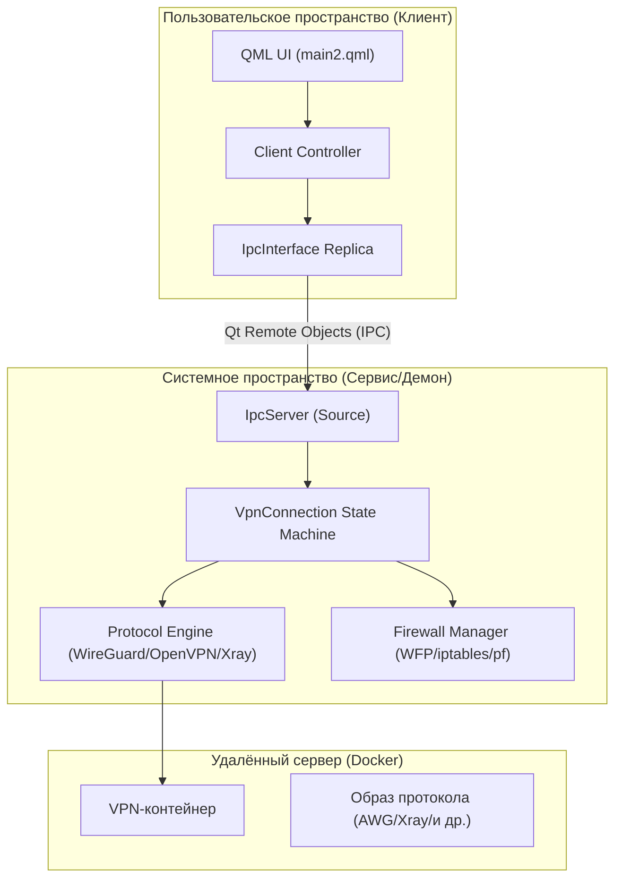
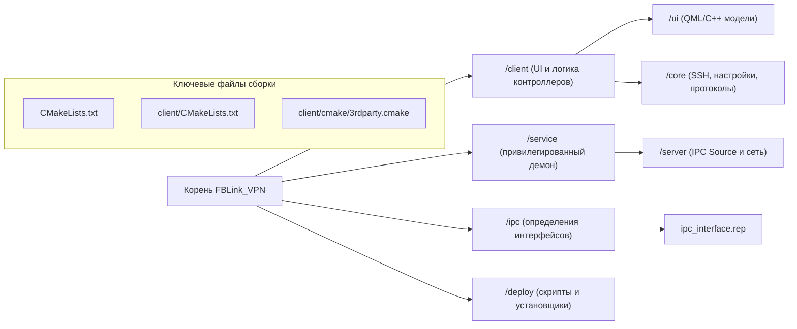

# FBLink VPN — Обзор проекта

Соответствующие исходные файлы

Следующие файлы были использованы в качестве контекста для создания этой wiki-страницы:

- [.gitpod.Dockerfile](.gitpod.Dockerfile)
- [.gitpod.yml](.gitpod.yml)
- [CMakeLists.txt](CMakeLists.txt)
- [README.md](README.md)
- [README_RU.md](README_RU.md)
- [client/CMakeLists.txt](client/CMakeLists.txt)
- [client/android/build.gradle](client/android/build.gradle)
- [client/cmake/3rdparty.cmake](client/cmake/3rdparty.cmake)
- [client/core/sshclient.cpp](client/core/sshclient.cpp)
- [client/core/sshclient.h](client/core/sshclient.h)
- [client/ui/models/languageModel.cpp](client/ui/models/languageModel.cpp)
- [client/ui/models/languageModel.h](client/ui/models/languageModel.h)
- [deploy/install_ios_deps.sh](deploy/install_ios_deps.sh)
- [deploy/verify_windows_runtime.ps1](deploy/verify_windows_runtime.ps1)
- [service/CMakeLists.txt](service/CMakeLists.txt)
- [service/common.cmake](service/common.cmake)
- [service/server/CMakeLists.txt](service/server/CMakeLists.txt)
- [service/src/qtservice.cmake](service/src/qtservice.cmake)

FBLink VPN — это кроссплатформенное VPN-решение с открытым исходным кодом, предназначенное для самостоятельного размещения. Оно позволяет пользователям развёртывать собственную VPN-инфраструктуру на удалённых серверах по SSH, используя Docker-контейнеры для управления различными VPN-протоколами. Проект построен на фреймворке Qt6 и использует разделённую архитектуру: непривилегированный клиентский интерфейс и привилегированный фоновый сервис для управления сетевыми задачами на системном уровне.

### Основная философия
- **Самостоятельное размещение**: Пользователи предоставляют собственный сервер (VPS), а приложение автоматизирует развёртывание VPN-протоколов с помощью Docker [README.md:32-32]().
- **Разнообразие протоколов**: Поддержка стандартных протоколов (OpenVPN, WireGuard, IKEv2) и обфусцированных протоколов (AmneziaWG, Xray, Shadowsocks, Cloak) для обхода цензуры [README.md:33-34]().
- **Безопасность через изоляцию**: Сетевая логика инкапсулирована в привилегированном сервисе, а пользовательский интерфейс работает в пользовательском пространстве, взаимодействуя через межпроцессное взаимодействие (IPC).

---

## Архитектура верхнего уровня

Система разделена на три основных слоя: **Клиентское приложение**, **Привилегированный сервис** и **Удалённый VPN-бэкенд**.

### Диаграмма системных компонентов

Следующая диаграмма иллюстрирует взаимосвязь между основными программными сущностями и их роли в жизненном цикле подключения.

**Источники:** [client/CMakeLists.txt:100-103](), [service/server/CMakeLists.txt:88-90](), [README.md:32-34]()

---

## Основные подсистемы

### 1. Разделение клиент-сервис
Для управления системными ресурсами, такими как таблицы маршрутизации и TUN-интерфейсы, FBLink VPN использует привилегированный сервис. В Windows это системная служба; в Linux/macOS — демон. Клиент и сервис взаимодействуют через **Qt Remote Objects**, определённые в `.rep`-файлах [client/CMakeLists.txt:101-102]().

- **Клиент**: Управляет взаимодействием с пользователем, управлением серверами и хранением конфигурации.
- **Сервис**: Управляет жизненным циклом VPN-туннеля, конфигурацией DNS и функцией «Kill Switch».

Подробнее о структуре и ключевых терминах см. [Структура репозитория и ключевые концепции](#1.1).

### 2. Абстракция протоколов
Кодовая база рассматривает VPN-протоколы как взаимозаменяемые модули. Будь то `WireGuard`, `OpenVPN` или `Xray` — каждый протокол реализует общий интерфейс, управляемый конечным автоматом `VpnConnection`.
- **Десктоп/Linux**: Протоколы обычно управляются процессом `service`.
- **Мобильные платформы (Android/iOS)**: Протоколы реализованы с использованием нативных платформенных API (например, Android `VpnService` или iOS `PacketTunnelProvider`) [CMakeLists.txt:23-26]().

### 3. Сборка и развёртывание
Проект использует сложную систему сборки на основе CMake для поддержки Windows, macOS, Linux, Android и iOS [CMakeLists.txt:17-29](). Интегрировано несколько сторонних библиотек, в первую очередь `libssh` для оркестрации удалённых серверов и `OpenSSL` для криптографии [client/cmake/3rdparty.cmake:11-12]().

Инструкции по настройке среды разработки см. в [Начало работы и настройка среды разработки](#1.2).

---

## Технологический стек

| Компонент | Технология |
| :--- | :--- |
| **Фреймворк** | Qt 6.5+ (Core, Quick, Network, RemoteObjects) [client/CMakeLists.txt:11-15]() |
| **Языки** | C++17/20, QML, Go (для мостов Xray/AWG), Kotlin (Android), Swift (iOS) |
| **IPC** | Qt Remote Objects (контракты `.rep`) [client/CMakeLists.txt:101-102]() |
| **Безопасность** | OpenSSL, QtKeychain (безопасное хранилище) [client/cmake/3rdparty.cmake:120-123]() |
| **Оркестрация** | libssh (удалённое управление Docker) [client/core/sshclient.cpp:106-113]() |
| **Система сборки** | CMake, скрипты Python/Bash/Batch для развёртывания |

---

## Карта репозитория (пространство программных сущностей)

Эта диаграмма сопоставляет концепции верхнего уровня с конкретными структурами каталогов и файлами проекта.

**Источники:** [CMakeLists.txt:51-57](), [client/CMakeLists.txt:145-146](), [client/cmake/3rdparty.cmake:1-7]()

---

## Дочерние страницы
- [Структура репозитория и ключевые концепции](#1.1): Подробный обзор структуры каталогов и архитектурных паттернов, используемых на различных платформах.
- [Начало работы и настройка среды разработки](#1.2): Пошаговое руководство по компиляции проекта и настройке среды разработки.
