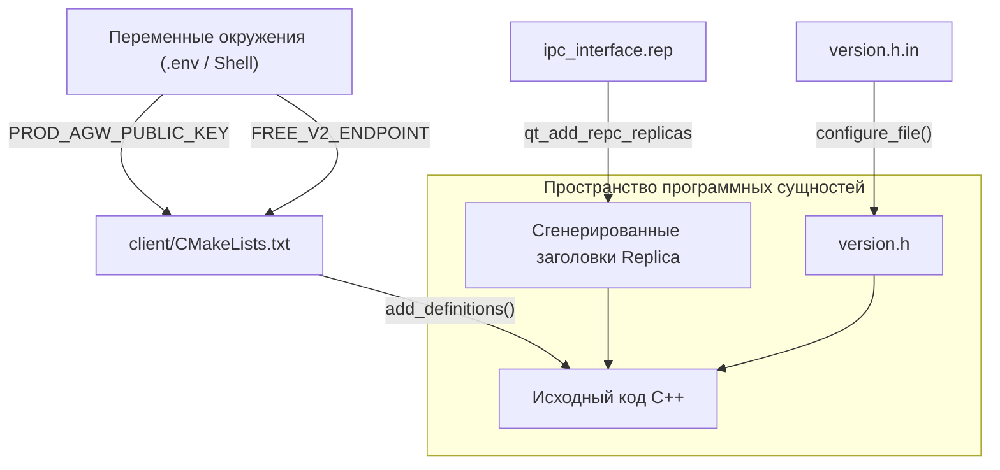
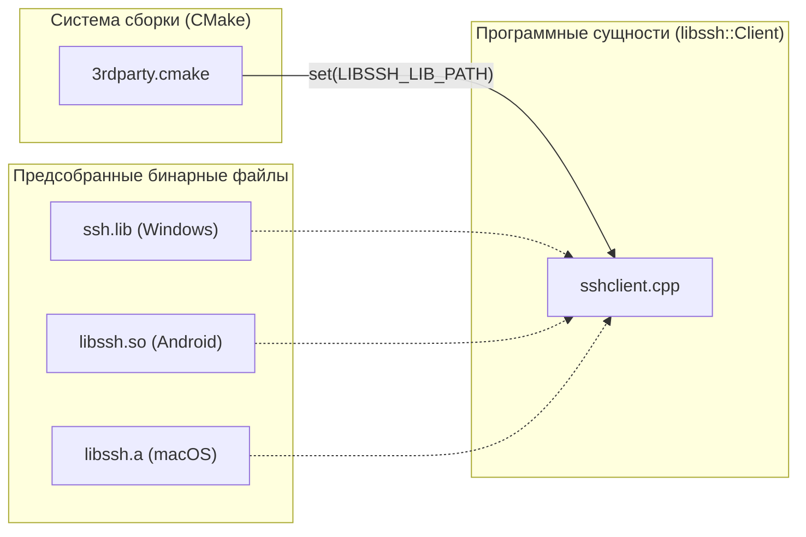

# Начало работы и настройка среды разработки

<details>
<summary>Соответствующие исходные файлы</summary>

Следующие файлы были использованы в качестве контекста для создания этой wiki-страницы:

- [.gitmodules](.gitmodules)
- [.gitpod.Dockerfile](.gitpod.Dockerfile)
- [.gitpod.yml](.gitpod.yml)
- [CMakeLists.txt](CMakeLists.txt)
- [README.md](README.md)
- [client/CMakeLists.txt](client/CMakeLists.txt)
- [client/android/build.gradle](client/android/build.gradle)
- [client/cmake/3rdparty.cmake](client/cmake/3rdparty.cmake)
- [client/cmake/android.cmake](client/cmake/android.cmake)
- [client/cmake/ios.cmake](client/cmake/ios.cmake)
- [client/cmake/macos_ne.cmake](client/cmake/macos_ne.cmake)
- [client/cmake/osxtools.cmake](client/cmake/osxtools.cmake)
- [client/core/sshclient.cpp](client/core/sshclient.cpp)
- [client/core/sshclient.h](client/core/sshclient.h)
- [client/ios/networkextension/CMakeLists.txt](client/ios/networkextension/CMakeLists.txt)
- [client/ios/networkextension/WireGuardNetworkExtension-Bridging-Header.h](client/ios/networkextension/WireGuardNetworkExtension-Bridging-Header.h)
- [client/macos/networkextension/CMakeLists.txt](client/macos/networkextension/CMakeLists.txt)
- [client/macos/networkextension/WireGuardNetworkExtension-Bridging-Header.h](client/macos/networkextension/WireGuardNetworkExtension-Bridging-Header.h)
- [client/platforms/ios/StoreKitController.h](client/platforms/ios/StoreKitController.h)
- [client/platforms/ios/StoreKitController.mm](client/platforms/ios/StoreKitController.mm)
- [client/platforms/ios/WireGuard-Bridging-Header.h](client/platforms/ios/WireGuard-Bridging-Header.h)
- [client/ui/models/languageModel.cpp](client/ui/models/languageModel.cpp)
- [client/ui/models/languageModel.h](client/ui/models/languageModel.h)
- [deploy/install_ios_deps.sh](deploy/install_ios_deps.sh)
- [deploy/verify_windows_runtime.ps1](deploy/verify_windows_runtime.ps1)
- [service/CMakeLists.txt](service/CMakeLists.txt)
- [service/common.cmake](service/common.cmake)
- [service/server/CMakeLists.txt](service/server/CMakeLists.txt)
- [service/src/qtservice.cmake](service/src/qtservice.cmake)

</details>


На этой странице приведены технические инструкции по настройке локальной среды разработки, сборке проекта FBLink VPN из исходного кода и пониманию основных зависимостей системы сборки.

## Назначение и область применения

Проект FBLink VPN — это мультиплатформенное C++/Qt-приложение, состоящее из клиентского графического интерфейса и привилегированного фонового сервиса. Данное руководство описывает предварительные требования и шаги настройки, необходимые для сборки обоих компонентов под Windows, Linux, macOS, Android и iOS. В нём подробно рассматривается интеграция сторонних библиотек, таких как `libssh` и `OpenSSL`, а также использование переменных окружения для оркестрации бэкенда.

---

## Обзор системы сборки

Проект использует **CMake** (минимальная версия 3.25.0) в качестве основной системы сборки [CMakeLists.txt:1-1](). Сборка организована в два основных подкаталога:
1.  `client/`: Содержит пользовательский интерфейс на основе QML и логику протоколов [CMakeLists.txt:51-51]().
2.  `service/`: Содержит привилегированный фоновый демон (для десктопных платформ) [CMakeLists.txt:54-54]().

### Основные зависимости

На хосте разработки должно быть установлено следующее программное обеспечение:
*   **Qt 6.6.2+**: Необходимые модули включают `Core`, `Gui`, `Network`, `Quick`, `Svg`, `QuickControls2`, `Concurrent` и `RemoteObjects` [client/CMakeLists.txt:11-15, 47-48]().
*   **Go (v1.16+)**: Требуется для сборки мостов протоколов, таких как `wireguard-go` и `amnezia-xray` [README.md:106-108]().
*   **OpenSSL**: Используется для безопасных коммуникаций и криптографии через `QSimpleCrypto` [client/cmake/3rdparty.cmake:12-15]().
*   **libssh**: Форк библиотеки, используемый для удалённой подготовки серверов по SSH [README.md:58-58]().

### Поток данных: от конфигурации сборки к бинарному файлу

Диаграмма ниже иллюстрирует, как конфигурация CMake и переменные окружения передаются в скомпилированный C++-код.

**Поток данных конфигурации сборки**

*Источники: [client/CMakeLists.txt:32-41](), [client/CMakeLists.txt:101-102](), [client/CMakeLists.txt:168-168]()*

---

## Переменные окружения

Приложение использует несколько переменных окружения, определённых во время сборки, для настройки конечных точек API бэкенда и публичных ключей. Они внедряются как определения препроцессора.

| Переменная | Описание | Источник |
| :--- | :--- | :--- |
| `PROD_AGW_PUBLIC_KEY` | Публичный ключ для продуктового API Gateway | [client/CMakeLists.txt:32]() |
| `PROD_S3_ENDPOINT` | Конечная точка продуктового S3-хранилища | [client/CMakeLists.txt:33]() |
| `DEV_AGW_ENDPOINT` | Конечная точка API Gateway для разработки | [client/CMakeLists.txt:36]() |
| `FREE_V2_ENDPOINT` | Конечная точка API для бесплатного тарифа | [client/CMakeLists.txt:39]() |
| `PREM_V1_ENDPOINT` | Конечная точка API для премиум-тарифа | [client/CMakeLists.txt:40]() |

---

## Интеграция сторонних библиотек

FBLink VPN использует предсобранные бинарные файлы для сложных зависимостей для обеспечения кроссплатформенной совместимости. Они управляются в подмодуле `client/3rd-prebuilt` [.gitmodules:7-10]().

### OpenSSL и libssh
Файл `client/cmake/3rdparty.cmake` обрабатывает привязку путей для этих библиотек в зависимости от целевой ОС и архитектуры. Например, в Windows с MSVC он ищет `.lib`-файлы, а на Android — нацеливается на конкретную `${CMAKE_ANDROID_ARCH_ABI}` [client/cmake/3rdparty.cmake:16-35, 76-83]().

### Бинарные файлы, специфичные для протоколов
Система сборки линкуется со специализированными библиотеками для VPN-протоколов:
*   **WireGuard**: `libwg-go.a` (iOS/macOS) или `libwg-go.so` (Android) [client/ios/networkextension/CMakeLists.txt:146-150](), [client/cmake/android.cmake:52-52]().
*   **Xray**: `libhev-socks5-tunnel.a` и `libxray.aar` [client/ios/networkextension/CMakeLists.txt:154-154](), [client/cmake/android.cmake:64-65]().

**Архитектура привязки библиотек**

*Источники: [client/cmake/3rdparty.cmake:11-91](), [client/core/sshclient.cpp:106-121]()*

---

## Платформенно-специфичная настройка

### Android
*   **Min SDK**: 30 [client/cmake/android.cmake:6-6]().
*   **Target SDK**: 36 [client/cmake/android.cmake:17-17]().
*   **Требования**: Необходим `Qt6::CorePrivate` для реализации `QAndroidBinder` и `-ljnigraphics` для рендеринга UI [client/cmake/android.cmake:28-31]().

### iOS
*   **Минимальная версия**: iOS 13.0 [client/cmake/ios.cmake:2-2]().
*   **Network Extension**: Сборка генерирует отдельный таргет `networkextension`, который упаковывается как `.appex` [client/ios/networkextension/CMakeLists.txt:5-9]().
*   **Режим симулятора**: Существует специальный флаг `IOS_SIMULATOR_UI_ONLY` для обхода требований `libssh` и `wireguard` при тестировании UI на симуляторах ARM64/x86_64 [client/cmake/3rdparty.cmake:51-60]().

### Windows
*   **Сервис**: `FBLink-service` собирается как отдельный исполняемый файл для обработки привилегированных операций, таких как маршрутизация и управление брандмауэром [service/server/CMakeLists.txt:3-4]().
*   **Среда выполнения**: Предоставляется PowerShell-скрипт `deploy/verify_windows_runtime.ps1` для проверки наличия зависимостей VCRT.

---

## Запуск в режиме разработки

### Интеграция с Gitpod
Репозиторий включает `.gitpod.yml` и `.gitpod.Dockerfile` для облачной разработки. Эта среда поставляется с предварительно настроенным набором инструментов C++ и зависимостями Qt 6.

### Локальный запуск
1.  **Инициализация подмодулей**:
    ```bash
    git submodule update --init --recursive
    ```
    *Источник: [README.md:66-67]()*

2.  **Конфигурация и сборка**:
    Используйте `qt-cmake` для обеспечения доступности правильных Qt-специфичных макросов CMake.
    ```bash
    mkdir build && cd build
    qt-cmake .. -DCMAKE_BUILD_TYPE=Debug
    cmake --build .
    ```

3.  **Определения отладки**:
    Компиляция в режиме `Debug` автоматически включает макрос препроцессора `MZ_DEBUG`, который активирует расширенное логирование в классе `Logger` [client/CMakeLists.txt:170-172]().

### Обработка парольной фразы SSH
При разработке, если используются SSH-ключи с парольными фразами, класс `libssh::Client` использует механизм обратного вызова `m_passphraseCallback` для получения учётных данных из UI [client/core/sshclient.cpp:97-104]().

---
**Источники:**
*   `CMakeLists.txt:1-91`
*   `client/CMakeLists.txt:1-172`
*   `client/cmake/3rdparty.cmake:1-162`
*   `client/cmake/android.cmake:1-66`
*   `client/cmake/ios.cmake:1-151`
*   `client/ios/networkextension/CMakeLists.txt:1-156`
*   `client/core/sshclient.cpp:1-204`
*   `README.md:1-143`

---
