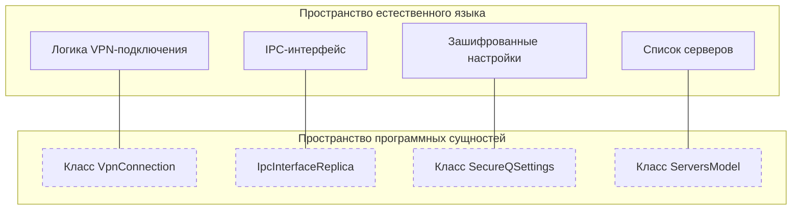

# Глоссарий

<details>
<summary>Соответствующие исходные файлы</summary>

Следующие файлы были использованы в качестве контекста для создания этой wiki-страницы:

- [.github/workflows/deploy.yml](.github/workflows/deploy.yml)
- [CMakeLists.txt](CMakeLists.txt)
- [client/android/build.gradle](client/android/build.gradle)
- [client/android/res/mipmap-hdpi/ic_banner.png](client/android/res/mipmap-hdpi/ic_banner.png)
- [client/android/res/mipmap-mdpi/ic_banner.png](client/android/res/mipmap-mdpi/ic_banner.png)
- [client/android/res/mipmap-xhdpi/ic_banner.png](client/android/res/mipmap-xhdpi/ic_banner.png)
- [client/android/src/com/fblink/vpn/VpnProto.kt](client/android/src/com/fblink/vpn/VpnProto.kt)
- [client/containers/containers_defs.cpp](client/containers/containers_defs.cpp)
- [client/containers/containers_defs.h](client/containers/containers_defs.h)
- [client/core/controllers/serverController.cpp](client/core/controllers/serverController.cpp)
- [client/core/controllers/serverController.h](client/core/controllers/serverController.h)
- [client/core/defs.h](client/core/defs.h)
- [client/core/errorstrings.cpp](client/core/errorstrings.cpp)
- [client/core/ipcclient.cpp](client/core/ipcclient.cpp)
- [client/core/ipcclient.h](client/core/ipcclient.h)
- [client/core/scripts_registry.cpp](client/core/scripts_registry.cpp)
- [client/core/scripts_registry.h](client/core/scripts_registry.h)
- [client/main.cpp](client/main.cpp)
- [client/platforms/ios/Log.swift](client/platforms/ios/Log.swift)
- [client/platforms/ios/LogRecord.swift](client/platforms/ios/LogRecord.swift)
- [client/platforms/ios/NELogController.swift](client/platforms/ios/NELogController.swift)
- [client/platforms/ios/PacketTunnelProvider+OpenVPN.swift](client/platforms/ios/PacketTunnelProvider+OpenVPN.swift)
- [client/platforms/ios/PacketTunnelProvider+WireGuard.swift](client/platforms/ios/PacketTunnelProvider+WireGuard.swift)
- [client/platforms/ios/PacketTunnelProvider+Xray.swift](client/platforms/ios/PacketTunnelProvider+Xray.swift)
- [client/platforms/ios/PacketTunnelProvider.swift](client/platforms/ios/PacketTunnelProvider.swift)
- [client/platforms/ios/WGConfig.swift](client/platforms/ios/WGConfig.swift)
- [client/platforms/ios/ios_controller.h](client/platforms/ios/ios_controller.h)
- [client/platforms/ios/ios_controller.mm](client/platforms/ios/ios_controller.mm)
- [client/protocols/openvpnprotocol.cpp](client/protocols/openvpnprotocol.cpp)
- [client/protocols/openvpnprotocol.h](client/protocols/openvpnprotocol.h)
- [client/protocols/protocols_defs.cpp](client/protocols/protocols_defs.cpp)
- [client/protocols/protocols_defs.h](client/protocols/protocols_defs.h)
- [client/protocols/xrayprotocol.cpp](client/protocols/xrayprotocol.cpp)
- [client/protocols/xrayprotocol.h](client/protocols/xrayprotocol.h)
- [client/secure_qsettings.cpp](client/secure_qsettings.cpp)
- [client/secure_qsettings.h](client/secure_qsettings.h)
- [client/server_scripts/check_server_is_busy.sh](client/server_scripts/check_server_is_busy.sh)
- [client/server_scripts/check_user_in_sudo.sh](client/server_scripts/check_user_in_sudo.sh)
- [client/server_scripts/install_docker.sh](client/server_scripts/install_docker.sh)
- [client/settings.cpp](client/settings.cpp)
- [client/settings.h](client/settings.h)
- [client/ui/controllers/api/fblink_controller.cpp](client/ui/controllers/api/fblink_controller.cpp)
- [client/ui/controllers/api/fblink_controller.h](client/ui/controllers/api/fblink_controller.h)
- [client/ui/controllers/settingsController.cpp](client/ui/controllers/settingsController.cpp)
- [client/ui/controllers/settingsController.h](client/ui/controllers/settingsController.h)
- [client/ui/models/containers_model.cpp](client/ui/models/containers_model.cpp)
- [client/ui/models/containers_model.h](client/ui/models/containers_model.h)
- [client/ui/models/protocols_model.cpp](client/ui/models/protocols_model.cpp)
- [client/ui/models/protocols_model.h](client/ui/models/protocols_model.h)
- [client/ui/models/servers_model.cpp](client/ui/models/servers_model.cpp)
- [client/ui/models/servers_model.h](client/ui/models/servers_model.h)
- [client/ui/qml/Components/PremiumBadge.qml](client/ui/qml/Components/PremiumBadge.qml)
- [client/ui/qml/Components/ServersListView.qml](client/ui/qml/Components/ServersListView.qml)
- [client/ui/qml/Pages2/PageDeinstalling.qml](client/ui/qml/Pages2/PageDeinstalling.qml)
- [client/ui/qml/Pages2/PageHome.qml](client/ui/qml/Pages2/PageHome.qml)
- [client/ui/qml/Pages2/PageSettingsServersList.qml](client/ui/qml/Pages2/PageSettingsServersList.qml)
- [client/ui/qml/Pages2/PageSetupWizardInstalling.qml](client/ui/qml/Pages2/PageSetupWizardInstalling.qml)
- [client/vpnconnection.cpp](client/vpnconnection.cpp)
- [client/vpnconnection.h](client/vpnconnection.h)
- [deploy/build_android.sh](deploy/build_android.sh)
- [deploy/build_linux.sh](deploy/build_linux.sh)
- [deploy/build_macos.sh](deploy/build_macos.sh)
- [ipc/ipc_interface.rep](ipc/ipc_interface.rep)
- [ipc/ipcserver.cpp](ipc/ipcserver.cpp)
- [ipc/ipcserver.h](ipc/ipcserver.h)
- [service/CMakeLists.txt](service/CMakeLists.txt)
- [service/common.cmake](service/common.cmake)
- [service/server/CMakeLists.txt](service/server/CMakeLists.txt)
- [service/server/router.cpp](service/server/router.cpp)
- [service/server/router.h](service/server/router.h)
- [service/server/router_linux.cpp](service/server/router_linux.cpp)
- [service/server/router_linux.h](service/server/router_linux.h)
- [service/server/router_mac.cpp](service/server/router_mac.cpp)
- [service/server/router_mac.h](service/server/router_mac.h)
- [service/server/router_win.cpp](service/server/router_win.cpp)
- [service/server/router_win.h](service/server/router_win.h)
- [service/src/qtservice.cmake](service/src/qtservice.cmake)
- [vpn-backend/admin/index.html](vpn-backend/admin/index.html)
- [vpn-backend/internal/handlers/admin.go](vpn-backend/internal/handlers/admin.go)
- [vpn-backend/internal/handlers/promo_codes.go](vpn-backend/internal/handlers/promo_codes.go)
- [vpn-backend/internal/handlers/vip_features.go](vpn-backend/internal/handlers/vip_features.go)
- [vpn-backend/internal/handlers/vpn.go](vpn-backend/internal/handlers/vpn.go)
- [vpn-backend/internal/handlers/xray_vip.go](vpn-backend/internal/handlers/xray_vip.go)
- [vpn-backend/internal/models/models.go](vpn-backend/internal/models/models.go)
- [vpn-backend/internal/router/router.go](vpn-backend/internal/router/router.go)

</details>


Эта страница предоставляет определения специализированной терминологии, реализаций протоколов и архитектурных концепций, используемых в кодовой базе FBLink VPN.

## Основные архитектурные термины

### Разделение клиент-сервис (Client-Service Split)
Архитектура безопасности, при которой UI-приложение (клиент) работает с привилегиями пользователя, а фоновый процесс (сервис/демон) работает с повышенными привилегиями (Root/SYSTEM) для выполнения сетевых задач, таких как манипуляция маршрутами и настройка файрвола.
*   **Указатель на код:** `client/main.cpp` запускает UI, а `service/server/` содержит привилегированную логику.

### IPC (межпроцессное взаимодействие)
Механизм, используемый клиентом для запроса привилегированных действий у сервиса. FBLink использует **Qt Remote Objects** для определения контракта между процессами.
*   **Указатель на код:** [ipc/ipc_interface.rep:1-50]() определяет API; [client/core/ipcclient.cpp:15-40]() реализует клиентский прокси.

### Контейнер / DockerContainer
Логическая единица, представляющая VPN-протокол или сервис, развёрнутый на сервере. Хотя клиент видит их как «Протоколы», бэкенд управляет ими как Docker-контейнерами.
*   **Указатель на код:** перечисление `fblink::DockerContainer` в [client/containers/containers_defs.h:10-40]().

### Безопасный режим (Safe Mode)
Клиентское состояние, активируемое после повторяющихся неудач подключения. Оно предотвращает вход приложения в «цикл переподключения», который может исчерпать системные ресурсы или аккумулятор.
*   **Реализация:** [client/vpnconnection.cpp:44-55]() определяет пороги (`kSafeModeFailureThreshold`).

---

## Определения протоколов

### AWG / AmneziaWG
Форк WireGuard с добавленными заголовками обфускации (`Jc`, `Jmin`, `Jmax`, `S1`, `S2`, `H1-H4`) для обхода глубокой инспекции пакетов (DPI).
*   **Указатель на код:** [client/containers/containers_defs.cpp:31-34]() обрабатывает `DockerContainer::Awg` и `Awg2`.

### Xray / VLESS / REALITY
Сложный прокси-протокол. В FBLink он часто используется совместно с **REALITY** для TLS-маскировки и **tun2socks** для обеспечения системного VPN-интерфейса.
*   **Указатель на код:** [client/protocols/xrayprotocol.cpp:10-100]() управляет процессом Xray и генерацией конфигурации.

### Cloak
Подключаемый транспорт, маскирующий трафик под легитимный HTTPS веб-трафик (обычно имитируя популярный сайт, такой как Google или Bing) для обхода активного зондирования.
*   **Указатель на код:** [client/containers/containers_defs.cpp:123-125]().

---

## Поток данных и сопоставление пространства сущностей

Следующая диаграмма сопоставляет высокоуровневые системные концепции с конкретными классами и файлами, их реализующими.

**Сопоставление системных концепций с программными сущностями**

**Источники:** [client/vpnconnection.h:27-120](), [ipc/ipc_interface.rep:1-30](), [client/secure_qsettings.cpp:1-50](), [client/ui/models/servers_model.h:10-60]().

---

## Доменные концепции

| Термин | Определение | Деталь реализации |
| :--- | :--- | :--- |
| **Kill Switch** | Предотвращает утечку трафика при разрыве VPN. | Управляется через `refreshKillSwitch` в [client/vpnconnection.cpp:125-136](). |
| **Раздельное туннелирование (Split Tunneling)** | Маршрутизация только определённых приложений или сайтов через VPN. | Обрабатывается `SitesController` и `AppSplitTunnelingModel`. |
| **VpnService (Android)** | Базовый Android-класс для VPN-приложений. | Наследуется в `FBLinkService` (сторона Kotlin/Java). |
| **Network Extension** | Фреймворк iOS/macOS для VPN. | Реализован в `PacketTunnelProvider` [client/platforms/ios/ios_controller.h:1-20](). |
| **Configurator** | Классы, генерирующие протокольно-специфичные конфигурационные файлы. | Расположены в `client/configurators/` [client/vpnconnection.cpp:23-26](). |

---

## Жизненный цикл подключения

Класс `VpnConnection` выступает центральным координатором машины состояний подключения.

**Переходы состояний VPN-подключения**
```mermaid
stateDiagram-v2
    [*] --> "Disconnected"
    "Disconnected" --> "Preparing" : "connectToVpn()"
    "Preparing" --> "Connecting" : "startNewConnection()"
    "Connecting" --> "Connected" : "onConnectionStateChanged(Connected)"
    "Connecting" --> "Error" : "Watchdog Timeout"
    "Connected" --> "Reconnecting" : "Network Loss"
    "Reconnecting" --> "Connected" : "Recovery Success"
    "Reconnecting" --> "Error" : "kMaxRecoveryAttempts reached"
    "Connected" --> "Disconnecting" : "userRequestedDisconnect"
    "Disconnecting" --> "Disconnected"
    "Error" --> "Disconnected"
```
**Источники:** [client/vpnconnection.cpp:73-114](), [client/vpnconnection.h:90-119]().

---

## Платформенно-специфичная терминология

### Адаптер TAP/TUN
Виртуальные сетевые интерфейсы ядра.
*   **Windows:** Использует драйвер `Wintun` или `TAP-Windows`.
*   **Linux/macOS:** Использует стандартные `tun`-устройства.
*   **Указатель на код:** [service/server/router_win.cpp:1-100]() (Windows-специфичная маршрутизация).

### SCM (Service Control Manager)
Подсистема Windows, отвечающая за управление фоновыми сервисами.
*   **Указатель на код:** [CMakeLists.txt:78-82]() ссылается на WiX-патчи для установки сервиса.

### AAB (Android App Bundle)
Формат публикации для Google Play.
*   **Указатель на код:** [deploy/build_android.sh:15-17]().

---

## Концепции бэкенда и API

### AGW (Amnezia Gateway)
API-шлюз, обрабатывающий клиентские запросы на конфигурацию и аутентификацию.
*   **Указатель на код:** [client/ui/controllers/api/fblink_controller.h:10-50]().

### VpnKey
Уникальный идентификатор или «приглашение», используемое для импорта конфигураций серверов, часто начинающееся со схемы `vpn://`.
*   **Указатель на код:** [client/ui/models/servers_model.cpp:47-54]().

### VIP-функции
Улучшения на основе подписки, такие как **VIP AdBlock** (Pi-hole) и **VIP-профили маршрутизации**.
*   **Указатель на код:** [vpn-backend/internal/handlers/vip_features.go:1-100]().

---
**Источники:** [client/vpnconnection.cpp:1-150](), [client/containers/containers_defs.cpp:1-150](), [client/ui/models/servers_model.cpp:1-170](), [client/main.cpp:1-124](), [deploy/build_android.sh:1-50]().
