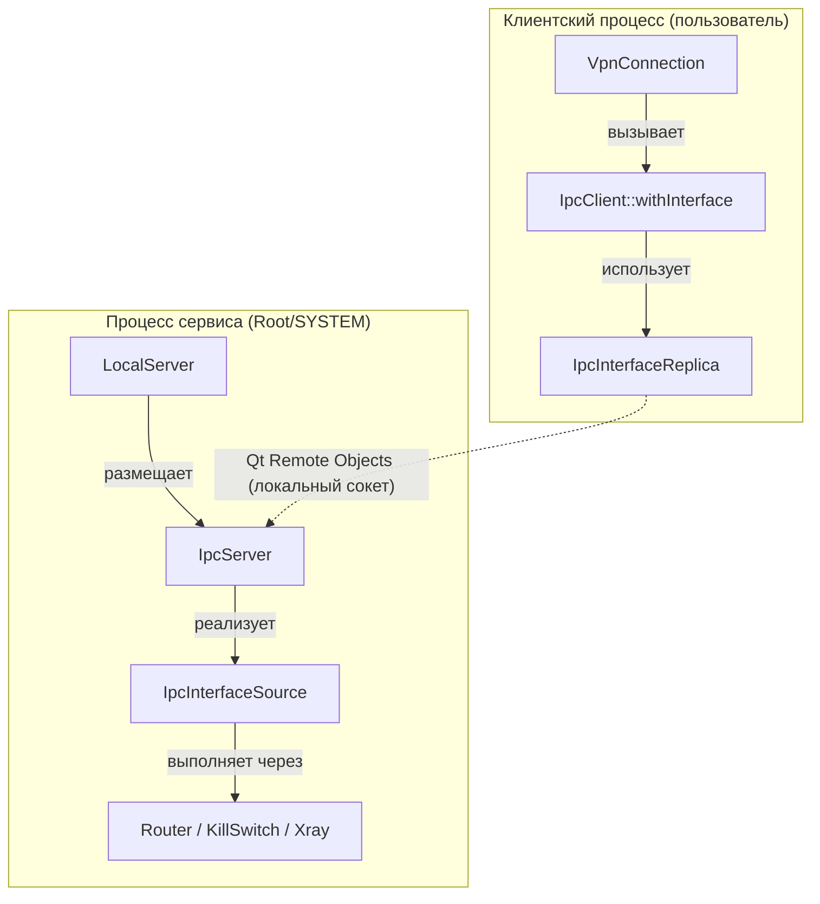
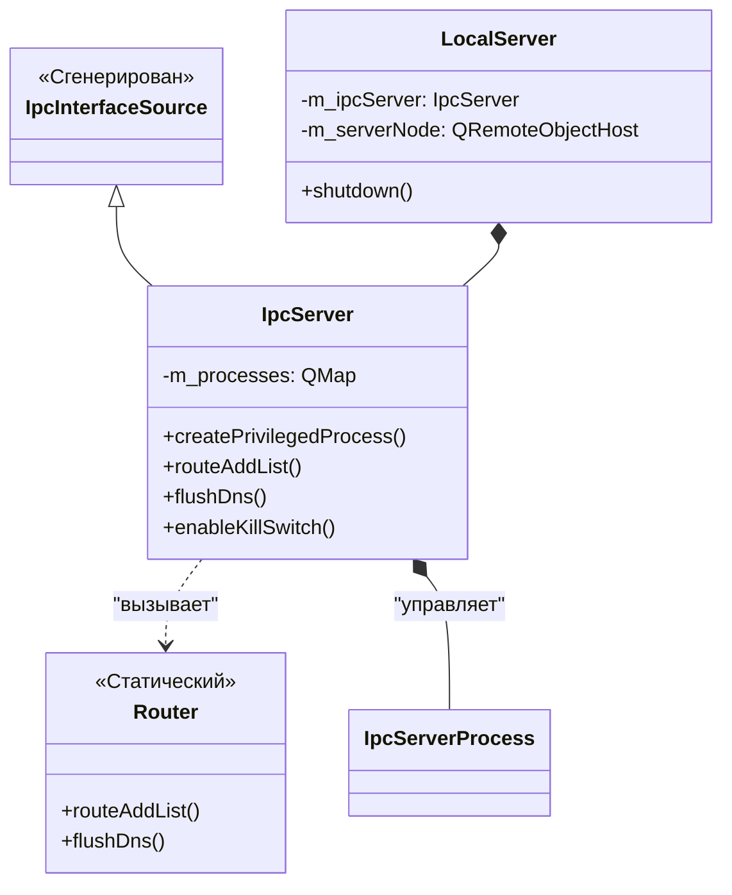
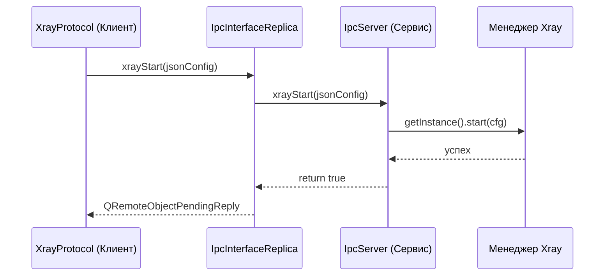

# IPC: Взаимодействие клиент-сервис

<details>
<summary>Соответствующие исходные файлы</summary>

Следующие файлы были использованы в качестве контекста для создания этой wiki-страницы:

- [client/core/ipcclient.cpp](client/core/ipcclient.cpp)
- [client/core/ipcclient.h](client/core/ipcclient.h)
- [client/daemon/daemonlocalserver.cpp](client/daemon/daemonlocalserver.cpp)
- [client/mozilla/shared/ipaddress.cpp](client/mozilla/shared/ipaddress.cpp)
- [client/protocols/openvpnprotocol.cpp](client/protocols/openvpnprotocol.cpp)
- [client/protocols/openvpnprotocol.h](client/protocols/openvpnprotocol.h)
- [client/protocols/wireguardprotocol.cpp](client/protocols/wireguardprotocol.cpp)
- [client/protocols/wireguardprotocol.h](client/protocols/wireguardprotocol.h)
- [client/protocols/xrayprotocol.cpp](client/protocols/xrayprotocol.cpp)
- [client/protocols/xrayprotocol.h](client/protocols/xrayprotocol.h)
- [client/vpnconnection.cpp](client/vpnconnection.cpp)
- [client/vpnconnection.h](client/vpnconnection.h)
- [ipc/ipc.h](ipc/ipc.h)
- [ipc/ipc_interface.rep](ipc/ipc_interface.rep)
- [ipc/ipcserver.cpp](ipc/ipcserver.cpp)
- [ipc/ipcserver.h](ipc/ipcserver.h)
- [ipc/ipcserverprocess.cpp](ipc/ipcserverprocess.cpp)
- [ipc/ipcserverprocess.h](ipc/ipcserverprocess.h)
- [service/server/localserver.cpp](service/server/localserver.cpp)
- [service/server/localserver.h](service/server/localserver.h)
- [service/server/main.cpp](service/server/main.cpp)
- [service/server/router.cpp](service/server/router.cpp)
- [service/server/router.h](service/server/router.h)
- [service/server/router_linux.cpp](service/server/router_linux.cpp)
- [service/server/router_linux.h](service/server/router_linux.h)
- [service/server/router_mac.cpp](service/server/router_mac.cpp)
- [service/server/router_mac.h](service/server/router_mac.h)
- [service/server/router_win.cpp](service/server/router_win.cpp)
- [service/server/router_win.h](service/server/router_win.h)
- [service/server/systemservice.cpp](service/server/systemservice.cpp)
- [service/server/systemservice.h](service/server/systemservice.h)

</details>


FBLink VPN использует архитектуру с разделением: UI-клиент работает с пользовательскими привилегиями, а фоновый сервис (демон) — с административными/root-привилегиями. В этом разделе описывается уровень межпроцессного взаимодействия (IPC), основанный на **Qt Remote Objects (QtRO)**, который позволяет клиенту запрашивать привилегированные операции: модификацию таблицы маршрутизации, правила брандмауэра и управление TUN-интерфейсами.

## Обзор архитектуры

Система IPC определяется контрактом `.rep`, генерирующим классы Source (серверная сторона) и Replica (клиентская сторона). Коммуникация осуществляется через локальные доменные сокеты (Unix-сокеты на Linux/macOS, именованные каналы на Windows).

### Связи между компонентами

Следующая диаграмма иллюстрирует поток от высокоуровневого клиентского запроса до привилегированного выполнения в сервисе.

**Диаграмма: Поток IPC-запросов**

**Источники:** `client/core/ipcclient.h` [1-20](), `ipc/ipcserver.h` [16-20](), `service/server/localserver.cpp` [82-115]()

---

## Контракт IPC (`IpcInterface.rep`)

API взаимодействия определяется в файле шаблона Qt Remote Objects. Этот файл задаёт слоты и сигналы, доступные для удалённого вызова.

| Категория | Ключевые слоты | Описание |
| :--- | :--- | :--- |
| **Маршрутизация** | `routeAddList`, `routeDeleteList`, `clearSavedRoutes` | Управляет записями таблицы маршрутизации ОС. |
| **Сеть** | `flushDns`, `resetIpStack`, `updateResolvers` | Обрабатывает сброс DNS и сброс IP-стека. |
| **Kill Switch** | `enableKillSwitch`, `disableKillSwitch`, `refreshKillSwitch` | Управляет правилами брандмауэра (WFP в Windows, NFTables в Linux, PF в macOS). |
| **TUN/TAP** | `createTun`, `deleteTun`, `checkAndInstallDriver` | Управляет виртуальными сетевыми интерфейсами. |
| **Xray** | `xrayStart`, `xrayStop` | Управляет привилегированным процессом ядра Xray. |
| **Процессы** | `createPrivilegedProcess` | Создаёт специализированный `IpcServerProcess` для определённых задач. |

**Источники:** `ipc/ipcserver.h` [20-49](), `ipc/ipcserver.cpp` [67-101]()

---

## Серверная реализация: `IpcServer`

Класс `IpcServer`, определённый в `ipc/ipcserver.h` [16](), наследуется от `IpcInterfaceSource`. Он выступает в роли диспетчера, принимая вызовы от клиента и делегируя их специализированным серверным модулям.

### Инициализация и подключение
Класс `LocalServer` инициализирует IPC-узел. Он настраивает `QLocalServer` с опцией `WorldAccessOption`, позволяющей клиенту подключаться к пути сокета, определённому `fblink::getIpcServiceUrl()` [service/server/localserver.cpp:85-90]().

### Управление привилегированными процессами
Для некоторых операций, требующих изолированного управления процессами, `IpcServer` может создать `IpcServerProcess`.
- **`createPrivilegedProcess()`**: Увеличивает локальный PID, создаёт новый `QLocalServer` для дочернего процесса и включает удалённый доступ к конкретному экземпляру `IpcServerProcess` [ipc/ipcserver.cpp:31-65]().

**Диаграмма: Сопоставление программных сущностей (серверная сторона)**

**Источники:** `ipc/ipcserver.h` [53-65](), `service/server/localserver.h` [1-30](), `ipc/ipcserver.cpp` [73-101]()

---

## Использование на стороне клиента: `IpcClient`

Клиент взаимодействует с сервисом через синглтон `IpcClient` [client/core/ipcclient.cpp:20-24](). Он управляет `QRemoteObjectNode` и `IpcInterfaceReplica`.

### Безопасное выполнение с `withInterface`
Для обработки перезапусков сервиса или разрывов соединения клиент использует шаблонную вспомогательную функцию `withInterface`.
- Она пытается получить реплику [client/core/ipcclient.h:24-26]().
- Если реплика недействительна или источник отсутствует, вызывается `reconnect()` [client/core/ipcclient.h:28-31]().
- Предоставленная лямбда выполняется только при наличии работающего соединения.

### Пример: Обновление Kill Switch
Когда пользователь переключает Kill Switch в UI, `VpnConnection` выполняет IPC-вызов:
```cpp
IpcClient::withInterface([enabled](QSharedPointer<IpcInterfaceReplica> iface){
    QRemoteObjectPendingReply<bool> reply = iface->refreshKillSwitch(enabled);
    reply.waitForFinished(1500);
});
```
[client/vpnconnection.cpp:128-134]()

---

## Критические рабочие процессы IPC

### 1. Управление жизненным циклом подключения
При переходах состояния VPN `VpnConnection` запускает множественные IPC-вызовы для подготовки среды ОС:
- **При подключении**: Вызывает `resetIpStack()` (для протоколов, отличных от Xray) и `flushDns()` [client/vpnconnection.cpp:161-170]().
- **При отключении**: Вызывает `flushDns()` и `clearSavedRoutes()` для восстановления системы в исходное состояние [client/vpnconnection.cpp:184-190]().

### 2. Интеграция Xray
Xray требует привилегированного моста, поскольку управляет TUN-интерфейсом и сложной маршрутизацией.
- `XrayProtocol` вызывает `iface->xrayStart(config)` [client/protocols/xrayprotocol.cpp:3-5]().
- На серверной стороне `IpcServer::xrayStart` делегирует вызов синглтону `Xray`, который управляет нижележащим исполняемым файлом [ipc/ipcserver.cpp:307-313]().

### 3. Восстановление сети в Windows
В Windows сервис отслеживает события пробуждения системы. При возобновлении работы `LocalServer` запускает последовательность восстановления через IPC и внутренние вызовы `Router` для исправления устаревших маршрутов или настроек DNS, которые могли быть нарушены во время спящего режима [service/server/localserver.cpp:125-142]().

**Диаграмма: Взаимодействие компонентов (запуск Xray)**

**Источники:** `client/protocols/xrayprotocol.cpp` [1-20](), `ipc/ipcserver.cpp` [307-313](), `service/server/localserver.cpp` [45-78]()

---

## Сводка потока данных

| Действие | Инициатор | Метод IPC | Реализация в сервисе |
| :--- | :--- | :--- | :--- |
| **Добавление маршрута** | `VpnConnection` | `routeAddList` | `Router::routeAddList` [ipc/ipcserver.cpp:73]() |
| **Сброс DNS** | `VpnConnection` | `flushDns` | `Router::flushDns` [ipc/ipcserver.cpp:100]() |
| **Запуск Xray** | `XrayProtocol` | `xrayStart` | `Xray::start` [ipc/ipcserver.cpp:313]() |
| **Kill Switch** | `VpnConnection` | `refreshKillSwitch` | `KillSwitch::refresh` [ipc/ipcserver.cpp:304]() |
| **Установка TAP** | `OpenVpnProtocol`| `checkAndInstallDriver` | `TapController::checkAndSetup` [ipc/ipcserver.cpp:119]() |

**Источники:** `client/vpnconnection.cpp` [128-180](), `client/protocols/openvpnprotocol.cpp` [72-90](), `ipc/ipcserver.cpp` [67-313]()

---
