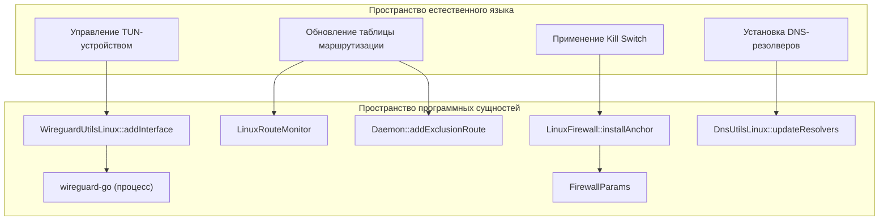
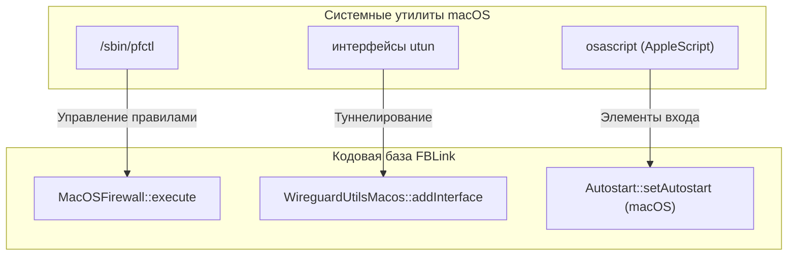

# Демон Linux и macOS

Соответствующие исходные файлы

Следующие файлы были использованы в качестве контекста для создания этой wiki-страницы:

- [client/daemon/daemon.cpp](client/daemon/daemon.cpp)
- [client/daemon/interfaceconfig.cpp](client/daemon/interfaceconfig.cpp)
- [client/daemon/interfaceconfig.h](client/daemon/interfaceconfig.h)
- [client/mozilla/localsocketcontroller.cpp](client/mozilla/localsocketcontroller.cpp)
- [client/platforms/linux/daemon/dbustypeslinux.h](client/platforms/linux/daemon/dbustypeslinux.h)
- [client/platforms/linux/daemon/dnsutilslinux.cpp](client/platforms/linux/daemon/dnsutilslinux.cpp)
- [client/platforms/linux/daemon/dnsutilslinux.h](client/platforms/linux/daemon/dnsutilslinux.h)
- [client/platforms/linux/daemon/iputilslinux.cpp](client/platforms/linux/daemon/iputilslinux.cpp)
- [client/platforms/linux/daemon/iputilslinux.h](client/platforms/linux/daemon/iputilslinux.h)
- [client/platforms/linux/daemon/linuxdaemon.cpp](client/platforms/linux/daemon/linuxdaemon.cpp)
- [client/platforms/linux/daemon/linuxfirewall.cpp](client/platforms/linux/daemon/linuxfirewall.cpp)
- [client/platforms/linux/daemon/linuxfirewall.h](client/platforms/linux/daemon/linuxfirewall.h)
- [client/platforms/linux/daemon/wireguardutilslinux.cpp](client/platforms/linux/daemon/wireguardutilslinux.cpp)
- [client/platforms/linux/daemon/wireguardutilslinux.h](client/platforms/linux/daemon/wireguardutilslinux.h)
- [client/platforms/linux/linuxdependencies.cpp](client/platforms/linux/linuxdependencies.cpp)
- [client/platforms/macos/daemon/iputilsmacos.cpp](client/platforms/macos/daemon/iputilsmacos.cpp)
- [client/platforms/macos/daemon/macosfirewall.cpp](client/platforms/macos/daemon/macosfirewall.cpp)
- [client/platforms/macos/daemon/macosfirewall.h](client/platforms/macos/daemon/macosfirewall.h)
- [client/platforms/macos/daemon/macosroutemonitor.cpp](client/platforms/macos/daemon/macosroutemonitor.cpp)
- [client/platforms/macos/daemon/wireguardutilsmacos.cpp](client/platforms/macos/daemon/wireguardutilsmacos.cpp)
- [client/platforms/windows/daemon/windowsroutemonitor.cpp](client/platforms/windows/daemon/windowsroutemonitor.cpp)
- [client/platforms/windows/daemon/wireguardutilswindows.cpp](client/platforms/windows/daemon/wireguardutilswindows.cpp)
- [client/ui/qautostart.cpp](client/ui/qautostart.cpp)
- [deploy/data/macos/pf/amn.000.allowLoopback.conf](deploy/data/macos/pf/amn.000.allowLoopback.conf)
- [deploy/data/macos/pf/amn.100.blockAll.conf](deploy/data/macos/pf/amn.100.blockAll.conf)
- [deploy/data/macos/pf/amn.110.allowNets.conf](deploy/data/macos/pf/amn.110.allowNets.conf)

Демоны Linux и macOS обеспечивают привилегированную среду выполнения системного уровня, необходимую для управления сетевыми интерфейсами, таблицами маршрутизации и правилами файрвола. В отличие от Windows-реализации, использующей выделенную Windows-службу, версии Linux и macOS используют общий базовый класс `Daemon` и взаимодействуют с клиентом через локальный Unix-доменный сокет.

## Общая архитектура демона

Класс `Daemon` служит центральным контроллером привилегированных операций на не-мобильных платформах. Он управляет жизненным циклом VPN-интерфейса, конфигурацией маршрутизации и разрешением DNS.

### Ключевые классы и обязанности
*   **`Daemon`**: Синглтон-контроллер, координирующий `WireguardUtils`, `IPUtils` и `DNSUtils` [client/daemon/daemon.cpp:29-48]().
*   **`LocalSocketController`**: Обрабатывает IPC-подключение между непривилегированным клиентом и привилегированным демоном через Unix-сокет по адресу `/var/run/fblink/daemon.socket` (или `/tmp/fblink.socket` как запасной вариант) [client/mozilla/localsocketcontroller.cpp:106-110]().
*   **`InterfaceConfig`**: Структура данных, содержащая полную криптографическую и сетевую конфигурацию туннеля (закрытые ключи, конечные точки пиров, параметры обфускации) [client/daemon/interfaceconfig.h:16-64]().

### Поток данных активации
Когда клиент запрашивает подключение, метод `Daemon::activate` следует этой последовательности:
1.  **Создание интерфейса**: Вызывает `wgutils()->addInterface(config)` для инициализации туннеля WireGuard/AmneziaWG [client/daemon/daemon.cpp:134-144]().
2.  **Конфигурация IP**: Использует `iputils()` для назначения IPv4/IPv6-адресов и установки MTU [client/daemon/daemon.cpp:148-156]().
3.  **Настройка пира**: Вызывает `wgutils()->updatePeer(config)` для установки публичного ключа и конечной точки удалённого сервера [client/daemon/daemon.cpp:164-173]().
4.  **Обновление DNS**: Вызывает `dnsutils()->updateResolvers()` для перенаправления системы на VPN DNS [client/daemon/daemon.cpp:203-229]().
5.  **Маршрутизация**: Перебирает `m_allowedIPAddressRanges` для применения записей таблицы маршрутизации через `wgutils()->updateRoutePrefix()` [client/daemon/daemon.cpp:183-190]().

**Источники:** [client/daemon/daemon.cpp:56-201](), [client/mozilla/localsocketcontroller.cpp:100-114](), [client/daemon/interfaceconfig.h:16-64]()

---

## Реализация Linux

Демон Linux опирается на стандартные средства ядра (`ip-route`, `iptables`/`nftables`) и пользовательскую реализацию WireGuard.

### WireGuard и управление интерфейсом
`WireguardUtilsLinux` управляет процессом `wireguard-go`. Он поддерживает обфускацию AmneziaWG путём передачи магических заголовков и параметров мусорных пакетов (Jc, Jmin, Jmax, S1-S4, H1-H4) через WireGuard UAPI (Userspace API) [client/platforms/linux/daemon/wireguardutilslinux.cpp:109-141]().

### Файрвол Linux (iptables)
Класс `LinuxFirewall` управляет Kill Switch и раздельным туннелированием. Он организует правила в «якоря» (пользовательские цепочки) для обеспечения приоритета правил FBLink над системными правилами.

| Таблица | Цепочка | Назначение |
| :--- | :--- | :--- |
| `filter` | `amn.anchors` | Корневая цепочка, связанная с `OUTPUT` для блокировки утечек [client/platforms/linux/daemon/linuxfirewall.cpp:58-80](). |
| `mangle` | `PREROUTING` | Используется для маркировки пакетов и разделения трафика [client/platforms/linux/daemon/linuxfirewall.cpp:62](). |
| `nat` | `POSTROUTING` | Обрабатывает маскарадинг при необходимости [client/platforms/linux/daemon/linuxfirewall.cpp:60](). |

### Карта программных сущностей Linux
Следующая диаграмма связывает высокоуровневые сетевые задачи Linux с конкретными классами и методами, их реализующими.

«Карта сетевого пространства Linux и программных сущностей»

**Источники:** [client/platforms/linux/daemon/wireguardutilslinux.cpp:61-100](), [client/platforms/linux/daemon/linuxfirewall.cpp:70-116](), [client/platforms/linux/daemon/linuxfirewall.h:42-65]()

---

## Реализация macOS

Демон macOS использует `pf` (Packet Filter) для файрвола и устройства `utun` для VPN-туннеля.

### Файрвол macOS (pf)
`MacOSFirewall` управляет утилитой `pfctl`. Он использует систему на основе токенов для включения/отключения файрвола без конфликтов с другими системными правилами [client/platforms/macos/daemon/macosfirewall.cpp:134]().

*   **Якоря**: Правила загружаются из файлов `.conf`, расположенных в `/Library/Application Support/FBLink/pf` [client/platforms/macos/daemon/macosfirewall.cpp:55]().
*   **Приоритет**: `ensureRootAnchorPriority()` обеспечивает расположение якоря `amn` в конце набора правил для поддержания приоритета по последнему совпадению [client/platforms/macos/daemon/macosfirewall.cpp:157-162]().

### WireGuard на macOS
`WireguardUtilsMacos` повторяет Linux-реализацию, но ориентирован на семейство интерфейсов `utun` [client/platforms/macos/daemon/wireguardutilsmacos.cpp:81](). Он также отслеживает таблицу маршрутизации через `MacosRouteMonitor` [client/platforms/macos/daemon/wireguardutilsmacos.cpp:98]().

### Карта программных сущностей macOS
Следующая диаграмма связывает системные утилиты macOS с кодовой базой FBLink.

«Карта системного пространства macOS и программных сущностей»

**Источники:** [client/platforms/macos/daemon/macosfirewall.cpp:72-89](), [client/platforms/macos/daemon/wireguardutilsmacos.cpp:60-98](), [client/ui/qautostart.cpp:61-90]()

---

## Сравнение логики файрволов

Обе платформы используют структуру `FirewallParams` для передачи требований от `Daemon` к платформенно-специфичному классу файрвола.

| Функция | Linux (`LinuxFirewall`) | macOS (`MacOSFirewall`) |
| :--- | :--- | :--- |
| **Бэкенд** | `iptables` / `ip6tables` | `pfctl` |
| **Блокировка по умолчанию** | Якорь `amn.a.blockAll` | `amn.100.blockAll.conf` |
| **Исключения** | `allowNets` через `updateAllowNets` | `amn.110.allowNets.conf` |
| **Утечки DNS** | `getDNSRules` для конкретных IP | Перенаправление на основе якорей |

**Источники:** [client/platforms/linux/daemon/linuxfirewall.h:42-65](), [client/platforms/macos/daemon/macosfirewall.h:41-66](), [client/platforms/linux/daemon/linuxfirewall.cpp:135-150]()

---
