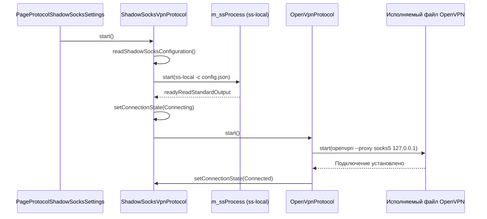
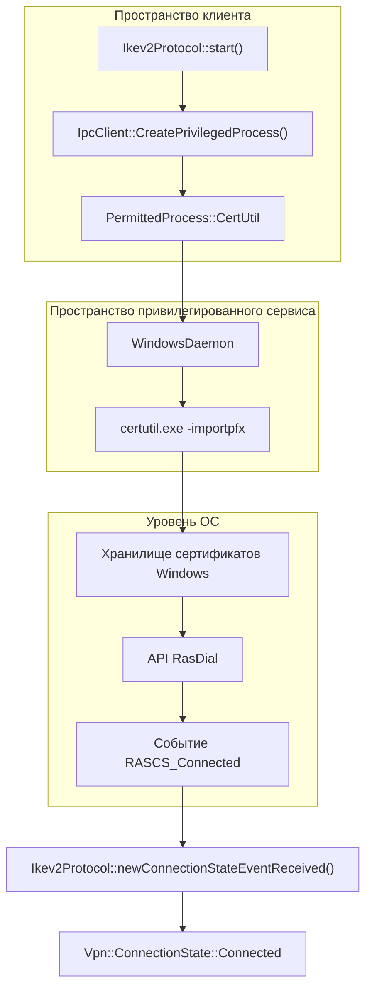

# OpenVPN, ShadowSocks, Cloak и IKEv2

Соответствующие исходные файлы

Следующие файлы были использованы в качестве контекста для создания этой wiki-страницы:

- [client/configurators/awg_configurator.cpp](client/configurators/awg_configurator.cpp)
- [client/configurators/awg_configurator.h](client/configurators/awg_configurator.h)
- [client/configurators/cloak_configurator.cpp](client/configurators/cloak_configurator.cpp)
- [client/configurators/cloak_configurator.h](client/configurators/cloak_configurator.h)
- [client/configurators/configurator_base.h](client/configurators/configurator_base.h)
- [client/configurators/ikev2_configurator.cpp](client/configurators/ikev2_configurator.cpp)
- [client/configurators/ikev2_configurator.h](client/configurators/ikev2_configurator.h)
- [client/configurators/openvpn_configurator.cpp](client/configurators/openvpn_configurator.cpp)
- [client/configurators/openvpn_configurator.h](client/configurators/openvpn_configurator.h)
- [client/configurators/shadowsocks_configurator.cpp](client/configurators/shadowsocks_configurator.cpp)
- [client/configurators/shadowsocks_configurator.h](client/configurators/shadowsocks_configurator.h)
- [client/configurators/ssh_configurator.cpp](client/configurators/ssh_configurator.cpp)
- [client/configurators/wireguard_configurator.cpp](client/configurators/wireguard_configurator.cpp)
- [client/configurators/wireguard_configurator.h](client/configurators/wireguard_configurator.h)
- [client/core/controllers/vpnConfigurationController.cpp](client/core/controllers/vpnConfigurationController.cpp)
- [client/core/controllers/vpnConfigurationController.h](client/core/controllers/vpnConfigurationController.h)
- [client/protocols/ikev2_vpn_protocol_windows.cpp](client/protocols/ikev2_vpn_protocol_windows.cpp)
- [client/protocols/openvpnovercloakprotocol.cpp](client/protocols/openvpnovercloakprotocol.cpp)
- [client/protocols/openvpnovercloakprotocol.h](client/protocols/openvpnovercloakprotocol.h)
- [client/protocols/shadowsocksvpnprotocol.cpp](client/protocols/shadowsocksvpnprotocol.cpp)
- [client/protocols/shadowsocksvpnprotocol.h](client/protocols/shadowsocksvpnprotocol.h)
- [client/server_scripts/build_container.sh](client/server_scripts/build_container.sh)
- [client/server_scripts/ipsec/configure_container.sh](client/server_scripts/ipsec/configure_container.sh)
- [client/server_scripts/ipsec/mobileconfig.plist](client/server_scripts/ipsec/mobileconfig.plist)
- [client/server_scripts/ipsec/strongswan.profile](client/server_scripts/ipsec/strongswan.profile)
- [client/server_scripts/openvpn/Dockerfile](client/server_scripts/openvpn/Dockerfile)
- [client/server_scripts/openvpn/configure_container.sh](client/server_scripts/openvpn/configure_container.sh)
- [client/server_scripts/openvpn/template.ovpn](client/server_scripts/openvpn/template.ovpn)
- [client/server_scripts/openvpn_cloak/Dockerfile](client/server_scripts/openvpn_cloak/Dockerfile)
- [client/server_scripts/openvpn_cloak/configure_container.sh](client/server_scripts/openvpn_cloak/configure_container.sh)
- [client/server_scripts/openvpn_cloak/template.ovpn](client/server_scripts/openvpn_cloak/template.ovpn)
- [client/server_scripts/openvpn_shadowsocks/Dockerfile](client/server_scripts/openvpn_shadowsocks/Dockerfile)
- [client/server_scripts/openvpn_shadowsocks/configure_container.sh](client/server_scripts/openvpn_shadowsocks/configure_container.sh)
- [client/server_scripts/openvpn_shadowsocks/template.ovpn](client/server_scripts/openvpn_shadowsocks/template.ovpn)
- [client/server_scripts/wireguard/Dockerfile](client/server_scripts/wireguard/Dockerfile)
- [client/ui/qml/Pages2/PageProtocolCloakSettings.qml](client/ui/qml/Pages2/PageProtocolCloakSettings.qml)
- [client/ui/qml/Pages2/PageProtocolOpenVpnSettings.qml](client/ui/qml/Pages2/PageProtocolOpenVpnSettings.qml)
- [client/ui/qml/Pages2/PageProtocolRaw.qml](client/ui/qml/Pages2/PageProtocolRaw.qml)
- [client/ui/qml/Pages2/PageProtocolShadowSocksSettings.qml](client/ui/qml/Pages2/PageProtocolShadowSocksSettings.qml)
- [client/ui/qml/Pages2/PageServiceDnsSettings.qml](client/ui/qml/Pages2/PageServiceDnsSettings.qml)
- [client/ui/qml/Pages2/PageServiceSftpSettings.qml](client/ui/qml/Pages2/PageServiceSftpSettings.qml)
- [client/ui/qml/Pages2/PageServiceTorWebsiteSettings.qml](client/ui/qml/Pages2/PageServiceTorWebsiteSettings.qml)
- [client/ui/qml/Pages2/PageSettingsServerProtocol.qml](client/ui/qml/Pages2/PageSettingsServerProtocol.qml)
- [client/ui/qml/Pages2/PageSetupWizardProtocolSettings.qml](client/ui/qml/Pages2/PageSetupWizardProtocolSettings.qml)

В этом разделе описана реализация традиционных и обфусцированных VPN-протоколов в FBLink VPN. Рассматриваются жизненный цикл управления OpenVPN, интеграция ShadowSocks и Cloak в качестве транспортных слоёв, нативная реализация IKEv2 для Windows и стратегия контейнеризации на стороне сервера.

## Реализация OpenVPN

OpenVPN в FBLink VPN управляется через специализированный конфигуратор, обрабатывающий генерацию сертификатов и конфигурацию на основе шаблонов.

### Конфигурация и провизионирование
Класс `OpenVpnConfigurator` отвечает за генерацию клиентских сертификатов и финализацию конфигураций `.ovpn`. Он использует OpenSSL для создания запросов сертификатов локально перед их загрузкой на сервер для подписания.

*   **Запрос сертификата**: `createCertRequest` генерирует новый ключ RSA и CSR [client/configurators/openvpn_configurator.cpp:37]().
*   **Удалённое подписание**: CSR загружается в контейнер по пути `fblink::protocols::openvpn::clientsDirPath` [client/configurators/openvpn_configurator.cpp:45-47](). Затем конфигуратор выполняет `signCert` на удалённом сервере [client/configurators/openvpn_configurator.cpp:52]().
*   **Подстановка в шаблон**: Конфигуратор получает шаблон из `ProtocolScriptType::openvpn_template` и заменяет переменные: `$OPENVPN_CA_CERT`, `$OPENVPN_CLIENT_CERT` и `$OPENVPN_PRIV_KEY` [client/configurators/openvpn_configurator.cpp:78-106]().

### DNS и платформенные настройки
Конфигуратор динамически модифицирует конфигурацию OpenVPN в зависимости от целевой ОС:
*   **Windows**: Сохраняет `block-outside-dns` [client/configurators/openvpn_configurator.cpp:115-117]().
*   **Linux/macOS**: Внедряет скрипты `update-resolv-conf.sh` для обработки изменений состояния DNS [client/configurators/openvpn_configurator.cpp:154-161]().

**Источники:**
- `client/configurators/openvpn_configurator.cpp`
- `client/server_scripts/openvpn/template.ovpn`

---

## Обфускация ShadowSocks и Cloak

FBLink VPN поддерживает ShadowSocks и Cloak в качестве слоёв обфускации, обычно оборачивающих OpenVPN-трафик для обхода глубокой инспекции пакетов (DPI).

### Слой ShadowSocks
Класс `ShadowSocksVpnProtocol` наследуется от `OpenVpnProtocol`. Он управляет локальным процессом `ss-local`, создающим SOCKS5-прокси, который затем используется процессом OpenVPN в качестве транспорта [client/protocols/shadowsocksvpnprotocol.cpp:11-12]().

*   **Управление процессом**: Он находит исполняемый файл через `shadowSocksExecPath()` [client/protocols/shadowsocksvpnprotocol.cpp:108-115]() и запускает его с сгенерированной JSON-конфигурацией [client/protocols/shadowsocksvpnprotocol.cpp:44-53]().
*   **Жизненный цикл**: При запуске VPN сначала запускается `ss-local`; после его запуска инициируется логика подключения OpenVPN [client/protocols/shadowsocksvpnprotocol.cpp:80-86]().

### Слой Cloak
`OpenVpnOverCloakProtocol` предоставляет аналогичную функциональность обёртки с использованием бинарного файла `ck-client`.

*   **Конфигурация**: Считывает настройки, такие как «Маскировка под трафик с сайта» (site) и «Шифр» [client/ui/qml/Pages2/PageProtocolCloakSettings.qml:75-141]().
*   **Выполнение**: Запускает `ck-client` с аргументами `-c` (путь к конфигурации) и `-l` (локальный порт, обычно порт OpenVPN по умолчанию) [client/protocols/openvpnovercloakprotocol.cpp:47-48]().

### UI конфигурации
Настройки этих протоколов управляются через специальные QML-страницы:
*   `PageProtocolShadowSocksSettings.qml`: Настраивает порты и шифры (например, `chacha20-ietf-poly1305`) [client/ui/qml/Pages2/PageProtocolShadowSocksSettings.qml:104-110]().
*   `PageProtocolCloakSettings.qml`: Настраивает домен обхода и метод шифрования [client/ui/qml/Pages2/PageProtocolCloakSettings.qml:67-141]().

**Источники:**
- `client/protocols/shadowsocksvpnprotocol.cpp`
- `client/protocols/openvpnovercloakprotocol.cpp`
- `client/ui/qml/Pages2/PageProtocolShadowSocksSettings.qml`
- `client/ui/qml/Pages2/PageProtocolCloakSettings.qml`

---

## IKEv2 / IPsec (Windows)

Реализация IKEv2 на Windows использует нативный API RAS (Remote Access Service) вместо сторонних бинарных файлов.

### Логика реализации
Класс `Ikev2Protocol` управляет жизненным циклом VPN-подключения в Windows:
1.  **Установка сертификата**: Использует `IpcClient::CreatePrivilegedProcess()` для запуска `CertUtil` и импорта PFX-сертификата сервера в хранилище машины [client/protocols/ikev2_vpn_protocol_windows.cpp:195-216]().
2.  **Управление RAS**: Вызывает `RasDial` (через внутренние обёртки) и отслеживает состояния подключения через `RasDialFuncCallback` [client/protocols/ikev2_vpn_protocol_windows.cpp:22-25]().
3.  **Сопоставление состояний**: Состояния RAS, такие как `RASCS_Authenticate` и `RASCS_Connected`, сопоставляются с внутренним `Vpn::ConnectionState` [client/protocols/ikev2_vpn_protocol_windows.cpp:54-174]().

**Источники:**
- `client/protocols/ikev2_vpn_protocol_windows.cpp`
- `client/configurators/ikev2_configurator.cpp`

---

## Серверная инфраструктура

Каждый протокол развёртывается как Docker-контейнер. Репозиторий содержит Dockerfile'ы и скрипты конфигурации для каждой среды.

### Архитектура контейнеров
| Компонент протокола | Путь к Dockerfile | Скрипт настройки |
| :--- | :--- | :--- |
| **OpenVPN** | `client/server_scripts/openvpn/Dockerfile` | `configure_container.sh` |
| **ShadowSocks** | `client/server_scripts/openvpn_shadowsocks/Dockerfile` | `configure_container.sh` |
| **Cloak** | `client/server_scripts/openvpn_cloak/Dockerfile` | `configure_container.sh` |
| **IKEv2/IPsec** | Н/Д (на базе StrongSwan) | `client/server_scripts/ipsec/configure_container.sh` |

### Поток развёртывания
`ServerController` использует SSH для выполнения `build_container.sh` на удалённом хосте, который загружает соответствующее окружение и запускает скрипт `configure_container.sh` для настройки правил брандмауэра и внутренней маршрутизации внутри контейнера [client/server_scripts/build_container.sh]().

**Источники:**
- `client/server_scripts/openvpn/Dockerfile`
- `client/server_scripts/openvpn_shadowsocks/configure_container.sh`
- `client/server_scripts/ipsec/configure_container.sh`

---

## Диаграммы потоков данных

### Оркестрация протокола (OpenVPN через ShadowSocks)
Эта диаграмма показывает, как `ShadowSocksVpnProtocol` координирует два отдельных процесса для установления безопасного туннеля.

**Источники:**
- `client/protocols/shadowsocksvpnprotocol.cpp:27-92]()`
- `client/ui/qml/Pages2/PageProtocolShadowSocksSettings.qml:154-170]()`

### Провизионирование IKEv2 в Windows
Эта диаграмма связывает концепцию «Установка VPN» с конкретными программными сущностями, задействованными в специфичном для Windows потоке IKEv2.

**Источники:**
- `client/protocols/ikev2_vpn_protocol_windows.cpp:181-216]()`
- `client/protocols/ikev2_vpn_protocol_windows.cpp:54-165]()`

---
