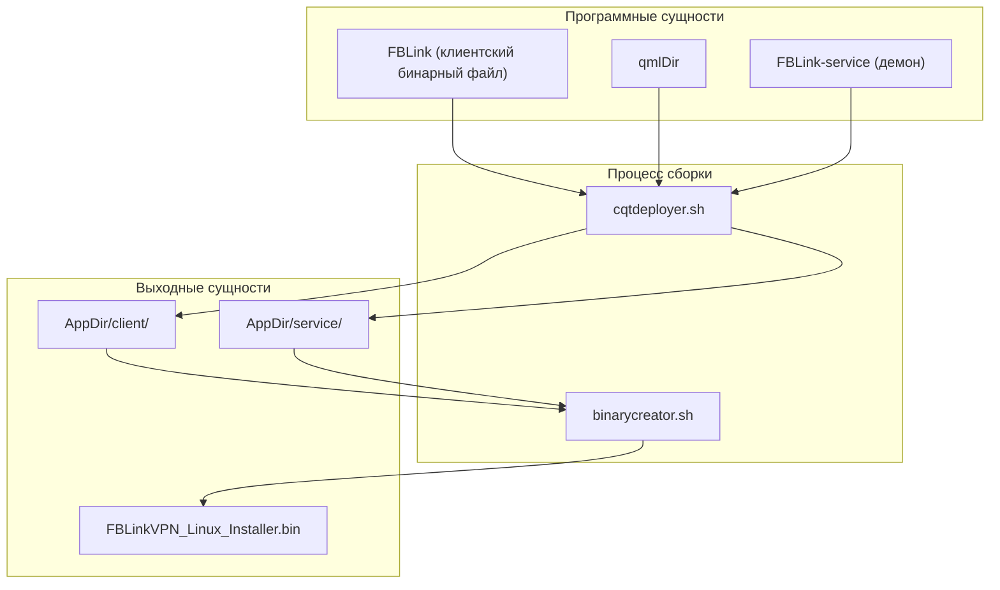
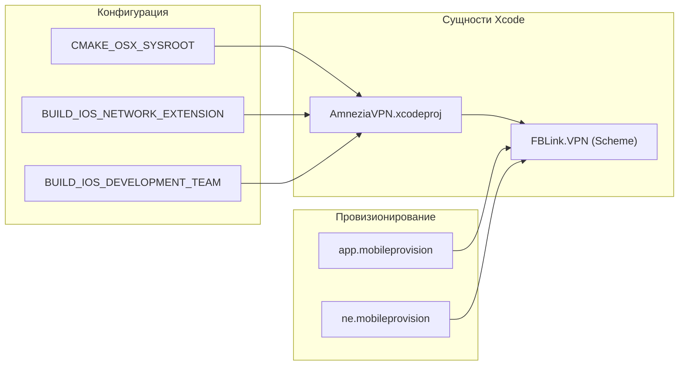

# Платформенные скрипты сборки и упаковка

Соответствующие исходные файлы

Следующие файлы были использованы в качестве контекста для создания этой wiki-страницы:

- [.github/workflows/deploy.yml](.github/workflows/deploy.yml)
- [client/android/res/mipmap-hdpi/ic_banner.png](client/android/res/mipmap-hdpi/ic_banner.png)
- [client/android/res/mipmap-mdpi/ic_banner.png](client/android/res/mipmap-mdpi/ic_banner.png)
- [client/android/res/mipmap-xhdpi/ic_banner.png](client/android/res/mipmap-xhdpi/ic_banner.png)
- [client/android/src/com/fblink/vpn/VpnProto.kt](client/android/src/com/fblink/vpn/VpnProto.kt)
- [client/cmake/ios-arch-fixup.cmake](client/cmake/ios-arch-fixup.cmake)
- [client/cmake/ios-filter-linkfile.cmake](client/cmake/ios-filter-linkfile.cmake)
- [client/platforms/windows/FBLink.rc.in](client/platforms/windows/FBLink.rc.in)
- [deploy/DeveloperIDG2CA.cer](deploy/DeveloperIDG2CA.cer)
- [deploy/build_android.sh](deploy/build_android.sh)
- [deploy/build_ios.sh](deploy/build_ios.sh)
- [deploy/build_ios_sim.sh](deploy/build_ios_sim.sh)
- [deploy/build_linux.sh](deploy/build_linux.sh)
- [deploy/build_macos.sh](deploy/build_macos.sh)
- [deploy/build_macos_ne.sh](deploy/build_macos_ne.sh)
- [deploy/data/linux/FBLink.png](deploy/data/linux/FBLink.png)
- [deploy/data/linux/FBLinkVPN.service](deploy/data/linux/FBLinkVPN.service)
- [deploy/data/linux/client/FBLinkVPN.sh](deploy/data/linux/client/FBLinkVPN.sh)
- [deploy/data/linux/post_install.sh](deploy/data/linux/post_install.sh)
- [deploy/data/linux/post_uninstall.sh](deploy/data/linux/post_uninstall.sh)
- [deploy/data/linux/service/FBLinkVPN-service.sh](deploy/data/linux/service/FBLinkVPN-service.sh)
- [deploy/data/macos/FBLink.plist](deploy/data/macos/FBLink.plist)
- [deploy/data/macos/check_install.sh](deploy/data/macos/check_install.sh)
- [deploy/data/macos/check_uninstall.sh](deploy/data/macos/check_uninstall.sh)
- [deploy/data/macos/distribution.xml](deploy/data/macos/distribution.xml)
- [deploy/data/macos/distribution_uninstall.xml](deploy/data/macos/distribution_uninstall.xml)
- [deploy/data/macos/post_install.sh](deploy/data/macos/post_install.sh)
- [deploy/data/macos/post_uninstall.sh](deploy/data/macos/post_uninstall.sh)
- [deploy/data/macos/uninstall_conclusion.html](deploy/data/macos/uninstall_conclusion.html)
- [deploy/data/macos/uninstall_welcome.html](deploy/data/macos/uninstall_welcome.html)
- [deploy/installer/packages/org.fblinkvpn.package/meta/LICENSE.txt](deploy/installer/packages/org.fblinkvpn.package/meta/LICENSE.txt)
- [deploy/open_ios_xcode.sh](deploy/open_ios_xcode.sh)
- [deploy/run_ios_sim.sh](deploy/run_ios_sim.sh)

Эта страница документирует платформенно-специфичные скрипты сборки и логику упаковки, используемые для создания готовых к продакшну артефактов для Android, macOS, Linux и iOS. Эти скрипты автоматизируют процессы компиляции, развёртывания бинарных файлов, подписания кода и генерации инсталляторов для различных операционных систем.

## Конвейер сборки Android (`build_android.sh`)

Процесс сборки Android обрабатывается скриптом `deploy/build_android.sh`. Он поддерживает генерацию как Android App Bundle (AAB) для распространения через Play Store, так и APK для прямой установки или F-Droid.

### Ключевые особенности
*   **Управление ABI**: Поддержка `x86`, `x86_64`, `armeabi-v7a` и `arm64-v8a` [deploy/build_android.sh:17-18]().
*   **Патчинг пакетов**: Включает Python-утилиту `patch_legacy_awg_package_path`, которая выполняет бинарный патчинг скомпилированных `.so` файлов для замены устаревших имён пакетов (напр., `org.amnezia.vpn`) на идентификатор FBLink (`com.fblink.vpn`) [deploy/build_android.sh:91-143]().
*   **Размещение плагинов Qt**: Управляет ручным размещением отсутствующих платформенных и runtime-плагинов Qt (таких как `qopensslbackend`) в директорию Android `libs` перед Gradle-сборкой [deploy/build_android.sh:179-212]().
*   **TV-вариант**: Включает флаг `--tv` для сборки UI-варианта Android TV [deploy/build_android.sh:26-27]().

### Поток данных: генерация Android-артефактов
1.  **Настройка окружения**: Определяет доступные Android ABI на основе установленного Qt SDK [deploy/build_android.sh:154-177]().
2.  **Инъекция плагинов**: Копирует необходимые разделяемые библиотеки (`.so`) для форматов изображений, TLS и движков иконок из хост-пути Qt в выходную директорию сборки [deploy/build_android.sh:214-250]().
3.  **Бинарный патчинг**: Запускает Python-скрипт для обеспечения соответствия JNI-вызовов текущему имени пакета [deploy/build_android.sh:110-142]().
4.  **Вызов Gradle**: (Подразумевается стандартным потоком Qt Android) запускает финальную компиляцию Java/Kotlin и C++ кода в запрошенный тип артефакта.

**Источники:** [deploy/build_android.sh:1-250]()

---

## Сборка и нотаризация macOS (`build_macos.sh`)

Скрипт сборки macOS обрабатывает сложные требования модели безопасности Apple, включая подписание с Hardened Runtime и нотаризацию.

### Рабочий процесс подписания и нотаризации
Скрипт создаёт временный keychain для хранения сертификатов Developer ID [deploy/build_macos.sh:71-94](). Он использует `macdeployqt` для сборки зависимостей, после чего выполняет следующие шаги:

| Шаг | Команда/Сущность | Назначение |
| :--- | :--- | :--- |
| **Подписание приложения** | `codesign --options runtime` | Подписывает `.app`-бандл с включённым Hardened Runtime [deploy/build_macos.sh:148](). |
| **Включение сервиса** | `FBLink-service` | Копирует привилегированный бинарный файл сервиса в app-бандл [deploy/build_macos.sh:134](). |
| **Создание инсталлятора** | `pkgbuild` | Упаковывает приложение в `.pkg`-инсталлятор [deploy/build_macos.sh:165](). |
| **Нотаризация** | `xcrun notarytool` | (Опционально) Загружает пакет в Apple для проверки безопасности [deploy/build_macos.sh:20](). |

### Логика постустановки
Скрипт `deploy/data/macos/post_install.sh` выполняется macOS Installer. Он:
1.  Мигрирует локализованные установки на стандартные пути [deploy/data/macos/post_install.sh:28-33]().
2.  Очищает устаревшие LaunchDaemon'ы [deploy/data/macos/post_install.sh:53-54]().
3.  Выполняет начальную загрузку `FBLink-service` через `launchctl` [deploy/data/macos/post_install.sh:76-79]().
4.  Обновляет базу данных `LaunchServices` для обновления иконки приложения [deploy/data/macos/post_install.sh:82-86]().

**Источники:** [deploy/build_macos.sh:1-180](), [deploy/data/macos/post_install.sh:1-103]()

---

## Развёртывание Linux (`build_linux.sh`)

Сборка Linux фокусируется на создании портативного `AppDir` и автономного инсталлятора с использованием Qt Installer Framework (QIF).

### Карта сущностей сборки
Следующая диаграмма иллюстрирует, как сущности сборки связаны с финальным Linux-пакетом.

**Архитектура упаковки Linux**

*Источники: [deploy/build_linux.sh:83-84](), [deploy/build_linux.sh:100]()*

### Стратегия развёртывания
*   **CQtDeployer**: Используется для сбора всех необходимых разделяемых библиотек (`.so`) и плагинов Qt в `AppDir` [deploy/build_linux.sh:83-84]().
*   **Интеграция с systemd**: Скрипт `post_install.sh` регистрирует юнит `FBLinkVPN.service`, включая привилегированный демон [deploy/data/linux/post_install.sh:62-79]().
*   **Скрипты-обёртки**: Генерирует shell-обёртки (напр., `FBLinkVPN.sh`) для установки `LD_LIBRARY_PATH` перед запуском бинарного файла [deploy/build_linux.sh:89]().

**Источники:** [deploy/build_linux.sh:1-101](), [deploy/data/linux/post_install.sh:1-160]()

---

## Сборки iOS и симулятора (`build_ios.sh` и `open_ios_xcode.sh`)

Сборки iOS управляются преимущественно через CMake, генерирующий проекты Xcode, со специальной обработкой Network Extension.

### Варианты сборки
1.  **Продакшн-сборка (`build_ios.sh`)**: Выполняет полное архивирование и экспорт IPA. Управляет профилями провизионирования как для основного приложения, так и для Network Extension [deploy/build_ios.sh:74-84]().
2.  **Сборка для симулятора (`build_ios_sim.sh`)**: Специально настроена для архитектур `iphonesimulator` (`arm64` или `x86_64`) и обычно отключает Network Extension (`BUILD_IOS_NETWORK_EXTENSION=OFF`), так как VPN-расширения не могут работать в симуляторе [deploy/build_ios_sim.sh:50-51]().

### Взаимодействие iOS-компонентов
Эта диаграмма сопоставляет конфигурацию сборки iOS с программными сущностями.

**Сопоставление компонентов сборки iOS**

*Источники: [deploy/open_ios_xcode.sh:194-203](), [deploy/build_ios.sh:74-75](), [deploy/build_ios.sh:116]()*

### Автоматизация зависимостей
Скрипт `deploy/open_ios_xcode.sh` автоматизирует установку `gomobile` и инициализацию Go-окружения, необходимого для кросс-компиляции протокольных бэкендов [deploy/open_ios_xcode.sh:149-150]().

**Источники:** [deploy/build_ios.sh:1-156](), [deploy/open_ios_xcode.sh:1-219](), [deploy/build_ios_sim.sh:1-96]()

---

## Интеграция CI/CD (`deploy.yml`)

Рабочий процесс GitHub Actions оркестрирует эти скрипты на нескольких раннерах.

*   **Linux**: Использует `ubuntu-latest`, устанавливает `libsecret-1-dev` и выполняет `build_linux.sh` [.github/workflows/deploy.yml:14-65]().
*   **Windows**: Использует `windows-2022`, обрабатывает импорт PFX-сертификата для подписания кода и использует WiX Toolset для генерации MSI [.github/workflows/deploy.yml:94-196]().
*   **Извлечение версии**: Рабочий процесс динамически извлекает `AMNEZIAVPN_VERSION` из корневого `CMakeLists.txt` для тегирования артефактов [.github/workflows/deploy.yml:53-54]().

**Источники:** [.github/workflows/deploy.yml:1-196]()

---
