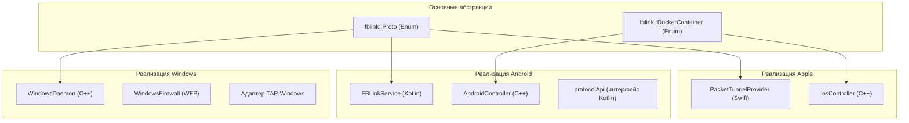
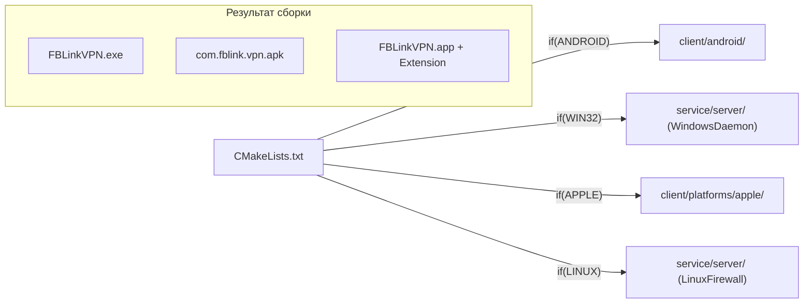

# Платформенно-специфичные реализации

Соответствующие исходные файлы

Следующие файлы были использованы в качестве контекста для создания этой wiki-страницы:

- [CMakeLists.txt](CMakeLists.txt)
- [client/android/build.gradle](client/android/build.gradle)
- [client/containers/containers_defs.cpp](client/containers/containers_defs.cpp)
- [client/containers/containers_defs.h](client/containers/containers_defs.h)
- [client/core/scripts_registry.cpp](client/core/scripts_registry.cpp)
- [client/core/scripts_registry.h](client/core/scripts_registry.h)
- [client/protocols/protocols_defs.cpp](client/protocols/protocols_defs.cpp)
- [client/protocols/protocols_defs.h](client/protocols/protocols_defs.h)
- [client/ui/models/protocols_model.cpp](client/ui/models/protocols_model.cpp)
- [client/ui/models/protocols_model.h](client/ui/models/protocols_model.h)
- [service/CMakeLists.txt](service/CMakeLists.txt)
- [service/common.cmake](service/common.cmake)
- [service/server/CMakeLists.txt](service/server/CMakeLists.txt)
- [service/src/qtservice.cmake](service/src/qtservice.cmake)

Эта страница предоставляет высокоуровневый обзор того, как кодовая база FBLink VPN адаптируется к различным операционным системам. Проект использует кроссплатформенное ядро на базе Qt, делегируя низкоуровневые сетевые задачи (управление TUN/TAP, маршрутизация, правила файрвола) платформенно-специфичным слоям.

Целевая платформа определяется во время сборки через переменную `MZ_PLATFORM_NAME` в корневой конфигурации CMake [CMakeLists.txt:17-29]().

### Обзор сопоставления платформ

Архитектура приложения существенно различается между десктопными и мобильными платформами. Десктопные версии (Windows, Linux, macOS) обычно используют привилегированный фоновый сервис (`service/`) и непривилегированный клиент (`client/`), тогда как мобильные версии (Android, iOS) интегрируют VPN-логику в платформенно-специфичные расширения ОС.

| Платформа | Основной язык | Сетевой слой | Компонент системы сборки |
| :--- | :--- | :--- | :--- |
| **Android** | Kotlin / C++ | `VpnService` | `android.cmake`, Gradle |
| **iOS / macOS** | Swift / C++ | `NetworkExtension` | `ios.cmake`, `macos.cmake` |
| **Windows** | C++ | WFP / WinAPI | Флаги `WIN32` в CMake |
| **Linux** | C++ | iptables / nftables | Флаги `LINUX` в CMake |

---

### Системная архитектура: мост между кодом и платформой

Следующая диаграмма иллюстрирует, как абстрактные системные компоненты (такие как VPN-протоколы и сетевые утилиты) реализуются как конкретные сущности на различных платформах.

**Диаграмма: Сопоставление платформенных сущностей**

**Источники:** [client/protocols/protocols_defs.h:119-211](), [client/containers/containers_defs.h:17-36](), [service/server/CMakeLists.txt:16-30]()

---

### Платформенно-специфичные детали

#### [Платформа Android](#5.1)
Реализация Android опирается на API `VpnService` для перехвата пакетов. Она использует модульную Kotlin-архитектуру, где каждый протокол (AWG, Xray, OpenVPN) реализует общий `protocolApi`. Процесс сборки управляется через `build_android.sh` и специализированные конфигурации Gradle [client/android/build.gradle:1-9]().
*   **Ключевые сущности:** `FBLinkService`, `AndroidController`, `com.fblink.vpn`.
*   **Подробнее см. [Платформа Android](#5.1).**

#### [Платформа iOS и macOS](#5.2)
Платформы Apple используют фреймворк `NetworkExtension`. На iOS и macOS (при включённом `MACOS_NE`) VPN работает внутри `PacketTunnelProvider`. UI взаимодействует с этим расширением через платформенно-специфичный `IosController`.
*   **Ключевые сущности:** `PacketTunnelProvider`, `IosController`, флаг `MACOS_NE`.
*   **Подробнее см. [Платформа iOS и macOS](#5.2).**

#### [Платформа Windows](#5.3)
Реализация Windows включает привилегированный `WindowsDaemon`, управляющий `WindowsFirewall` через WFP (Windows Filtering Platform). Он обрабатывает сложные обновления таблиц маршрутизации и управляет TAP/TUN-адаптерами для протоколов OpenVPN и WireGuard.
*   **Ключевые сущности:** `WindowsDaemon`, `WindowsFirewall`, `WireGuardUtilsWindows`.
*   **Подробнее см. [Платформа Windows](#5.3).**

#### [Демон Linux и macOS](#5.4)
Реализация Linux сосредоточена вокруг каталога `service/`, используя `iptables` или `nftables` для Kill Switch и раздельного туннелирования. Демон macOS (версия без Network Extension) использует `pf` (Packet Filter) для управления файрволом.
*   **Ключевые сущности:** `LinuxFirewall`, `MacOSFirewall`, `iptables`, `pf`.
*   **Подробнее см. [Демон Linux и macOS](#5.4).**

---

### Адаптация системы сборки
Корневой `CMakeLists.txt` управляет этими различиями, условно добавляя подкаталоги и устанавливая архитектурно-специфичные флаги. Например, привилегированный `service` исключается для сборок Android и iOS, так как эти платформы используют абстракции сервисов на уровне ОС [CMakeLists.txt:53-57]().

**Диаграмма: Логика потока сборки**

**Источники:** [CMakeLists.txt:17-29](), [CMakeLists.txt:53-57](), [service/server/CMakeLists.txt:16-30]()

**Источники:**
*   Определение платформы: [CMakeLists.txt:17-29]()
*   Исключение подкаталогов: [CMakeLists.txt:53-57]()
*   Определения контейнеров: [client/containers/containers_defs.h:17-36]()
*   Определения протоколов: [client/protocols/protocols_defs.h:119-211]()
*   Логика сборки сервиса: [service/server/CMakeLists.txt:16-30]()

---
