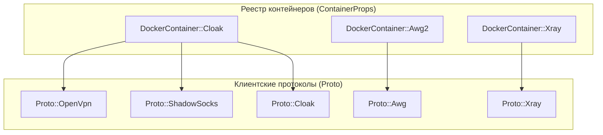
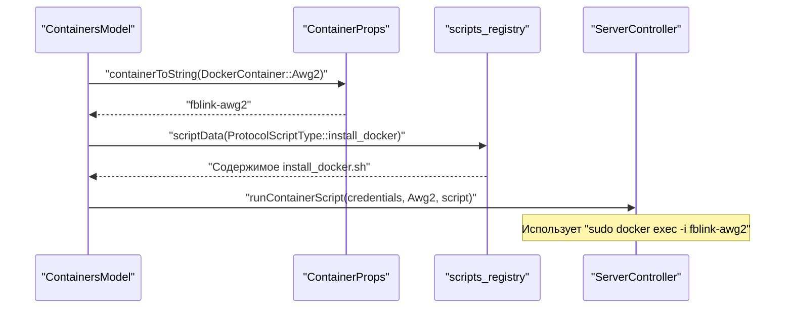
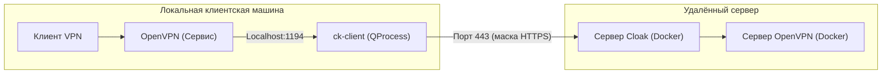

# Абстракция протоколов и реестр контейнеров

Соответствующие исходные файлы

Следующие файлы были использованы в качестве контекста для создания этой wiki-страницы:

- [client/configurators/awg_configurator.cpp](client/configurators/awg_configurator.cpp)
- [client/configurators/awg_configurator.h](client/configurators/awg_configurator.h)
- [client/configurators/cloak_configurator.cpp](client/configurators/cloak_configurator.cpp)
- [client/configurators/cloak_configurator.h](client/configurators/cloak_configurator.h)
- [client/configurators/configurator_base.h](client/configurators/configurator_base.h)
- [client/configurators/ikev2_configurator.cpp](client/configurators/ikev2_configurator.cpp)
- [client/configurators/ikev2_configurator.h](client/configurators/ikev2_configurator.h)
- [client/configurators/openvpn_configurator.cpp](client/configurators/openvpn_configurator.cpp)
- [client/configurators/openvpn_configurator.h](client/configurators/openvpn_configurator.h)
- [client/configurators/shadowsocks_configurator.cpp](client/configurators/shadowsocks_configurator.cpp)
- [client/configurators/shadowsocks_configurator.h](client/configurators/shadowsocks_configurator.h)
- [client/configurators/wireguard_configurator.cpp](client/configurators/wireguard_configurator.cpp)
- [client/configurators/wireguard_configurator.h](client/configurators/wireguard_configurator.h)
- [client/containers/containers_defs.cpp](client/containers/containers_defs.cpp)
- [client/containers/containers_defs.h](client/containers/containers_defs.h)
- [client/core/controllers/serverController.cpp](client/core/controllers/serverController.cpp)
- [client/core/controllers/serverController.h](client/core/controllers/serverController.h)
- [client/core/controllers/vpnConfigurationController.cpp](client/core/controllers/vpnConfigurationController.cpp)
- [client/core/controllers/vpnConfigurationController.h](client/core/controllers/vpnConfigurationController.h)
- [client/core/defs.h](client/core/defs.h)
- [client/core/errorstrings.cpp](client/core/errorstrings.cpp)
- [client/core/scripts_registry.cpp](client/core/scripts_registry.cpp)
- [client/core/scripts_registry.h](client/core/scripts_registry.h)
- [client/protocols/openvpnovercloakprotocol.cpp](client/protocols/openvpnovercloakprotocol.cpp)
- [client/protocols/openvpnovercloakprotocol.h](client/protocols/openvpnovercloakprotocol.h)
- [client/protocols/protocols_defs.cpp](client/protocols/protocols_defs.cpp)
- [client/protocols/protocols_defs.h](client/protocols/protocols_defs.h)
- [client/protocols/shadowsocksvpnprotocol.cpp](client/protocols/shadowsocksvpnprotocol.cpp)
- [client/protocols/shadowsocksvpnprotocol.h](client/protocols/shadowsocksvpnprotocol.h)
- [client/server_scripts/check_server_is_busy.sh](client/server_scripts/check_server_is_busy.sh)
- [client/server_scripts/check_user_in_sudo.sh](client/server_scripts/check_user_in_sudo.sh)
- [client/server_scripts/install_docker.sh](client/server_scripts/install_docker.sh)
- [client/ui/models/protocols_model.cpp](client/ui/models/protocols_model.cpp)
- [client/ui/models/protocols_model.h](client/ui/models/protocols_model.h)

В этом разделе описывается сопоставление между высокоуровневыми VPN-протоколами, серверным развёртыванием на основе Docker и логикой клиентской реализации. Система использует централизованный реестр для управления жизненным циклом различных VPN-технологий, абстрагируя платформенно-специфичные детали от UI и базовой логики подключения.

## Основные перечисления и свойства

Система классифицирует VPN-технологии на два основных уровня: **Docker-контейнеры** (серверные единицы развёртывания) и **Протоколы** (логика клиентской реализации).

### Перечисление DockerContainer
Перечисление `DockerContainer` определяет поддерживаемые серверные среды. Каждый элемент обычно соответствует конкретному Docker-образу или скрипту развёртывания.

| Значение перечисления | Строковый идентификатор | Описание |
|:---|:---|:---|
| `Awg` | `fblink-awg` | Устаревший контейнер AmneziaWG |
| `Awg2` | `fblink-awg2` | Текущий контейнер AmneziaWG |
| `OpenVpn` | `fblink-openvpn` | Стандартное развёртывание OpenVPN |
| `Cloak` | `fblink-openvpn-cloak` | OpenVPN с обфускацией через Cloak |
| `Xray` | `fblink-xray` | Xray/VLESS с REALITY |
| `Ipsec` | `fblink-ipsec` | Развёртывание IKEv2/IPsec |

**Источники:** [client/containers/containers_defs.h:17-35](), [client/containers/containers_defs.cpp:25-39]()

### Перечисление Proto
Перечисление `Proto` определяет конкретный коммуникационный протокол, используемый клиентом. Один `DockerContainer` может поддерживать несколько протоколов (например, контейнер `Cloak` поддерживает `OpenVpn`, `ShadowSocks` и `Cloak`).

**Источники:** [client/protocols/protocols_defs.h:134-180](), [client/containers/containers_defs.cpp:57-84]()

## Логика сопоставления и поток данных

Классы `ContainerProps` и `ProtocolProps` предоставляют статические служебные функции для сопоставления этих перечислений с человекочитаемыми строками, портами по умолчанию и ключами конфигурации.

### Сопоставление контейнеров с протоколами
Функция `ContainerProps::protocolsForContainer` определяет, какие клиентские протоколы совместимы с данным серверным контейнером.

**Источники:** [client/containers/containers_defs.cpp:57-84]()

### Ассоциация программных сущностей: от развёртывания к реализации
Следующая диаграмма иллюстрирует, как выбранный пользователем контейнер в UI разрешается в конкретные программные сущности для развёртывания и подключения.

**Источники:** [client/containers/containers_defs.cpp:25-39](), [client/core/controllers/serverController.cpp:97-115](), [client/core/scripts_registry.cpp:10-50]()

## Серверные скрипты и оркестрация

`scripts_registry` управляет shell-скриптами, используемыми для подготовки серверов и управления контейнерами. Эти скрипты встроены в бинарный файл и извлекаются через `fblink::scriptData`.

### Ключевые скрипты
*   **`install_docker.sh`**: Определяет дистрибутив Linux (`apt`, `dnf`, `yum`, `zypper`, `pacman`) и устанавливает движок Docker. [client/server_scripts/install_docker.sh:1-25]()
*   **`check_user_in_sudo.sh`**: Проверяет, имеет ли SSH-пользователь достаточные привилегии. [client/core/scripts_registry.h:15-30]()
*   **Шаблоны протоколов**: Скрипты вроде `openvpn_template` или `awg_template` используются конфигураторами для генерации клиентских файлов `.ovpn` или `.conf`. [client/configurators/openvpn_configurator.cpp:78-80]()

### Подстановка переменных
`ServerController` выполняет подстановку переменных в скриптах перед их выполнением с помощью `replaceVars`. Общие переменные включают:
*   `$CONTAINER_NAME`: Разрешается через `ContainerProps::containerToString`.
*   `$IP`: IP-адрес сервера.
*   `$PORT`: Порт прослушивания протокола.

**Источники:** [client/core/controllers/serverController.cpp:101-115](), [client/core/controllers/serverController.cpp:135-143]()

## Клиентская реализация протоколов

Протоколы реализованы как классы, наследующиеся от базовой логики протокола (например, `OpenVpnProtocol`).

### Пример реализации: Обфусцированные протоколы
Некоторые протоколы требуют запуска локального прокси-процесса перед установлением VPN-туннеля.

1.  **ShadowSocks**: Запускает `ss-local` как `QProcess` перед инициацией OpenVPN-подключения. [client/protocols/shadowsocksvpnprotocol.cpp:27-92]()
2.  **Cloak**: Запускает `ck-client`, который туннелирует трафик к серверному плагину Cloak, маскируя OpenVPN-трафик под стандартный веб-трафик. [client/protocols/openvpnovercloakprotocol.cpp:23-84]()

**Источники:** [client/protocols/openvpnovercloakprotocol.cpp:47-51](), [client/protocols/protocols_defs.h:134-158]()

## Таблица свойств протоколов

| Протокол | Порт по умолчанию | Транспорт | Класс конфигуратора |
|:---|:---|:---|:---|
| `OpenVpn` | `1194` | UDP | `OpenVpnConfigurator` |
| `WireGuard` | `51820` | UDP | `WireguardConfigurator` |
| `Awg` | `51820` | UDP | `AwgConfigurator` |
| `Xray` | `443` | TCP | `XrayConfigurator` |
| `Sftp` | `222` | TCP | `SftpConfigurator` |

**Источники:** [client/protocols/protocols_defs.cpp:126-145](), [client/protocols/protocols_defs.cpp:168-188](), [client/configurators/wireguard_configurator.cpp:23-38]()

## Обработка ошибок
Реестр также сопоставляет системные сбои с локализованными строками ошибок через `errorString(ErrorCode)`. Распространённые ошибки, связанные с контейнерами:
*   `ErrorCode::ServerContainerMissingError`: Docker-контейнер не запущен на хосте. [client/core/errorstrings.cpp:20-20]()
*   `ErrorCode::ServerDockerFailedError`: Общий сбой движка Docker. [client/core/errorstrings.cpp:21-21]()
*   `ErrorCode::NoInstalledContainersError`: Попытка подключения при отсутствии установленных протоколов. [client/core/errorstrings.cpp:64-64]()

**Источники:** [client/core/errorstrings.cpp:1-87](), [client/core/defs.h:40-135]()

---
