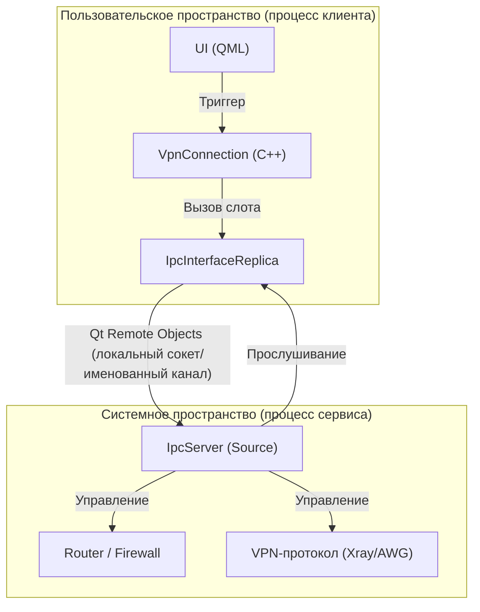
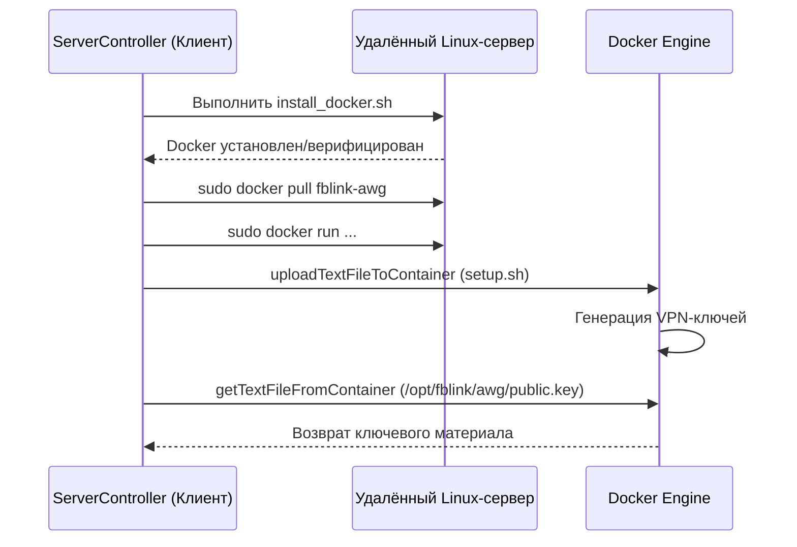

# Структура репозитория и ключевые концепции

Соответствующие исходные файлы

Следующие файлы были использованы в качестве контекста для создания этой wiki-страницы:

- [CMakeLists.txt](CMakeLists.txt)
- [client/CMakeLists.txt](client/CMakeLists.txt)
- [client/android/build.gradle](client/android/build.gradle)
- [client/cmake/3rdparty.cmake](client/cmake/3rdparty.cmake)
- [client/containers/containers_defs.cpp](client/containers/containers_defs.cpp)
- [client/containers/containers_defs.h](client/containers/containers_defs.h)
- [client/core/controllers/serverController.cpp](client/core/controllers/serverController.cpp)
- [client/core/controllers/serverController.h](client/core/controllers/serverController.h)
- [client/core/defs.h](client/core/defs.h)
- [client/core/errorstrings.cpp](client/core/errorstrings.cpp)
- [client/core/scripts_registry.cpp](client/core/scripts_registry.cpp)
- [client/core/scripts_registry.h](client/core/scripts_registry.h)
- [client/core/sshclient.cpp](client/core/sshclient.cpp)
- [client/core/sshclient.h](client/core/sshclient.h)
- [client/protocols/protocols_defs.cpp](client/protocols/protocols_defs.cpp)
- [client/protocols/protocols_defs.h](client/protocols/protocols_defs.h)
- [client/server_scripts/check_server_is_busy.sh](client/server_scripts/check_server_is_busy.sh)
- [client/server_scripts/check_user_in_sudo.sh](client/server_scripts/check_user_in_sudo.sh)
- [client/server_scripts/install_docker.sh](client/server_scripts/install_docker.sh)
- [client/ui/models/languageModel.cpp](client/ui/models/languageModel.cpp)
- [client/ui/models/languageModel.h](client/ui/models/languageModel.h)
- [client/ui/models/protocols_model.cpp](client/ui/models/protocols_model.cpp)
- [client/ui/models/protocols_model.h](client/ui/models/protocols_model.h)
- [deploy/install_ios_deps.sh](deploy/install_ios_deps.sh)
- [deploy/verify_windows_runtime.ps1](deploy/verify_windows_runtime.ps1)
- [service/CMakeLists.txt](service/CMakeLists.txt)
- [service/common.cmake](service/common.cmake)
- [service/server/CMakeLists.txt](service/server/CMakeLists.txt)
- [service/src/qtservice.cmake](service/src/qtservice.cmake)

На этой странице описана организация верхнего уровня кодовой базы FBLink VPN, архитектурное разделение между пользовательским интерфейсом и привилегированным системным сервисом, а также ключевые концепции развёртывания VPN-протоколов через Docker.

## Структура репозитория

Репозиторий организован в виде отдельных подпроектов, разделяющих кроссплатформенный клиентский интерфейс, привилегированный системный сервис и серверную логику развёртывания.

| Каталог | Описание |
| :--- | :--- |
| `client/` | Основное приложение Qt/QML. Содержит логику UI, конфигурации протоколов и SSH-оркестрацию для настройки серверов. |
| `service/` | Привилегированный фоновый сервис (демон). Обрабатывает низкоуровневые системные задачи: маршрутизацию, правила брандмауэра (WFP/IPTables) и управление TUN-интерфейсами. |
| `ipc/` | Определение интерфейсов Qt Remote Objects (`.rep`), используемых для взаимодействия между `client` и `service`. |
| `vpn-backend/` | Go-бэкенд для оркестрации управляемых VPN-узлов. |
| `deploy/` | Скрипты и конфигурационные файлы для сборки установщиков (WiX для Windows, CPack и др.) и конвейеров CI/CD. |

**Источники:** `CMakeLists.txt` [51-57](), `client/CMakeLists.txt` [145-153](), `service/server/CMakeLists.txt` [88-91]()

---

## Архитектура разделения клиент-сервис

FBLink VPN использует развязанную архитектуру, в которой графический интерфейс пользователя (`client`) работает со стандартными пользовательскими привилегиями, а фоновый процесс (`service`) работает с административными/root-привилегиями для выполнения сетевых перенастроек.

### Поток взаимодействия
Два процесса взаимодействуют через **Qt Remote Objects (QtRO)**. `client` выступает в роли Replica (клиентский прокси), а `service` — в роли Source (серверная реализация).

1.  **Определение интерфейса:** Описано в `ipc/ipc_interface.rep`.
2.  **Серверная сторона:** Класс `IpcServer` (наследуемый от `IpcInterfaceSource`) реализует логику слотов, таких как `connectVpn` или `setupRouting`.
3.  **Клиентская сторона:** `client` использует `qt_add_repc_replicas` для генерации прокси-объектов, вызывающих методы на сервисе.

### Диаграмма взаимодействия процессов

Следующая диаграмма иллюстрирует, как запрос на подключение передаётся от UI к системному уровню.

**Источники:** `client/CMakeLists.txt` [100-103](), `service/server/CMakeLists.txt` [88-90](), `ipc/ipcserver.h` [1-20]()

---

## Модель Docker-контейнеров

FBLink VPN использует подход «Контейнеры в первую очередь» для серверного развёртывания. Вместо установки VPN-программ непосредственно в хостовую ОС, развёртываются специализированные Docker-контейнеры. Это обеспечивает изоляцию среды и упрощает процесс удаления.

### Основные сущности
*   **`DockerContainer` (Enum):** Представляет конкретный образ/единицу развёртывания (например, `fblink-awg`, `fblink-xray`).
*   **`Proto` (Enum):** Представляет базовый VPN-протокол (например, `OpenVpn`, `Awg`, `Xray`). Один контейнер может поддерживать несколько протоколов (например, контейнер `Cloak` поддерживает `OpenVpn`, `ShadowSocks` и `Cloak`).

### Таблица сопоставления контейнеров

| Имя контейнера (`DockerContainer`) | Человекочитаемое имя | Поддерживаемые протоколы |
| :--- | :--- | :--- |
| `fblink-awg` | FBLinkWG | `Proto::Awg` |
| `fblink-xray` | XRay | `Proto::Xray` |
| `fblink-openvpn-cloak` | OpenVPN over Cloak | `OpenVpn`, `ShadowSocks`, `Cloak` |
| `fblink-dns` | FBLinkDNS | `Proto::Dns` |

**Источники:** `client/containers/containers_defs.cpp` [25-39](), `client/containers/containers_defs.cpp` [57-84](), `client/containers/containers_defs.cpp` [97-114]()

---

## Подготовка серверов и SSH-оркестрация

`ServerController` отвечает за превращение необработанного Linux-сервера в функциональный VPN-узел. Он использует `libssh` для выполнения команд и передачи файлов.

### Рабочий процесс развёртывания
1.  **Валидация сервера:** Проверка доступа `sudo` и существующих сервисов с помощью `check_user_in_sudo.sh` и `check_server_is_busy.sh`.
2.  **Установка Docker:** Выполнение `install_docker.sh` для установки Docker-движка на различных дистрибутивах (Debian, Fedora, CentOS, Arch).
3.  **Развёртывание контейнера:** Использование `runContainerScript` для выполнения специфичной для протокола настройки внутри целевого контейнера.
4.  **Получение конфигурации:** Использование `getTextFileFromContainer` для извлечения сгенерированных ключей или сертификатов (например, `xray_public.key`) обратно в клиент.

### Диаграмма логики развёртывания

**Источники:** `client/core/controllers/serverController.cpp` [48-95](), `client/core/controllers/serverController.cpp` [97-115](), `client/core/controllers/serverController.cpp` [174-190](), `client/server_scripts/install_docker.sh` [1-25]()

---

## Обработка ошибок и определения

Система использует централизованное перечисление `ErrorCode` для обработки сбоев на уровнях SSH, IPC и VPN-протоколов.

*   **Определение:** `fblink::ErrorCode` в `client/core/defs.h`.
*   **Человекочитаемые строки:** `errorString(ErrorCode code)` в `client/core/errorstrings.cpp` сопоставляет коды с локализованными сообщениями UI.

### Основные категории ошибок
*   **Ошибки сервера (200-214):** `ServerContainerMissingError`, `ServerDockerFailedError`, `DockerPullRateLimit`.
*   **Ошибки SSH (300-305):** `SshTimeoutError`, `SshPrivateKeyFormatError`.
*   **Ошибки API (1100-1113):** `ApiSubscriptionExpiredError`, `ApiConfigDownloadError`.

**Источники:** `client/core/defs.h` [40-135](), `client/core/errorstrings.cpp` [11-84]()
