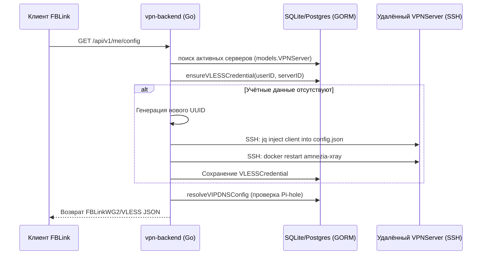
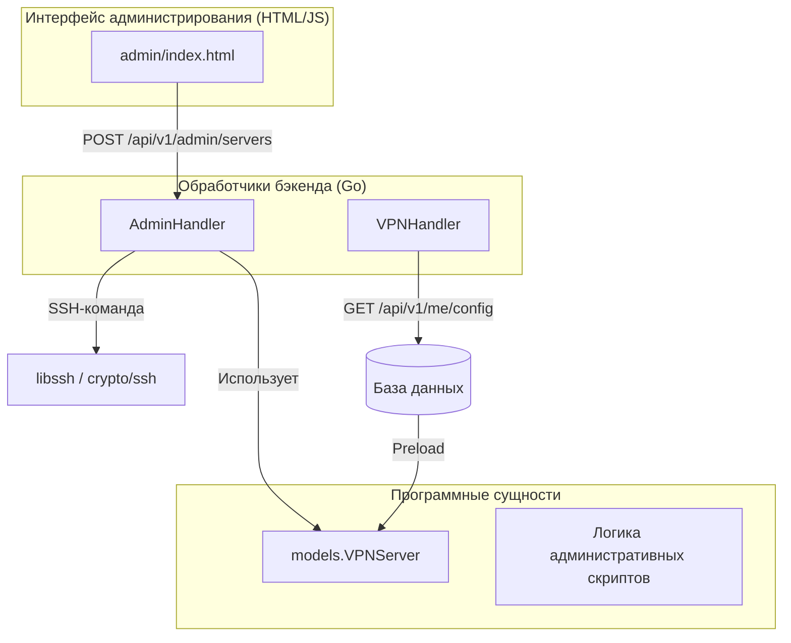

# Провизионирование серверов и SSH-оркестрация

Соответствующие исходные файлы

Следующие файлы были использованы в качестве контекста для создания этой wiki-страницы:

- [client/core/controllers/serverController.cpp](client/core/controllers/serverController.cpp)
- [client/core/controllers/serverController.h](client/core/controllers/serverController.h)
- [client/core/defs.h](client/core/defs.h)
- [client/core/errorstrings.cpp](client/core/errorstrings.cpp)
- [client/core/serialization/transfer.h](client/core/serialization/transfer.h)
- [client/core/serialization/vless.cpp](client/core/serialization/vless.cpp)
- [client/server_scripts/check_server_is_busy.sh](client/server_scripts/check_server_is_busy.sh)
- [client/server_scripts/check_user_in_sudo.sh](client/server_scripts/check_user_in_sudo.sh)
- [client/server_scripts/dns/run_container.sh](client/server_scripts/dns/run_container.sh)
- [client/server_scripts/install_docker.sh](client/server_scripts/install_docker.sh)
- [client/server_scripts/ipsec/run_container.sh](client/server_scripts/ipsec/run_container.sh)
- [client/server_scripts/openvpn/run_container.sh](client/server_scripts/openvpn/run_container.sh)
- [client/server_scripts/openvpn/start.sh](client/server_scripts/openvpn/start.sh)
- [client/server_scripts/openvpn_cloak/run_container.sh](client/server_scripts/openvpn_cloak/run_container.sh)
- [client/server_scripts/openvpn_shadowsocks/run_container.sh](client/server_scripts/openvpn_shadowsocks/run_container.sh)
- [client/server_scripts/prepare_host.sh](client/server_scripts/prepare_host.sh)
- [client/server_scripts/sftp/run_container.sh](client/server_scripts/sftp/run_container.sh)
- [client/server_scripts/wireguard/run_container.sh](client/server_scripts/wireguard/run_container.sh)
- [client/server_scripts/xray/SELFHOSTED_SETUP.md](client/server_scripts/xray/SELFHOSTED_SETUP.md)
- [client/server_scripts/xray/install_selfhosted.sh](client/server_scripts/xray/install_selfhosted.sh)
- [client/server_scripts/xray/template.json](client/server_scripts/xray/template.json)
- [client/ui/controllers/api/fblink_controller.cpp](client/ui/controllers/api/fblink_controller.cpp)
- [client/ui/controllers/api/fblink_controller.h](client/ui/controllers/api/fblink_controller.h)
- [vpn-backend/admin/index.html](vpn-backend/admin/index.html)
- [vpn-backend/internal/handlers/admin.go](vpn-backend/internal/handlers/admin.go)
- [vpn-backend/internal/handlers/promo_codes.go](vpn-backend/internal/handlers/promo_codes.go)
- [vpn-backend/internal/handlers/vip_features.go](vpn-backend/internal/handlers/vip_features.go)
- [vpn-backend/internal/handlers/vpn.go](vpn-backend/internal/handlers/vpn.go)
- [vpn-backend/internal/handlers/xray_bootstrap.go](vpn-backend/internal/handlers/xray_bootstrap.go)
- [vpn-backend/internal/handlers/xray_vip.go](vpn-backend/internal/handlers/xray_vip.go)
- [vpn-backend/internal/models/models.go](vpn-backend/internal/models/models.go)
- [vpn-backend/internal/router/router.go](vpn-backend/internal/router/router.go)

Бэкенд FBLink VPN выступает управляемым оркестратором, автоматизирующим развёртывание и настройку VPN-узлов. Система использует SSH для удалённого выполнения команд на Linux-серверах, управляя жизненным циклом контейнеров, внедряя протокольно-специфичные учётные данные клиентов и начальной настройкой функций безопасности, таких как Pi-hole для VIP-пользователей.

## Модели данных серверов

Бэкенд использует структуры, сопоставленные через GORM, для определения целевых серверов и шаблонов протоколов, используемых при провизионировании.

### VPNServer
Модель `VPNServer` определяет параметры подключения и протокольно-специфичные метаданные для удалённого узла.
- **Подключение**: Хранит `SSHHost`, `SSHPort`, `SSHUser` и `SSHPassword` для оркестрации [vpn-backend/internal/models/models.go:113-116]().
- **Настройки протокола**: Содержит параметры обфускации AmneziaWG (AWG), такие как `Jc`, `Jmin`, `Jmax` и магические заголовки `S1-S4` и `H1-H4` [vpn-backend/internal/models/models.go:95-105]().
- **Управление контейнерами**: Указывает имена целевых Docker-контейнеров для AWG (`AWGContainer`) и Xray (`VLESSTemplate.ContainerName`) [vpn-backend/internal/models/models.go:117,166]().

### VLESSServerTemplate
Эта модель определяет глобальную конфигурацию REALITY для Xray-узла, включая `PublicKey`, `ShortID` и `ServerName` (SNI), используемые для маскировки [vpn-backend/internal/models/models.go:150-167]().

## Поток SSH-оркестрации

Провизионирование запускается через панель администрирования или автоматически при запросах конфигурации пользователем. Бэкенд выполняет команды непосредственно на удалённом хосте для модификации работающих контейнеров.

### Логика управления пирами

| Действие | Функция | Деталь реализации |
| :--- | :--- | :--- |
| **Добавление AWG-пира** | `addAWGPeer` | Внедряет публичные ключи в контейнер AmneziaWG через команды `wg set` [vpn-backend/internal/handlers/vpn.go:138](). |
| **Добавление Xray-клиента** | `addXrayClient` | Внедряет VLESS UUID в `config.json` Xray и перезапускает сервис [vpn-backend/internal/handlers/xray_vip.go:1](). |
| **Начальная настройка Pi-hole** | `BootstrapPiHole` | Настраивает gravity.db и групповую фильтрацию для VIP-пользователей [vpn-backend/internal/handlers/admin.go:216](). |

### Последовательность: Провизионирование VIP VLESS
Следующая диаграмма иллюстрирует, как бэкенд (`vpn-backend`) оркестрирует удалённый сервер (`VPNServer`) при запросе конфигурации VIP-пользователем.

Заголовок: Последовательность провизионирования VIP VLESS

Источники: [vpn-backend/internal/handlers/vpn.go:84-206](), [vpn-backend/internal/models/models.go:169-178](), [vpn-backend/internal/handlers/vip_features.go:54-59]().

## ServerController (клиентская сторона)

В то время как бэкенд обрабатывает коммерческую оркестрацию, клиентское приложение содержит класс `ServerController`, используемый для ручной настройки серверов и self-hosted развёртываний.

### Ключевые функции
- `runScript`: Подключается через `libssh` и выполняет серию shell-команд, обрабатывая переходы `sudo` [client/core/controllers/serverController.cpp:48-95]().
- `runContainerScript`: Загружает временный скрипт в `/opt/fblink/` на хосте, затем выполняет его внутри конкретного Docker-контейнера через `docker exec` [client/core/controllers/serverController.cpp:97-115]().
- `uploadTextFileToContainer`: Использует двухэтапный процесс: `uploadFileToHost` с последующим `docker cp` для обхода ограничений прямого доступа к файловой системе контейнера [client/core/controllers/serverController.cpp:117-172]().

### Реестр скриптов
Система опирается на коллекцию shell-скриптов для подготовки хоста и развёртывания контейнеров:
- `prepare_host.sh`: Устанавливает базовые зависимости.
- `install_docker.sh`: Определяет пакетный менеджер (`apt`, `dnf`, `yum`, `zypper`, `pacman`) и устанавливает Docker-движок [client/server_scripts/install_docker.sh:1-6]().
- `check_user_in_sudo.sh`: Проверяет, имеет ли SSH-пользователь достаточные привилегии [client/core/errorstrings.cpp:23]().

## Панель администрирования

Бэкенд предоставляет веб-интерфейс администрирования (SPA), расположенный в `/admin` [vpn-backend/internal/router/router.go:182]().

### Конечные точки оркестрации
- `POST /api/v1/admin/servers`: Добавляет новый сервер и опционально запускает `BootstrapSelfHostedXray` или `BootstrapPiHole` [vpn-backend/internal/handlers/admin.go:159,213-216]().
- `POST /api/v1/admin/servers/pihole-sync`: Принудительная синхронизация VIP-групп пользователей на удалённом экземпляре Pi-hole [vpn-backend/internal/handlers/admin.go:160]().
- `POST /api/v1/admin/backup/send`: Запуск ручного резервного копирования базы данных с отправкой через SMTP [vpn-backend/internal/handlers/admin.go:31-41]().

Заголовок: Карта оркестрации администрирования

Источники: [vpn-backend/admin/index.html:1-142](), [vpn-backend/internal/handlers/admin.go:71-162](), [vpn-backend/internal/router/router.go:150-174]().

## Обработка ошибок при провизионировании

Система сопоставляет ошибки SSH и удалённого выполнения с конкретными значениями `ErrorCode` для предоставления обратной связи в UI.

| Код ошибки | Описание |
| :--- | :--- |
| `SshTimeoutError` | Не удалось установить подключение в течение таймаута [client/core/defs.h:72](). |
| `ServerUserNotInSudo` | У пользователя нет прав на выполнение команд `docker` или `iptables` [client/core/defs.h:55](). |
| `ServerContainerMissingError` | Целевой контейнер (напр., `amnezia-xray`) не запущен на хосте [client/core/defs.h:52](). |
| `SshPrivateKeyFormatError` | Предоставленный ключ не в формате OpenSSH ED25519 или PEM [client/core/errorstrings.cpp:39](). |

Источники: [client/core/errorstrings.cpp:18-43](), [client/core/defs.h:49-75]().

---
