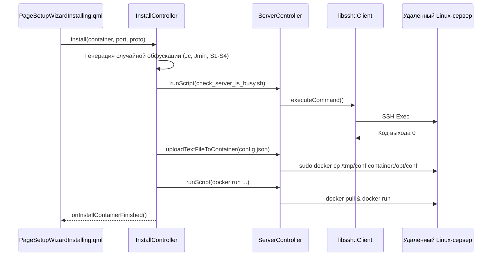
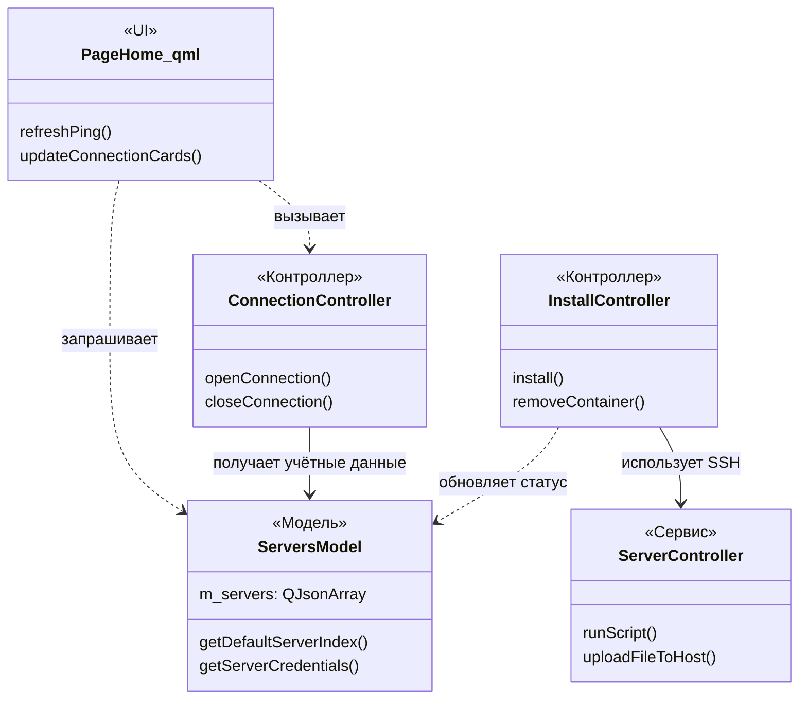

# Управление серверами и контейнерами

Соответствующие исходные файлы

Следующие файлы были использованы в качестве контекста для создания этой wiki-страницы:

- [add_server.bat](add_server.bat)
- [add_server.sh](add_server.sh)
- [client/android/openvpn/src/main/java/net/openvpn/ovpn3/ClientAPI_RemoteOverride.java](client/android/openvpn/src/main/java/net/openvpn/ovpn3/ClientAPI_RemoteOverride.java)
- [client/core/controllers/serverController.cpp](client/core/controllers/serverController.cpp)
- [client/core/controllers/serverController.h](client/core/controllers/serverController.h)
- [client/core/defs.h](client/core/defs.h)
- [client/core/errorstrings.cpp](client/core/errorstrings.cpp)
- [client/server_scripts/check_server_is_busy.sh](client/server_scripts/check_server_is_busy.sh)
- [client/server_scripts/check_user_in_sudo.sh](client/server_scripts/check_user_in_sudo.sh)
- [client/server_scripts/install_docker.sh](client/server_scripts/install_docker.sh)
- [client/ui/controllers/connectionController.cpp](client/ui/controllers/connectionController.cpp)
- [client/ui/controllers/connectionController.h](client/ui/controllers/connectionController.h)
- [client/ui/controllers/importController.cpp](client/ui/controllers/importController.cpp)
- [client/ui/controllers/importController.h](client/ui/controllers/importController.h)
- [client/ui/controllers/installController.cpp](client/ui/controllers/installController.cpp)
- [client/ui/controllers/installController.h](client/ui/controllers/installController.h)
- [client/ui/models/containers_model.cpp](client/ui/models/containers_model.cpp)
- [client/ui/models/containers_model.h](client/ui/models/containers_model.h)
- [client/ui/models/servers_model.cpp](client/ui/models/servers_model.cpp)
- [client/ui/models/servers_model.h](client/ui/models/servers_model.h)
- [client/ui/qml/Components/PremiumBadge.qml](client/ui/qml/Components/PremiumBadge.qml)
- [client/ui/qml/Components/ServersListView.qml](client/ui/qml/Components/ServersListView.qml)
- [client/ui/qml/Pages2/PageDeinstalling.qml](client/ui/qml/Pages2/PageDeinstalling.qml)
- [client/ui/qml/Pages2/PageHome.qml](client/ui/qml/Pages2/PageHome.qml)
- [client/ui/qml/Pages2/PageSettingsServersList.qml](client/ui/qml/Pages2/PageSettingsServersList.qml)
- [client/ui/qml/Pages2/PageSetupWizardInstalling.qml](client/ui/qml/Pages2/PageSetupWizardInstalling.qml)
- [client/ui/qml/Pages2/PageSetupWizardViewConfig.qml](client/ui/qml/Pages2/PageSetupWizardViewConfig.qml)
- [server.json](server.json)

В этом разделе описан жизненный цикл VPN-серверов и Docker-контейнеров в экосистеме FBLink VPN. Рассматриваются обнаружение и добавление серверов, SSH-провизионирование удалённых узлов и управление контейнеризованными VPN-протоколами через унифицированный контроллерный слой.

## Обзор управления серверами

Система рассматривает «Сервер» как удалённый хост (обычно Linux VPS), способный запускать Docker-контейнеры. Серверы управляются через `ServersModel`, который сохраняет конфигурации в настройках приложения.

### Обнаружение и добавление серверов
Серверы могут попасть в систему тремя основными способами:
1.  **Ручное добавление**: Пользователи предоставляют SSH-учётные данные (IP, имя пользователя, пароль/ключ) через UI.
2.  **Импорт конфигурации**: Импорт ссылок `vpn://` или JSON-файлов через `ImportController` [client/ui/controllers/importController.cpp:185-188]().
3.  **Обнаружение через бэкенд**: Управляемые серверы, полученные из FBLink API, синхронизируются в модель [client/ui/qml/Pages2/PageSettingsServersList.qml:23-32]().

### ServersModel
`ServersModel` [client/ui/models/servers_model.cpp:144-167]() — центральный поставщик данных для всех серверных UI-компонентов. Он управляет:
*   **Сервер по умолчанию**: Текущий активный сервер, используемый для VPN-подключений [client/ui/models/servers_model.h:73-79]().
*   **Обрабатываемый сервер**: Сервер, который в данный момент редактируется или устанавливается в «Мастере настройки» [client/ui/models/servers_model.h:87-89]().
*   **Учётные данные**: Безопасное хранение и извлечение `ServerCredentials` [client/ui/models/servers_model.cpp:1119-1123]().

**Источники:** [client/ui/models/servers_model.h:9-58](), [client/ui/models/servers_model.cpp:144-167](), [client/ui/controllers/importController.cpp:154-166]().

## Жизненный цикл контейнеров и провизионирование

FBLink использует контейнеризованный подход, при котором каждый VPN-протокол (AmneziaWG, Xray, OpenVPN и др.) работает в собственном Docker-контейнере на удалённом сервере.

### InstallController
`InstallController` координирует установку этих контейнеров. Он обрабатывает генерацию секретов, специфичных для протокола (например, параметров обфускации AmneziaWG), и управляет выполнением удалённых скриптов.

*   **Генерация секретов**: Для протоколов типа AmneziaWG (Awg2) контроллер генерирует случайные значения количества мусорных пакетов, размеров и магических заголовков для обеспечения уникальных паттернов обфускации [client/ui/controllers/installController.cpp:77-138]().
*   **Конвейер развёртывания**:
    1.  **SSH-подключение**: Устанавливается через `libssh::Client` [client/core/controllers/serverController.cpp:53-56]().
    2.  **Проверка окружения**: Запускает скрипты `check_server_is_busy.sh` и `check_user_in_sudo.sh` для проверки готовности хоста [client/ui/controllers/installController.cpp:1005-1015]().
    3.  **Настройка Docker**: Устанавливает Docker при его отсутствии с помощью `install_docker.sh`.
    4.  **Развёртывание контейнера**: Загружает соответствующий образ и запускает его с сгенерированной конфигурацией.

### ServerController
`ServerController` предоставляет низкоуровневый SSH-транспортный слой для развёртывания. Он абстрагирует выполнение команд и передачу файлов:
*   `runScript`: Выполняет shell-команды построчно на удалённом хосте [client/core/controllers/serverController.cpp:48-95]().
*   `uploadTextFileToContainer`: Высокоуровневый помощник, загружающий файл на хост и затем использующий `docker cp` для перемещения его в конкретный контейнер [client/core/controllers/serverController.cpp:117-172]().
*   `runContainerScript`: Оборачивает скрипт для выполнения внутри запущенного Docker-контейнера через `docker exec` [client/core/controllers/serverController.cpp:97-115]().

**Источники:** [client/ui/controllers/installController.cpp:65-147](), [client/core/controllers/serverController.cpp:39-115](), [client/core/controllers/serverController.h:15-35]().

## Технический поток данных

Следующая диаграмма иллюстрирует поток от инициации пользователем установки в UI до развёртывания Docker-контейнера на удалённом VPS.

### Конвейер провизионирования: от UI до удалённого Docker

**Источники:** [client/ui/qml/Pages2/PageSetupWizardInstalling.qml:28-46](), [client/ui/controllers/installController.cpp:65-147](), [client/core/controllers/serverController.cpp:97-115]().

## Сопоставление действий UI с программными сущностями

Система управления связывает высокоуровневые намерения пользователя с конкретными C++-классами и SSH-операциями.

### Диаграмма связей сущностей

**Источники:** [client/ui/qml/Pages2/PageHome.qml:91-98](), [client/ui/models/servers_model.h:9-58](), [client/ui/controllers/installController.h:18-40](), [client/ui/controllers/connectionController.h:15-35]().

## Конфигурации и метаданные контейнеров

`ContainersModel` определяет свойства доступных VPN-протоколов. Он определяет, поддерживается ли протокол на текущей платформе и как он должен отображаться в UI.

| Свойство | Описание | Ссылка на код |
| :--- | :--- | :--- |
| `NameRole` | Человекочитаемое имя (например, «FBLinkWG») | [client/ui/models/containers_model.cpp:26-31]() |
| `ServiceTypeRole` | Категоризация как `Vpn` или `Other` (сервис) | [client/ui/models/containers_model.cpp:47]() |
| `IsSupportedRole` | Проверка совместимости с платформой | [client/ui/models/containers_model.cpp:56]() |
| `IsInstalledRole` | Наличие контейнера на обрабатываемом сервере | [client/ui/models/containers_model.cpp:54]() |

### Обработка ошибок
Во время управления серверами и установки ошибки распространяются с использованием перечисления `fblink::ErrorCode` [client/core/defs.h:40-135](). Распространённые ошибки:
*   `ServerDockerFailedError` (203): Проблемы с Docker-демоном на VPS.
*   `SshTimeoutError` (305): Проблемы с подключением к удалённому хосту.
*   `ServerUserNotInSudo` (205): Недостаточные права у SSH-пользователя.

**Источники:** [client/ui/models/containers_model.cpp:15-62](), [client/core/errorstrings.cpp:5-83](), [client/core/defs.h:40-135]().

---
