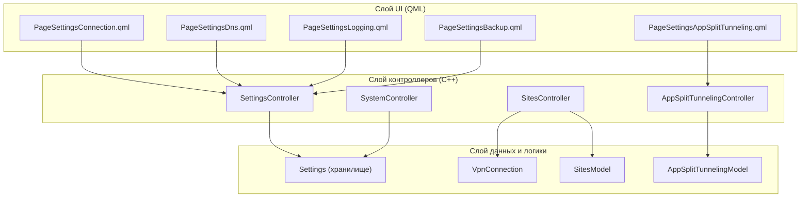
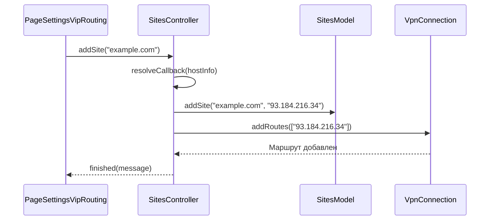

# Страницы настроек и контроллеры функций

Соответствующие исходные файлы

Следующие файлы были использованы в качестве контекста для создания этой wiki-страницы:

- [client/core/networkUtilities.cpp](client/core/networkUtilities.cpp)
- [client/core/networkUtilities.h](client/core/networkUtilities.h)
- [client/ui/controllers/appSplitTunnelingController.cpp](client/ui/controllers/appSplitTunnelingController.cpp)
- [client/ui/controllers/sitesController.cpp](client/ui/controllers/sitesController.cpp)
- [client/ui/controllers/sitesController.h](client/ui/controllers/sitesController.h)
- [client/ui/controllers/systemController.cpp](client/ui/controllers/systemController.cpp)
- [client/ui/controllers/systemController.h](client/ui/controllers/systemController.h)
- [client/ui/models/appSplitTunnelingModel.cpp](client/ui/models/appSplitTunnelingModel.cpp)
- [client/ui/models/appSplitTunnelingModel.h](client/ui/models/appSplitTunnelingModel.h)
- [client/ui/models/sites_model.cpp](client/ui/models/sites_model.cpp)
- [client/ui/models/sites_model.h](client/ui/models/sites_model.h)
- [client/ui/qml/Components/HomeSplitTunnelingDrawer.qml](client/ui/qml/Components/HomeSplitTunnelingDrawer.qml)
- [client/ui/qml/Pages2/PageSettingsApplication.qml](client/ui/qml/Pages2/PageSettingsApplication.qml)
- [client/ui/qml/Pages2/PageSettingsBackup.qml](client/ui/qml/Pages2/PageSettingsBackup.qml)
- [client/ui/qml/Pages2/PageSettingsConnection.qml](client/ui/qml/Pages2/PageSettingsConnection.qml)
- [client/ui/qml/Pages2/PageSettingsDns.qml](client/ui/qml/Pages2/PageSettingsDns.qml)
- [client/ui/qml/Pages2/PageSettingsKillSwitch.qml](client/ui/qml/Pages2/PageSettingsKillSwitch.qml)
- [client/ui/qml/Pages2/PageSettingsLogging.qml](client/ui/qml/Pages2/PageSettingsLogging.qml)
- [client/ui/qml/Pages2/PageSettingsServerData.qml](client/ui/qml/Pages2/PageSettingsServerData.qml)
- [client/ui/qml/Pages2/PageSettingsServerInfo.qml](client/ui/qml/Pages2/PageSettingsServerInfo.qml)
- [client/ui/qml/Pages2/PageSettingsSplitTunneling.qml](client/ui/qml/Pages2/PageSettingsSplitTunneling.qml)
- [client/utilities.cpp](client/utilities.cpp)
- [client/utilities.h](client/utilities.h)

В этом разделе описан пользовательский интерфейс и бизнес-логика настроек конфигурации приложения. Подсистема настроек разделена на несколько специализированных страниц, каждая из которых поддерживается контроллером, управляющим потоком данных между UI и базовым VPN-сервисом или постоянным хранилищем.

## Архитектурный обзор

Система настроек следует паттерну Контроллер-Модель-Представление. QML-страницы взаимодействуют с C++-контроллерами (например, `SettingsController`, `SitesController`, `SystemController`), которые, в свою очередь, манипулируют моделями или вызывают классы `VpnConnection` и `Settings`.

### Сопоставление программных сущностей

Следующая диаграмма связывает логические функции настроек с соответствующими C++-классами и QML-реализациями.

**Логика настроек и сопоставление сущностей**

**Источники:** [client/ui/qml/Pages2/PageSettingsConnection.qml:1-154](), [client/ui/controllers/sitesController.h:1-30](), [client/ui/controllers/systemController.h:1-40]()

---

## Настройки подключения и маршрутизации

### Конфигурация DNS
Страница настроек DNS позволяет пользователям указывать пользовательские основной и вторичный DNS-серверы. Значения валидируются с помощью регулярных выражений, предоставляемых классом `NetworkUtilities`.

*   **Реализация:** `PageSettingsDns.qml` привязывает текстовые поля к `SettingsController::primaryDns` и `secondaryDns`.
*   **Валидация:** Использует `InstallController.ipAddressRegExp()` для проверки ввода [client/ui/qml/Pages2/PageSettingsDns.qml:87-89]().
*   **Значения по умолчанию:** По умолчанию обычно устанавливаются `1.1.1.1` и `1.0.0.1` [client/ui/qml/Pages2/PageSettingsDns.qml:130-133]().

### Раздельное туннелирование
Приложение поддерживает два типа раздельного туннелирования:
1.  **На основе сайтов (VIP):** Управляется через `SitesController`. Позволяет добавлять определённые имена хостов или IP-диапазоны в маршрут VPN.
2.  **На основе приложений:** Управляется через `AppSplitTunnelingController`. Зависит от платформы и доступно преимущественно на Windows и Android [client/ui/qml/Pages2/PageSettingsConnection.qml:15-16]().

**Поток данных для маршрутизации на основе сайтов**

**Источники:** [client/ui/controllers/sitesController.cpp:24-74](), [client/ui/controllers/sitesController.cpp:136-138]()

---

## Логирование и управление системой

### Контроллер логирования
`SettingsController` управляет жизненным циклом логирования приложения. Он обрабатывает включение/отключение логов, очистку файлов логов и их экспорт для службы поддержки.

*   **Логика экспорта:** На мобильных устройствах используется фиксированное имя файла; на десктопе вызывается `SystemController::getFileName` для открытия нативного диалога сохранения [client/ui/qml/Pages2/PageSettingsLogging.qml:187-197]().
*   **Пути к логам:** Различает «Клиентские логи» и «Логи сервиса» (логи привилегированного демона), хотя логи сервиса скрыты на мобильных и macOS NE сборках [client/ui/qml/Pages2/PageSettingsLogging.qml:171-176]().

### Системный контроллер (`SystemController`)
Этот контроллер предоставляет абстракцию для платформенно-специфичных системных операций:
*   **Файловые операции:** `saveFile` и `readFile` оборачивают нативные вызовы для Android (через `AndroidController`) и iOS (через `IosController`) [client/ui/controllers/systemController.cpp:79-134]().
*   **Нативные диалоги:** `getFileName` запускает QML `mainFileDialog` и ожидает ответ через локальный `QEventLoop` [client/ui/controllers/systemController.cpp:172-193]().
*   **Сетевая диагностика:** Включает функцию `measurePing`, которая пытается подключиться к портам 443, 80 или 22 для вычисления задержки [client/ui/controllers/systemController.cpp:224-245]().

---

## Резервное копирование и восстановление
Система резервного копирования сериализует конфигурацию приложения (включая учётные данные серверов и закрытые ключи) в файл `.backup`.

*   **Предупреждение безопасности:** UI явно предупреждает пользователей о том, что резервные копии содержат конфиденциальную информацию [client/ui/qml/Pages2/PageSettingsBackup.qml:90-91]().
*   **Процесс:**
    1.  Пользователь выбирает местоположение через `SystemController`.
    2.  Вызывается `SettingsController::backupAppConfig(fileName)` для записи зашифрованных/сериализованных данных [client/ui/qml/Pages2/PageSettingsBackup.qml:119]().
    3.  Восстановление требует отключения от VPN для предотвращения повреждения таблиц маршрутизации [client/ui/qml/Pages2/PageSettingsBackup.qml:161-163]().

---

## UI управления серверами
Страница `PageSettingsServerData.qml` предоставляет административные действия для конкретных серверов.

| Действие | Метод контроллера | Описание |
| :--- | :--- | :--- |
| **Проверить сервер** | `InstallController.scanServerForInstalledContainers()` | Сканирует удалённый сервер на наличие существующих VPN-сервисов [client/ui/qml/Pages2/PageSettingsServerData.qml:115](). |
| **Перезагрузить** | `InstallController.rebootProcessedServer()` | Отправляет команду перезагрузки через SSH на удалённый хост [client/ui/qml/Pages2/PageSettingsServerData.qml:138](). |
| **Удалить** | `InstallController.removeProcessedServer()` | Удаляет запись сервера только из локального приложения [client/ui/qml/Pages2/PageSettingsServerData.qml:168](). |
| **Очистить** | `InstallController.removeAllContainers()` | Деинсталлирует всё управляемое FBLink VPN-ПО с удалённого сервера [client/ui/qml/Pages2/PageSettingsServerData.qml:198](). |

**Источники:** [client/ui/qml/Pages2/PageSettingsServerData.qml:106-200]()

---

## Вспомогательные утилиты
Контроллеры настроек используют `NetworkUtilities` для общих сетевых задач:
*   **Паттерны регулярных выражений:** Предоставляет стандартные паттерны для IPv4, подсетей и доменных имён [client/core/networkUtilities.cpp:51-83]().
*   **Суммирование маршрутов:** Содержит логику обработки списков IP в CIDR-блоки [client/core/networkUtilities.cpp:107-122]().
*   **Определение адаптера:** На Windows `AdapterIndexTo` использует `GetBestRoute2` для определения физического интерфейса, используемого для достижения конкретного назначения [client/core/networkUtilities.cpp:182-221]().

**Источники:** [client/core/networkUtilities.cpp:51-221](), [client/utilities.cpp:70-153]()

---
