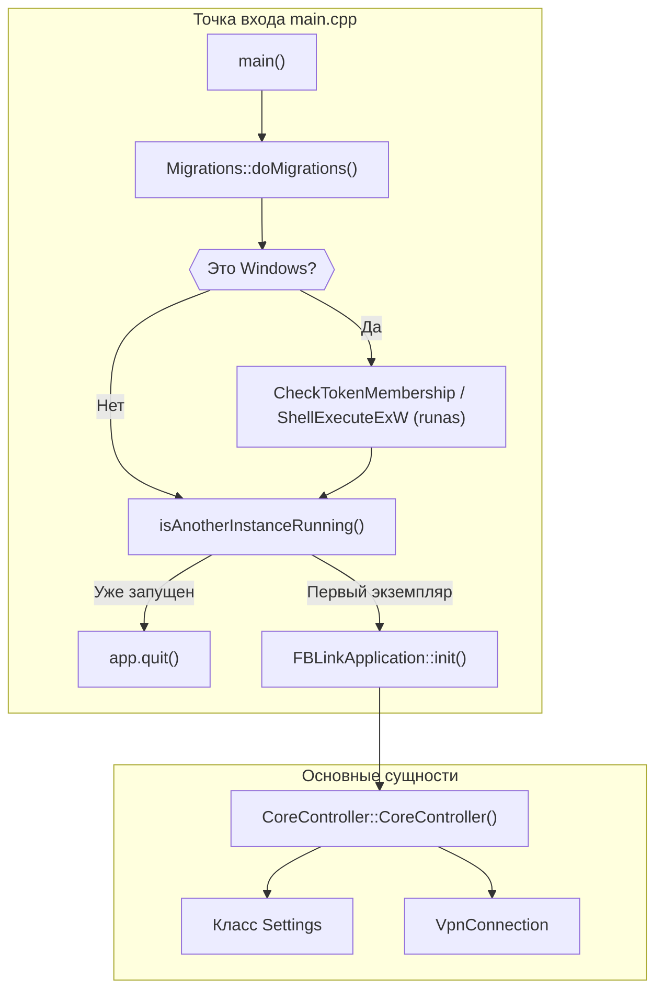
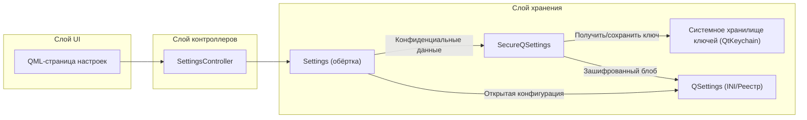

# Настройки, безопасное хранилище и жизненный цикл приложения

Соответствующие исходные файлы

Следующие файлы были использованы в качестве контекста для создания этой wiki-страницы:

- [client/FBLink_application.cpp](client/FBLink_application.cpp)
- [client/cmake/sources.cmake](client/cmake/sources.cmake)
- [client/core/controllers/coreController.cpp](client/core/controllers/coreController.cpp)
- [client/core/controllers/coreController.h](client/core/controllers/coreController.h)
- [client/core/osSignalHandler.cpp](client/core/osSignalHandler.cpp)
- [client/core/osSignalHandler.h](client/core/osSignalHandler.h)
- [client/main.cpp](client/main.cpp)
- [client/secure_qsettings.cpp](client/secure_qsettings.cpp)
- [client/secure_qsettings.h](client/secure_qsettings.h)
- [client/settings.cpp](client/settings.cpp)
- [client/settings.h](client/settings.h)
- [client/ui/controllers/settingsController.cpp](client/ui/controllers/settingsController.cpp)
- [client/ui/controllers/settingsController.h](client/ui/controllers/settingsController.h)
- [client/ui/notificationhandler.cpp](client/ui/notificationhandler.cpp)
- [client/ui/notificationhandler.h](client/ui/notificationhandler.h)
- [client/ui/qml/Modules/Style/qmldir](client/ui/qml/Modules/Style/qmldir)
- [client/ui/systemtray_notificationhandler.cpp](client/ui/systemtray_notificationhandler.cpp)
- [client/ui/systemtray_notificationhandler.h](client/ui/systemtray_notificationhandler.h)

На этой странице описаны процедуры запуска приложения FBLink VPN, управление постоянными настройками приложения, уровень безопасности для конфиденциальных данных и высокоуровневые контроллеры жизненного цикла.

## Запуск и жизненный цикл приложения

Точка входа приложения обрабатывает критические задачи предварительной инициализации, включая миграцию конфигурации, повышение привилегий в Windows и обеспечение работы единственного экземпляра.

### Последовательность запуска
1.  **Миграции**: Создаётся экземпляр класса `Migrations` для обновления устаревших форматов конфигурации до текущей версии [client/main.cpp:37-38]().
2.  **Повышение привилегий (Windows)**: В Windows приложение проверяет наличие прав администратора. При их отсутствии оно перезапускает себя с использованием команды `runas` для вызова запроса UAC [client/main.cpp:42-67]().
3.  **Проверка единственного экземпляра**: На десктопных платформах `isAnotherInstanceRunning()` пытается подключиться к локальному сокету с именем `FBLinkInstance`. При успешном подключении вторичный экземпляр завершается [client/main.cpp:23-32](), [client/main.cpp:88-91]().
4.  **Инициализация приложения**: Инициализируется `FBLinkApplication`, загружаются шрифты и регистрируются типы QML [client/main.cpp:100-109]().
5.  **Локальный сервер**: Основной экземпляр запускает `QLocalServer` для прослушивания будущих запусков экземпляров [client/main.cpp:92]().

### Диаграмма: Поток запуска приложения
Эта диаграмма сопоставляет логику запуска в `main.cpp` с поддерживающими классами.

Источники: [client/main.cpp:35-123](), [client/core/controllers/coreController.cpp:18-33]()

---

## Настройки и безопасное хранилище

Приложение использует многоуровневую архитектуру хранения: общие настройки хранятся в стандартных конфигурационных файлах, а конфиденциальные данные (например, учётные данные серверов) шифруются с помощью AES-256 и платформенных хранилищ ключей.

### Класс Settings
Класс `Settings` предоставляет высокоуровневый API для доступа и изменения конфигураций приложения. Он оборачивает `SecureQSettings` и предоставляет типобезопасные геттеры/сеттеры для:
*   **Серверы**: Управление списком серверов и выбор сервера по умолчанию [client/settings.h:40-57]().
*   **Контейнеры/Протоколы**: Сопоставление конфигурации для конкретных VPN-протоколов внутри контейнеров [client/settings.h:59-72]().
*   **Раздельное туннелирование**: Хранение правил маршрутизации на основе сайтов и приложений [client/settings.h:115-146]().
*   **DNS**: Настройки предпочитаемого первичного и вторичного DNS-серверов [client/settings.h:148-171]().

### SecureQSettings
`SecureQSettings` — специализированная обёртка над `QSettings`, реализующая прозрачное шифрование для определённых ключей (например, `Servers/serversList`) [client/secure_qsettings.cpp:25]().

*   **Реализация шифрования**: Использует `QSimpleCrypto` (блочный шифр AES) [client/secure_qsettings.cpp:182-202]().
*   **Управление ключами**: Ключи шифрования (`settingsKeyTag`) и IV (`settingsIvTag`) генерируются при первом запуске и сохраняются в системном хранилище ключей с использованием `QtKeychain` [client/secure_qsettings.cpp:213-250]().
*   **Формат данных**: Зашифрованные значения имеют префикс-маркер `EncData` для отличия от открытого текста [client/secure_qsettings.h:54]().

### Диаграмма: Поток данных настроек
Эта диаграмма иллюстрирует, как данные передаются из UI в зашифрованное хранилище.

Источники: [client/settings.h:20-25](), [client/secure_qsettings.cpp:42-111](), [client/ui/controllers/settingsController.cpp:73-104]()

---

## SettingsController

`SettingsController` выступает мостом между QML UI и логикой `Settings`. Он регистрируется как свойство контекста `SettingsController` [client/core/controllers/coreController.cpp:135]().

### Основные функции
| Функция | Описание |
| :--- | :--- |
| `backupAppConfig` | Экспортирует неконфиденциальную конфигурацию приложения в JSON-файл [client/ui/controllers/settingsController.cpp:166-179](). |
| `toggleLogging` | Включает/отключает локальное логирование и при необходимости запускает мост нативного логирования iOS [client/ui/controllers/settingsController.cpp:111-122](). |
| `toggleKillSwitch` | Взаимодействует с сервисом для включения/отключения системного Kill Switch [client/ui/controllers/settingsController.cpp:231-235](). |
| `checkIfNeedDisableLogs` | «Наблюдатель за логами», автоматически отключающий логирование по истечении установленного периода для предотвращения переполнения диска [client/ui/controllers/settingsController.cpp:36](). |

Источники: [client/ui/controllers/settingsController.h:12-172](), [client/ui/controllers/settingsController.cpp:1-54]()

---

## Логирование и системные уведомления

### Наблюдатель за логами
Система включает механизм безопасности для предотвращения чрезмерного потребления дискового пространства логами. При включении логирования записывается `logEnableDate` [client/settings.cpp:226](). `SettingsController` проверяет эту дату и может автоматически отключить логирование через процедуру `checkIfNeedDisableLogs()` [client/ui/controllers/settingsController.cpp:36]().

### Обработчик уведомлений
`NotificationHandler` (и его платформенный подкласс `SystemTrayNotificationHandler`) управляет системными оповещениями:
*   **Управление треем**: Обрабатывает состояния значка в системном трее (Подключено, Отключено, Ошибка) [client/ui/systemtray_notificationhandler.cpp:99-142]().
*   **Пользовательские уведомления**: Отображает уведомления на десктопе/мобильных устройствах об изменении статуса VPN и обнаружении незащищённой сети [client/ui/notificationhandler.cpp:44-78]().
*   **Меню трея**: Предоставляет быстрые действия: Подключить, Отключить и Показать окно [client/ui/systemtray_notificationhandler.cpp:35-54]().

Источники: [client/ui/systemtray_notificationhandler.cpp:27-56](), [client/ui/notificationhandler.cpp:16-22](), [client/settings.cpp:211-229]()

---
