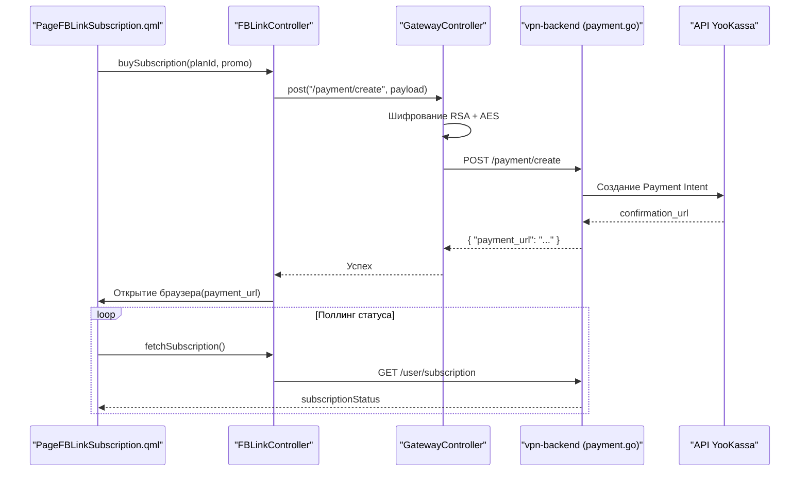
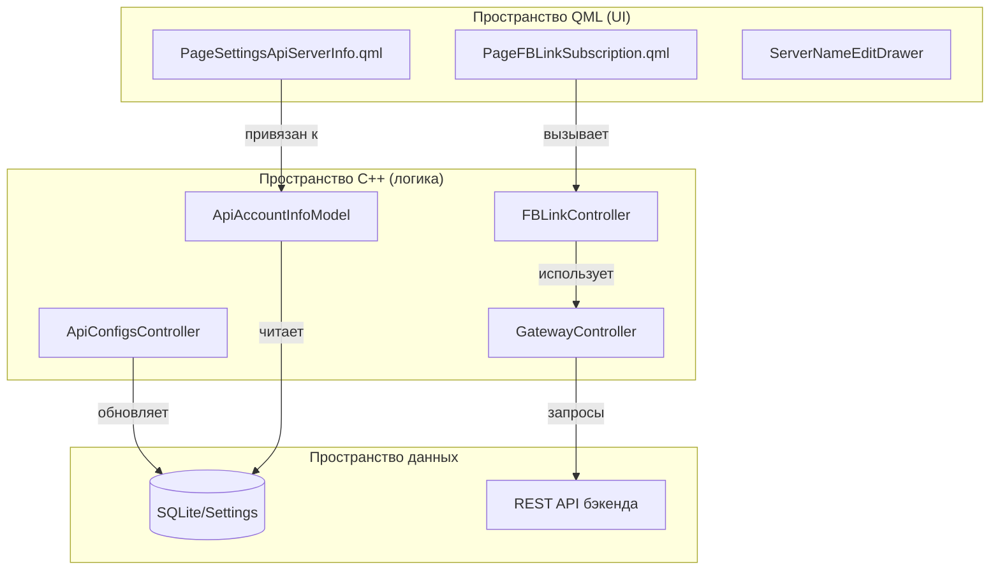

# Подписки, платежи и VIP-функции

Соответствующие исходные файлы

Следующие файлы были использованы в качестве контекста для создания этой wiki-страницы:

- [client/core/api/apiDefs.h](client/core/api/apiDefs.h)
- [client/core/api/apiUtils.cpp](client/core/api/apiUtils.cpp)
- [client/core/api/apiUtils.h](client/core/api/apiUtils.h)
- [client/core/controllers/gatewayController.cpp](client/core/controllers/gatewayController.cpp)
- [client/translations/FBLink_ar_EG.ts](client/translations/FBLink_ar_EG.ts)
- [client/translations/FBLink_fa_IR.ts](client/translations/FBLink_fa_IR.ts)
- [client/translations/FBLink_hi_IN.ts](client/translations/FBLink_hi_IN.ts)
- [client/translations/FBLink_my_MM.ts](client/translations/FBLink_my_MM.ts)
- [client/translations/FBLink_ru_RU.ts](client/translations/FBLink_ru_RU.ts)
- [client/translations/FBLink_uk_UA.ts](client/translations/FBLink_uk_UA.ts)
- [client/translations/FBLink_ur_PK.ts](client/translations/FBLink_ur_PK.ts)
- [client/translations/FBLink_zh_CN.ts](client/translations/FBLink_zh_CN.ts)
- [client/ui/controllers/api/apiConfigsController.cpp](client/ui/controllers/api/apiConfigsController.cpp)
- [client/ui/controllers/api/apiConfigsController.h](client/ui/controllers/api/apiConfigsController.h)
- [client/ui/controllers/api/apiSettingsController.cpp](client/ui/controllers/api/apiSettingsController.cpp)
- [client/ui/models/api/apiAccountInfoModel.cpp](client/ui/models/api/apiAccountInfoModel.cpp)
- [client/ui/models/api/apiAccountInfoModel.h](client/ui/models/api/apiAccountInfoModel.h)
- [client/ui/qml/Pages2/PageFBLinkSubscription.qml](client/ui/qml/Pages2/PageFBLinkSubscription.qml)
- [client/ui/qml/Pages2/PageSettingsApiAvailableCountries.qml](client/ui/qml/Pages2/PageSettingsApiAvailableCountries.qml)
- [client/ui/qml/Pages2/PageSettingsApiNativeConfigs.qml](client/ui/qml/Pages2/PageSettingsApiNativeConfigs.qml)
- [client/ui/qml/Pages2/PageSettingsApiServerInfo.qml](client/ui/qml/Pages2/PageSettingsApiServerInfo.qml)
- [client/ui/qml/Pages2/PageSettingsApiSupport.qml](client/ui/qml/Pages2/PageSettingsApiSupport.qml)
- [client/ui/qml/Pages2/PageSettingsKillSwitchExceptions.qml](client/ui/qml/Pages2/PageSettingsKillSwitchExceptions.qml)
- [client/ui/qml/Pages2/PageSettingsVipPresetCatalog.qml](client/ui/qml/Pages2/PageSettingsVipPresetCatalog.qml)
- [client/ui/qml/Pages2/PageSettingsVipRoutingProfileEditor.qml](client/ui/qml/Pages2/PageSettingsVipRoutingProfileEditor.qml)
- [client/ui/qml/Pages2/PageSettingsVipRoutingProfiles.qml](client/ui/qml/Pages2/PageSettingsVipRoutingProfiles.qml)
- [vpn-backend/internal/database/database.go](vpn-backend/internal/database/database.go)
- [vpn-backend/internal/handlers/payment.go](vpn-backend/internal/handlers/payment.go)
- [vpn-backend/internal/handlers/payment_sync.go](vpn-backend/internal/handlers/payment_sync.go)
- [vpn-backend/internal/handlers/renewal.go](vpn-backend/internal/handlers/renewal.go)
- [vpn-backend/internal/handlers/user.go](vpn-backend/internal/handlers/user.go)

Эта страница документирует экосистему подписок FBLink VPN, включая многоуровневую модель тарифов, обработку платежей через YooKassa, шифрованную API-коммуникацию и реализацию эксклюзивных VIP-функций, таких как пресеты раздельного туннелирования и интеграция AdBlock.

## Модель подписок и тарифы

FBLink VPN использует многоуровневую модель подписок, управляемую Go-бэкендом. Клиент классифицирует их как типы сервисов `fblink-free` и `fblink-premium` [client/ui/controllers/api/apiConfigsController.cpp:57-61]().

### Уровни тарифов
| ID тарифа | Отображаемое название | Функции |
| :--- | :--- | :--- |
| `free` | Free | Ограниченное количество локаций, базовый протокол AWG. |
| `trial` | Trial | Полный Premium-доступ на ограниченный срок для новых пользователей [client/ui/qml/Pages2/PageFBLinkSubscription.qml:54-55](). |
| `basic` | Premium | Безлимитный трафик, 10+ локаций, до 5 устройств [client/ui/qml/Pages2/PageFBLinkSubscription.qml:160-179](). |
| `vip` | VIP | Приоритетная сеть, VIP-профили маршрутизации, AdBlock (Pi-hole), 10 устройств [client/ui/qml/Pages2/PageFBLinkSubscription.qml:180-200](). |

Тарифы также доступны в 3-месячных вариантах (напр., `basic_3m`, `vip_3m`) со скидкой [client/ui/qml/Pages2/PageFBLinkSubscription.qml:165-186]().

## Интеграция платежей (YooKassa)

Платежи оркестрируются через `GatewayController`, который взаимодействует с обработчиками платежей бэкенда.

### Поток данных и шифрование
Для защиты конфиденциальной платёжной информации и предотвращения подмены запросов клиент использует двухуровневую схему шифрования [client/core/controllers/gatewayController.cpp:61-136]():
1.  **Обмен ключами**: Случайный AES-ключ, IV и соль генерируются и шифруются с использованием захардкоженного публичного RSA-ключа (`PROD_AGW_PUBLIC_KEY`) [client/core/controllers/gatewayController.cpp:108-119]().
2.  **Шифрование payload**: Фактический API-запрос (JSON) шифруется с использованием AES-параметров из шага 1 [client/core/controllers/gatewayController.cpp:121-122]().
3.  **Передача**: И зашифрованный ключевой payload, и зашифрованный API payload отправляются на бэкенд [client/core/controllers/gatewayController.cpp:130-135]().

### Диаграмма жизненного цикла платежа
Следующая диаграмма иллюстрирует взаимодействие между UI, `GatewayController` и платёжным потоком YooKassa.

**Последовательность оплаты подписки**

Источники: [client/core/controllers/gatewayController.cpp:61-136](), [client/ui/qml/Pages2/PageFBLinkSubscription.qml:132-143](), [vpn-backend/internal/handlers/payment.go]().

## Промокоды и автопродление

### Система промокодов
Клиент обеспечивает предварительный просмотр преимуществ промокода в реальном времени. Когда пользователь вводит код, срабатывает `FBLinkController::previewPaymentWithPromo` [client/ui/qml/Pages2/PageFBLinkSubscription.qml:153](). Бэкенд рассчитывает скидку и возвращает скорректированную сумму, которая отображается в UI перед подтверждением покупки [client/ui/qml/Pages2/PageFBLinkSubscription.qml:28-31]().

### Автопродление
Бэкенд обрабатывает автопродление через `renewal.go`. Статус подписки отслеживается в базе данных, а клиент отражает его через `ApiAccountInfoModel` [client/ui/models/api/apiAccountInfoModel.cpp:31-35](). Пользователи могут управлять или отменять рекуррентные платежи через раздел «Статус подписки» в настройках [client/ui/qml/Pages2/PageSettingsApiServerInfo.qml:158-171]().

## Реализация VIP-функций

### VIP-профили маршрутизации (пресеты раздельного туннелирования)
VIP-пользователи получают доступ к расширенному управлению маршрутизацией. В отличие от стандартного раздельного туннелирования, требующего ручного выбора приложений, VIP-профили маршрутизации позволяют применять предварительно настроенные «Каталоги» сайтов или приложений для конкретных сценариев (напр., «Стриминг», «Социальные сети», «Работа») [client/ui/qml/Pages2/PageSettingsVipPresetCatalog.qml]().

*   **Реализация**: Профили управляются через `VipRoutingController`. Пользователи могут редактировать эти профили для добавления/удаления конкретных доменов [client/ui/qml/Pages2/PageSettingsVipRoutingProfileEditor.qml]().
*   **Структура данных**: Профили хранятся как JSON-объекты, содержащие списки IP или шаблонов доменов, которые затем передаются VPN-сервису через IPC [client/ui/qml/Pages2/PageSettingsVipRoutingProfiles.qml]().

### VIP AdBlock (интеграция Pi-hole)
VIP-тарифы включают серверный AdBlock. Когда VIP-пользователь подключается, бэкенд провизионирует экземпляр Pi-hole или настраивает DNS-резолвер для указания на контейнер Pi-hole [vpn-backend/internal/handlers/user.go]().
*   **Обработка DNS**: Клиент определяет VIP-статус и настраивает локальные DNS-параметры для использования внутреннего DNS IP VIP-сервера, обеспечивая фильтрацию всего трафика от рекламы и трекеров [client/ui/controllers/api/apiConfigsController.cpp:125-133]().

## UI подписок и модели

Интерфейс подписок построен на QML с C++ backing-моделями для обработки сложной API-логики.

### Ключевые программные сущности

| Программная сущность | Роль |
| :--- | :--- |
| `ApiAccountInfoModel` | Предоставляет статус подписки, дату окончания и количество устройств в QML [client/ui/models/api/apiAccountInfoModel.h](). |
| `ApiConfigsController` | Обрабатывает установку протокольно-специфичных конфигураций (AWG, VLESS) после валидации подписки [client/ui/controllers/api/apiConfigsController.h](). |
| `PageFBLinkSubscription.qml` | Основной UI маркетплейса для выбора тарифов и ввода промокодов [client/ui/qml/Pages2/PageFBLinkSubscription.qml](). |
| `PageSettingsApiServerInfo.qml` | Отображает «Premium Card» с прогресс-барами подписки [client/ui/qml/Pages2/PageSettingsApiServerInfo.qml:117-200](). |

### Диаграмма системного сопоставления
Эта диаграмма связывает UI-компоненты с нижележащими C++-контроллерами и моделями.

**Карта сущностей управления подписками**

Источники: [client/ui/qml/Pages2/PageFBLinkSubscription.qml:153](), [client/ui/models/api/apiAccountInfoModel.cpp:31-69](), [client/core/controllers/gatewayController.cpp:158-180](), [client/ui/controllers/api/apiConfigsController.cpp:515-520]().

## Провизионирование конфигураций
При активной подписке `ApiConfigsController` получает конфигурации протоколов. Он поддерживает несколько протоколов, включая `awg` (AmneziaWG) и `vless` (Xray) [client/ui/controllers/api/apiConfigsController.cpp:23-25]().

1.  **Генерация ключей**: Для AWG клиент генерирует локальные приватный/публичный ключи [client/ui/controllers/api/apiConfigsController.cpp:127-130]().
2.  **API Payload**: Публичный ключ отправляется на бэкенд [client/ui/controllers/api/apiConfigsController.cpp:142-143]().
3.  **Инъекция конфигурации**: Бэкенд возвращает шаблон конфигурации. Клиент заменяет placeholder'ы, такие как `$WIREGUARD_CLIENT_PRIVATE_KEY`, на локально сгенерированный приватный ключ, гарантируя, что приватный ключ никогда не покидает устройство [client/ui/controllers/api/apiConfigsController.cpp:171-172]().

Источники: [client/ui/controllers/api/apiConfigsController.cpp:122-147](), [client/ui/controllers/api/apiConfigsController.cpp:168-185]().

---
