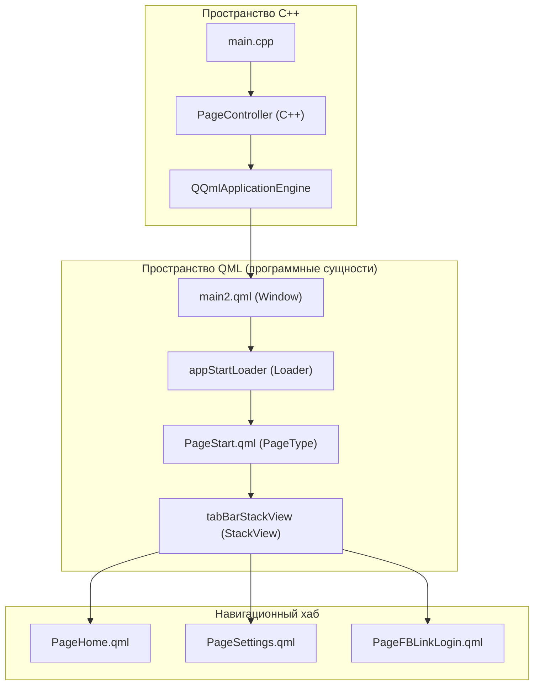
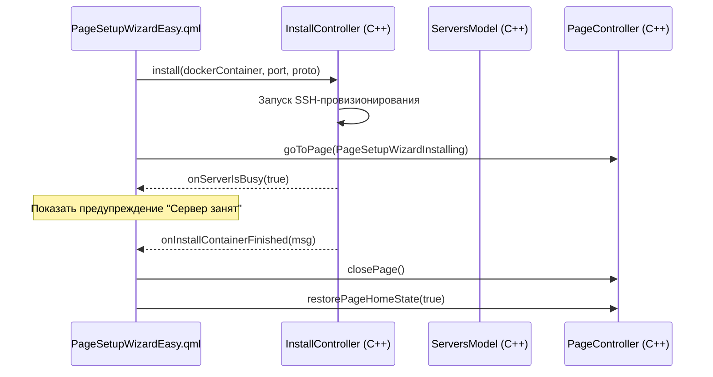

# Архитектура UI и навигация

Соответствующие исходные файлы

Следующие файлы были использованы в качестве контекста для создания этой wiki-страницы:

- [client/resources.qrc](client/resources.qrc)
- [client/ui/controllers/pageController.cpp](client/ui/controllers/pageController.cpp)
- [client/ui/controllers/pageController.h](client/ui/controllers/pageController.h)
- [client/ui/models/containers_model.cpp](client/ui/models/containers_model.cpp)
- [client/ui/models/containers_model.h](client/ui/models/containers_model.h)
- [client/ui/models/installedAppsModel.cpp](client/ui/models/installedAppsModel.cpp)
- [client/ui/models/installedAppsModel.h](client/ui/models/installedAppsModel.h)
- [client/ui/models/servers_model.cpp](client/ui/models/servers_model.cpp)
- [client/ui/models/servers_model.h](client/ui/models/servers_model.h)
- [client/ui/pages.h](client/ui/pages.h)
- [client/ui/qml/Components/ConnectButton.qml](client/ui/qml/Components/ConnectButton.qml)
- [client/ui/qml/Components/HomeContainersListView.qml](client/ui/qml/Components/HomeContainersListView.qml)
- [client/ui/qml/Components/InstalledAppsDrawer.qml](client/ui/qml/Components/InstalledAppsDrawer.qml)
- [client/ui/qml/Components/PremiumBadge.qml](client/ui/qml/Components/PremiumBadge.qml)
- [client/ui/qml/Components/ServersListView.qml](client/ui/qml/Components/ServersListView.qml)
- [client/ui/qml/Components/TransportProtoSelector.qml](client/ui/qml/Components/TransportProtoSelector.qml)
- [client/ui/qml/Components/TvKeyboardKey.qml](client/ui/qml/Components/TvKeyboardKey.qml)
- [client/ui/qml/Components/TvLoginRow.qml](client/ui/qml/Components/TvLoginRow.qml)
- [client/ui/qml/Components/TvOnScreenKeyboard.qml](client/ui/qml/Components/TvOnScreenKeyboard.qml)
- [client/ui/qml/Controls2/BasicButtonType.qml](client/ui/qml/Controls2/BasicButtonType.qml)
- [client/ui/qml/Controls2/CheckBoxType.qml](client/ui/qml/Controls2/CheckBoxType.qml)
- [client/ui/qml/Controls2/DividerType.qml](client/ui/qml/Controls2/DividerType.qml)
- [client/ui/qml/Controls2/DropDownType.qml](client/ui/qml/Controls2/DropDownType.qml)
- [client/ui/qml/Controls2/HorizontalRadioButton.qml](client/ui/qml/Controls2/HorizontalRadioButton.qml)
- [client/ui/qml/Controls2/SwitcherType.qml](client/ui/qml/Controls2/SwitcherType.qml)
- [client/ui/qml/Controls2/TabButtonType.qml](client/ui/qml/Controls2/TabButtonType.qml)
- [client/ui/qml/Controls2/TabImageButtonType.qml](client/ui/qml/Controls2/TabImageButtonType.qml)
- [client/ui/qml/Controls2/TextFieldWithHeaderType.qml](client/ui/qml/Controls2/TextFieldWithHeaderType.qml)
- [client/ui/qml/Controls2/TextTypes/ButtonTextType.qml](client/ui/qml/Controls2/TextTypes/ButtonTextType.qml)
- [client/ui/qml/Controls2/TextTypes/CaptionTextType.qml](client/ui/qml/Controls2/TextTypes/CaptionTextType.qml)
- [client/ui/qml/Controls2/TextTypes/Header1TextType.qml](client/ui/qml/Controls2/TextTypes/Header1TextType.qml)
- [client/ui/qml/Controls2/TextTypes/Header2TextType.qml](client/ui/qml/Controls2/TextTypes/Header2TextType.qml)
- [client/ui/qml/Controls2/TextTypes/LabelTextType.qml](client/ui/qml/Controls2/TextTypes/LabelTextType.qml)
- [client/ui/qml/Controls2/TextTypes/ListItemTitleType.qml](client/ui/qml/Controls2/TextTypes/ListItemTitleType.qml)
- [client/ui/qml/Controls2/TextTypes/ParagraphTextType.qml](client/ui/qml/Controls2/TextTypes/ParagraphTextType.qml)
- [client/ui/qml/Controls2/TextTypes/SmallTextType.qml](client/ui/qml/Controls2/TextTypes/SmallTextType.qml)
- [client/ui/qml/Controls2/VerticalRadioButton.qml](client/ui/qml/Controls2/VerticalRadioButton.qml)
- [client/ui/qml/Pages2/PageDeinstalling.qml](client/ui/qml/Pages2/PageDeinstalling.qml)
- [client/ui/qml/Pages2/PageFBLinkTvApprove.qml](client/ui/qml/Pages2/PageFBLinkTvApprove.qml)
- [client/ui/qml/Pages2/PageFBLinkTvScan.qml](client/ui/qml/Pages2/PageFBLinkTvScan.qml)
- [client/ui/qml/Pages2/PageHome.qml](client/ui/qml/Pages2/PageHome.qml)
- [client/ui/qml/Pages2/PageSettings.qml](client/ui/qml/Pages2/PageSettings.qml)
- [client/ui/qml/Pages2/PageSettingsAppSplitTunneling.qml](client/ui/qml/Pages2/PageSettingsAppSplitTunneling.qml)
- [client/ui/qml/Pages2/PageSettingsServersList.qml](client/ui/qml/Pages2/PageSettingsServersList.qml)
- [client/ui/qml/Pages2/PageSetupWizardConfigSource.qml](client/ui/qml/Pages2/PageSetupWizardConfigSource.qml)
- [client/ui/qml/Pages2/PageSetupWizardCredentials.qml](client/ui/qml/Pages2/PageSetupWizardCredentials.qml)
- [client/ui/qml/Pages2/PageSetupWizardEasy.qml](client/ui/qml/Pages2/PageSetupWizardEasy.qml)
- [client/ui/qml/Pages2/PageSetupWizardInstalling.qml](client/ui/qml/Pages2/PageSetupWizardInstalling.qml)
- [client/ui/qml/Pages2/PageSetupWizardProtocols.qml](client/ui/qml/Pages2/PageSetupWizardProtocols.qml)
- [client/ui/qml/Pages2/PageSetupWizardStart.qml](client/ui/qml/Pages2/PageSetupWizardStart.qml)
- [client/ui/qml/Pages2/PageStart.qml](client/ui/qml/Pages2/PageStart.qml)
- [client/ui/qml/main2.qml](client/ui/qml/main2.qml)
- [vpn-backend/internal/handlers/auth.go](vpn-backend/internal/handlers/auth.go)

Клиент FBLink VPN использует пользовательский интерфейс на основе QML, управляемый централизованным C++-контроллерным слоем. Архитектура разделяет визуальное представление и бизнес-логику с помощью паттерна Модель-Представление-Контроллер (MVC), где QML-представления взаимодействуют с C++-контроллерами и моделями, доступными через контекстные свойства.

## Корневое окно и главная точка входа

Основная точка входа приложения — `main2.qml`, определяющий корневой элемент `Window`. Он обрабатывает глобальные свойства окна, системные события (например, изменения жизненного цикла Android) и компоненты верхнего уровня UI, такие как глобальные уведомления и индикаторы загрузки.

### Ключевые компоненты main2.qml
*   **Управление окном**: Устанавливает размеры в зависимости от платформы (десктоп vs. мобильный) и обрабатывает событие `onClosing` для скрытия окна вместо завершения процесса на определённых платформах [client/ui/qml/main2.qml:46-62]().
*   **AppStartLoader**: Компонент `Loader`, инициализирующий `PageStart.qml` — основной навигационный контейнер [client/ui/qml/main2.qml:158-166]().
*   **Глобальные оверлеи**: Содержит компоненты `PopupType` для сообщений об ошибках и уведомлений, управляемые через сигналы от `PageController` [client/ui/qml/main2.qml:122-132]().
*   **Обработка фокуса**: Реализует `defaultFocusItem` для управления навигацией D-pad и Tab, со специальной логикой делегирования фокуса TV-интерфейсу, когда он активен [client/ui/qml/main2.qml:64-96]().

### Диаграмма инициализации UI
Эта диаграмма иллюстрирует связь между точкой входа C++ и начальной последовательностью загрузки QML.

Источники: [client/ui/qml/main2.qml:15-166](), [client/ui/controllers/pageController.h:99-105]()

## PageController и навигационный стек

Навигация координируется классом `PageController`. Он поддерживает состояние приложения относительно текущей активной страницы и предоставляет слоты для запуска переходов.

### Логика навигации
*   **Перечисление страниц**: Все навигируемые страницы определены в пространстве имён `PageEnum` [client/ui/controllers/pageController.h:13-90]().
*   **Управление стеком**: UI использует `StackView` (с псевдонимом `tabBarStackView` в `PageStart.qml`) для управления историей посещённых страниц [client/ui/qml/Pages2/PageStart.qml:124-132]().
*   **Сигналы**: Контроллер испускает сигналы `goToPage`, `goToPageHome` и `closePage`, которые обрабатываются блоками `Connections` внутри QML-страниц [client/ui/controllers/pageController.h:133-143]().

### Кроссплатформенные адаптации
UI адаптируется к различным форм-факторам через свойство `SettingsController.isTvInterfaceActive` и утилиту `GC` (Global Config):
*   **Десктоп**: Использует фиксированные предпочтительные размеры и стандартное оформление окна [client/ui/qml/main2.qml:46-55]().
*   **Мобильный**: Использует нижнюю `TabBar` для основной навигации между «Главная», «Серверы» и «Настройки» [client/ui/qml/Pages2/PageStart.qml:74-88]().
*   **Android TV**: Когда `isTvInterfaceActive` равно true, `PageStart` загружает `PageTvRoot.qml` через загрузчик, заменяя стандартный мобильный/десктопный макет интерфейсом, оптимизированным для D-pad [client/ui/qml/Pages2/PageStart.qml:23-36]().

Источники: [client/ui/controllers/pageController.h:13-172](), [client/ui/qml/Pages2/PageStart.qml:18-36](), [client/ui/qml/main2.qml:46-55]()

## PageStart: Навигационный хаб

`PageStart.qml` служит структурной основой главного интерфейса приложения. Он содержит `StackView` и логику переключения между основными функциональными областями.

| Компонент | Роль |
| :--- | :--- |
| `tabBarStackView` | `StackView`, содержащий активную иерархию страниц. |
| `tabBar` | Нижняя навигационная панель для мобильных/десктопных устройств (Главная, Серверы, Настройки). |
| `Connections` | Слушает сигналы `PageController` для добавления/удаления страниц [client/ui/qml/Pages2/PageStart.qml:69-154](). |
| `tvRootLoader` | Условно загружает TV-специфичный UI [client/ui/qml/Pages2/PageStart.qml:23-29](). |

Источники: [client/ui/qml/Pages2/PageStart.qml:1-154]()

## Мастер настройки и поток установки

Мастер настройки — это линейная последовательность страниц для добавления новых серверов или протоколов. Этот поток управляется `InstallController` совместно с `PageController`.

### Стандартная последовательность установки
1.  **PageSetupWizardConfigSource**: Пользователь выбирает способ: вставить ключ, сканировать QR-код или добавить сервер вручную [client/ui/qml/Pages2/PageSetupWizardConfigSource.qml:162-176]().
2.  **PageSetupWizardEasy**: Предоставляет упрощённый выбор между «Простой настройкой» (предварительно настроенные протоколы) и «Ручным» выбором [client/ui/qml/Pages2/PageSetupWizardEasy.qml:133-150]().
3.  **PageSetupWizardProtocols**: Пользователь выбирает конкретные VPN-протоколы (AWG, Xray и др.) [client/ui/controllers/pageController.h:63]().
4.  **PageSetupWizardInstalling**: Отображает прогресс-бар, пока `InstallController` выполняет SSH-скрипты на удалённом сервере [client/ui/qml/Pages2/PageSetupWizardInstalling.qml:114-132]().

### Поток данных при установке
UI отслеживает «текущий обрабатываемый» сервер или контейнер через индексы в моделях.

Источники: [client/ui/qml/Pages2/PageSetupWizardEasy.qml:161-167](), [client/ui/qml/Pages2/PageSetupWizardInstalling.qml:28-46](), [client/ui/models/servers_model.h:115-125]()

## PageHome: Главный интерфейс подключения

`PageHome.qml` — основной экран для подключения к VPN. Он агрегирует данные из нескольких контроллеров:
*   **ConnectionController**: Предоставляет текущее состояние подключения (Connected, Connecting, Disconnected) [client/ui/qml/Pages2/PageHome.qml:33-35]().
*   **ServersModel**: Предоставляет имя и адрес текущего выбранного сервера по умолчанию [client/ui/qml/Pages2/PageHome.qml:30-32]().
*   **FBLinkController**: Управляет VIP-функциями, такими как статус AdBlock и баннеры подписки [client/ui/qml/Pages2/PageHome.qml:41-56]().
*   **SystemController**: Используется для измерения пинга до выбранного сервера [client/ui/qml/Pages2/PageHome.qml:91-98]().

### Состояния UI подключения
Главная страница динамически обновляет подзаголовок и заголовок на основе `ConnectionController.isConnected` и `FBLinkController.isLoading` [client/ui/qml/Pages2/PageHome.qml:33-40]().

Источники: [client/ui/qml/Pages2/PageHome.qml:21-56](), [client/ui/qml/Pages2/PageHome.qml:158-168]()

---
