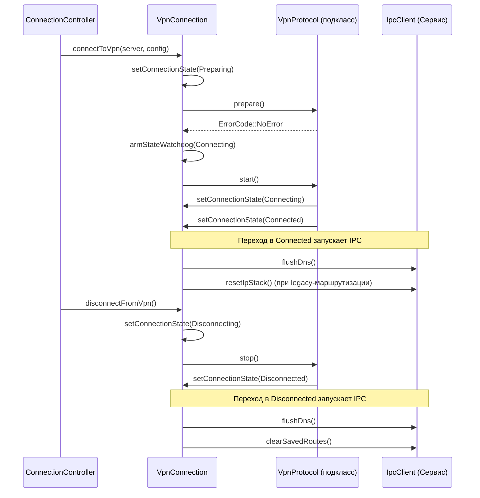
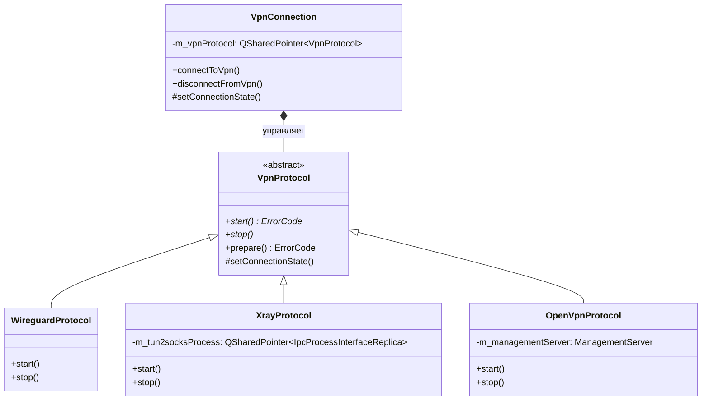

# Конечный автомат VPN-подключения

Соответствующие исходные файлы

Следующие файлы были использованы в качестве контекста для создания этой wiki-страницы:

- [client/core/ipcclient.cpp](client/core/ipcclient.cpp)
- [client/core/ipcclient.h](client/core/ipcclient.h)
- [client/protocols/openvpnprotocol.cpp](client/protocols/openvpnprotocol.cpp)
- [client/protocols/openvpnprotocol.h](client/protocols/openvpnprotocol.h)
- [client/protocols/vpnprotocol.cpp](client/protocols/vpnprotocol.cpp)
- [client/protocols/vpnprotocol.h](client/protocols/vpnprotocol.h)
- [client/protocols/xrayprotocol.cpp](client/protocols/xrayprotocol.cpp)
- [client/protocols/xrayprotocol.h](client/protocols/xrayprotocol.h)
- [client/ui/controllers/connectionController.cpp](client/ui/controllers/connectionController.cpp)
- [client/ui/controllers/connectionController.h](client/ui/controllers/connectionController.h)
- [client/ui/controllers/installController.cpp](client/ui/controllers/installController.cpp)
- [client/ui/controllers/installController.h](client/ui/controllers/installController.h)
- [client/vpnconnection.cpp](client/vpnconnection.cpp)
- [client/vpnconnection.h](client/vpnconnection.h)

Жизненный цикл VPN-подключения в FBLink VPN управляется классом `VpnConnection`. Этот компонент служит центральным координатором, связывающим запросы пользователя из UI (через `ConnectionController`) с конкретными реализациями протоколов (например, `WireguardProtocol`, `XrayProtocol`). Он поддерживает надёжный конечный автомат, обрабатывающий переходы между состояниями, восстановление после ошибок и системную очистку через IPC-вызовы к привилегированному сервису.

## Состояния подключения

Система использует перечисление `Vpn::ConnectionState` для отслеживания жизненного цикла VPN-туннеля.

| Состояние | Описание |
| :--- | :--- |
| `Disconnected` | Состояние простоя по умолчанию. Туннель не активен, ресурсы не выделены. |
| `Preparing` | Система выполняет предварительные проверки: установка драйвера (TAP/TUN) или генерация конфигурации. |
| `Connecting` | Процесс, специфичный для протокола, запускается, но туннель ещё не установлен. |
| `Connected` | Туннель полностью установлен, трафик проходит через VPN-интерфейс. |
| `Reconnecting` | Выполняется автоматическая попытка восстановления прерванного соединения. |
| `Disconnecting` | Система разрывает туннель и очищает правила маршрутизации. |
| `Error` | Терминальное состояние, достигаемое при неудачной попытке подключения или сбое активного туннеля. |

**Источники:**
- `client/vpnconnection.h:90-90` (Определение поля состояния)
- `client/protocols/vpnprotocol.cpp:136-151` (Строковые представления состояний)

## Логика конечного автомата и жизненный цикл

Конечный автомат управляется преимущественно функцией `VpnConnection::setConnectionState`. Эта функция фильтрует избыточные переходы и запускает платформенно-специфичную логику при переключении между терминальными состояниями.

### Диаграмма жизненного цикла: от подключения до отключения
Эта диаграмма иллюстрирует поток от запроса пользователя до успешного подключения и последующей очистки.

**Источники:**
- `client/vpnconnection.cpp:138-181` (IPC-вызовы при смене состояния)
- `client/vpnconnection.cpp:455-470` (Реализация setConnectionState)
- `client/protocols/vpnprotocol.cpp:79-99` (Базовая обработка состояний протокола)

## Восстановление после ошибок и сторожевые таймеры

Для обеспечения устойчивости к зависшим процессам или нестабильности сети `VpnConnection` реализует несколько механизмов на основе таймеров.

### Сторожевые таймеры
- **Сторожевой таймер подключения:** Срабатывает, если состояние остаётся `Connecting` более 15 секунд. Принудительно вызывает ошибку тайм-аута, чтобы предотвратить зависание UI. `[client/vpnconnection.cpp:45-45]()`
- **Сторожевой таймер отключения:** Гарантирует, что приложение не зависнет, если протокол (например, OpenVPN) не сможет корректно завершиться в течение 12 секунд. `[client/vpnconnection.cpp:46-46]()`

### Экспоненциальный откат и безопасный режим
При неожиданном разрыве соединения система пытается восстановить его с использованием стратегии экспоненциального отката:
1. **Таймер восстановления:** При сбое подключения вызывается `scheduleRecoveryReconnect`. Используется `m_recoveryAttempts` для задержки следующей попытки. `[client/vpnconnection.cpp:47-48]()`
2. **Безопасный режим:** Если система обнаруживает «всплеск сбоев» (3 сбоя в течение 180 секунд), она входит в **безопасный режим**. Это блокирует все попытки подключения на 30 минут (`kSafeModeDurationSecs`) для предотвращения непрерывного расходования ресурсов или блокировки аккаунта. `[client/vpnconnection.cpp:49-51]()`

**Источники:**
- `client/vpnconnection.cpp:76-82` (Инициализация сторожевых таймеров)
- `client/vpnconnection.cpp:387-410` (Логика восстановления)
- `client/vpnconnection.cpp:412-430` (Реализация безопасного режима)

## Уровень абстракции протоколов

Конечный автомат взаимодействует с конкретными VPN-технологиями через интерфейс `VpnProtocol`. Метод `VpnProtocol::factory` создаёт экземпляр нужного подкласса на основе типа `DockerContainer`.

### Ключевые взаимодействия протоколов
- **Xray/VLESS:** Использует `IpcClient::CreatePrivilegedProcess` для запуска моста `tun2socks` в контексте сервиса. `[client/protocols/xrayprotocol.cpp:35-52]()`
- **OpenVPN:** Взаимодействует с бинарным файлом `openvpn` через локальный TCP-сокет управления (`ManagementServer`) для мониторинга состояния и отправки `SIGTERM`. `[client/protocols/openvpnprotocol.cpp:128-135]()`
- **AmneziaWG/WireGuard:** Непосредственно настраивает нативный интерфейс или параметры обфускации. `[client/ui/controllers/installController.cpp:77-111]()`

**Источники:**
- `client/protocols/vpnprotocol.h:20-50` (Определение класса VpnProtocol)
- `client/protocols/vpnprotocol.cpp:111-129` (Фабрика протоколов)
- `client/core/ipcclient.cpp:43-52` (Создание привилегированного процесса для Xray)

## Интеграция IPC на десктопе

На десктопе (Windows, Linux, macOS) конечный автомат использует `IpcClient` для выполнения привилегированных операций при смене состояния.

1. **При переходе в `Connected`:**
   - Вызывает `iface->flushDns()` для предотвращения утечек DNS от предыдущей сессии. `[client/vpnconnection.cpp:166-170]()`
   - Вызывает `iface->resetIpStack()` для legacy-режимов маршрутизации для очистки старых состояний интерфейса. `[client/vpnconnection.cpp:161-164]()`
   - Добавляет маршруты DNS-серверов через `iface->routeAddList()` для обеспечения доступности DNS VPN. `[client/vpnconnection.cpp:179-180]()`

2. **При переходе в `Disconnected` или `Error`:**
   - Повторно вызывает `iface->flushDns()`. `[client/vpnconnection.cpp:184-187]()`
   - Вызывает `iface->clearSavedRoutes()` для восстановления таблицы маршрутизации в исходное состояние. `[client/vpnconnection.cpp:193-196]()`

**Источники:**
- `client/vpnconnection.cpp:151-205` (Логика IPC при смене состояния подключения)
- `client/core/ipcclient.h:18-41` (Вспомогательные функции интерфейса IpcClient)

---
