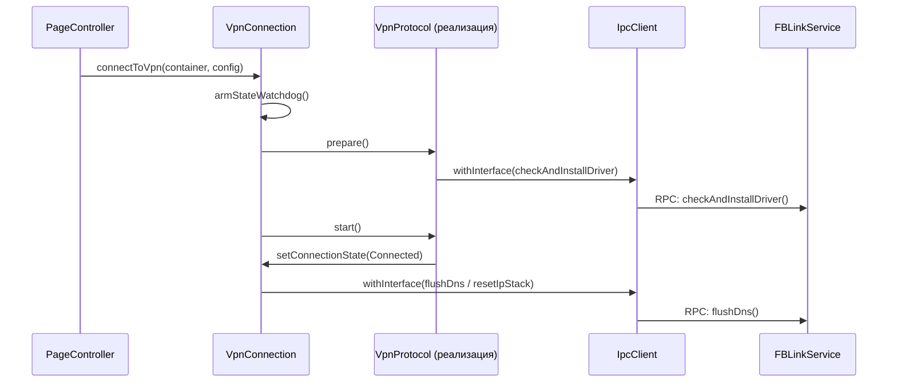

# VPN-протоколы

<details>
<summary>Соответствующие исходные файлы</summary>

Следующие файлы были использованы в качестве контекста для создания этой wiki-страницы:

- [client/containers/containers_defs.cpp](client/containers/containers_defs.cpp)
- [client/containers/containers_defs.h](client/containers/containers_defs.h)
- [client/core/ipcclient.cpp](client/core/ipcclient.cpp)
- [client/core/ipcclient.h](client/core/ipcclient.h)
- [client/core/scripts_registry.cpp](client/core/scripts_registry.cpp)
- [client/core/scripts_registry.h](client/core/scripts_registry.h)
- [client/protocols/openvpnprotocol.cpp](client/protocols/openvpnprotocol.cpp)
- [client/protocols/openvpnprotocol.h](client/protocols/openvpnprotocol.h)
- [client/protocols/protocols_defs.cpp](client/protocols/protocols_defs.cpp)
- [client/protocols/protocols_defs.h](client/protocols/protocols_defs.h)
- [client/protocols/xrayprotocol.cpp](client/protocols/xrayprotocol.cpp)
- [client/protocols/xrayprotocol.h](client/protocols/xrayprotocol.h)
- [client/ui/models/protocols_model.cpp](client/ui/models/protocols_model.cpp)
- [client/ui/models/protocols_model.h](client/ui/models/protocols_model.h)
- [client/vpnconnection.cpp](client/vpnconnection.cpp)
- [client/vpnconnection.h](client/vpnconnection.h)

</details>


Архитектура FBLink VPN поддерживает широкий спектр VPN-протоколов: от стандартных реализаций, таких как **WireGuard** и **OpenVPN**, до высокообфусцированных решений, таких как **AmneziaWG (AWG)** и **Xray (VLESS/REALITY)**.

Каждый протокол реализуется путём наследования от базового класса `VpnProtocol` [client/protocols/vpnprotocol.h:12-12](). Класс `VpnConnection` управляет жизненным циклом этих протоколов, обрабатывая переходы состояний и восстановление [client/vpnconnection.cpp:73-96]().

### Сопоставление протоколов и контейнеров

Система различает **Протоколы** (метод передачи данных) и **Docker-контейнеры** (серверные единицы развёртывания). Один контейнер может поддерживать несколько протоколов (например, контейнер Cloak поддерживает OpenVPN, Shadowsocks и Cloak).

| Тип контейнера | Основной протокол | Класс реализации |
| :--- | :--- | :--- |
| `Awg` / `Awg2` | AmneziaWG | `WireGuardProtocol` |
| `Xray` | VLESS + REALITY | `XrayProtocol` |
| `OpenVpn` | OpenVPN | `OpenVpnProtocol` |
| `ShadowSocks` | Shadowsocks | `OpenVpnProtocol` (через SS) |
| `Ipsec` | IKEv2/IPsec | Нативные API платформы |

**Источники:**
- [client/containers/containers_defs.cpp:57-84]() (Сопоставление контейнеров с протоколами)
- [client/protocols/protocols_defs.cpp:66-83]() (Человекочитаемые названия протоколов)
- [client/core/scripts_registry.cpp:7-25]() (Сопоставление контейнеров с серверными скриптами)

### Пространство программных сущностей: Абстракция протоколов

Следующая диаграмма иллюстрирует, как высокоуровневые концепции протоколов сопоставляются с конкретными классами и перечислениями C++ в кодовой базе.

**Иерархия реализации протоколов**
```mermaid
graph TD
    subgraph "Пространство естественного языка"
        A["VPN-протокол"]
        B["Docker-контейнер"]
    end

    subgraph "Пространство программных сущностей"
        A --> ProtoEnum["fblink::Proto (Enum)"]
        B --> ContainerEnum["fblink::DockerContainer (Enum)"]
        
        ProtoEnum --> ProtoProps["ProtocolProps (статические утилиты)"]
        ContainerEnum --> ContProps["ContainerProps (статические утилиты)"]
        
        VpnConn["VpnConnection"] -- "владеет" --> VpnProto["VpnProtocol (базовый класс)"]
        
        VpnProto <|-- WGProto["WireGuardProtocol"]
        VpnProto <|-- OVpnProto["OpenVpnProtocol"]
        VpnProto <|-- XrayProto["XrayProtocol"]
    end

    ProtoEnum -.-> |"Определён в"| Defs["protocols_defs.h"]
    ContainerEnum -.-> |"Определён в"| CDefs["containers_defs.h"]
```
**Источники:**
- [client/protocols/protocols_defs.h:8-117]()
- [client/containers/containers_defs.h:11-36]()
- [client/vpnconnection.h:69-69]()

---

### AmneziaWG (AWG) и WireGuard
Протокол **AmneziaWG** — модифицированная версия WireGuard, добавляющая параметры обфускации для обхода глубокой инспекции пакетов (DPI). Он использует специальные заголовки (Jc, Jmin, Jmax, S1-S4, H1-H4), определённые в конфигурации [client/protocols/protocols_defs.h:70-80](). Реализация выполняется через `WireGuardProtocol`, который управляет нативным интерфейсом WireGuard или реализацией в пользовательском пространстве в зависимости от платформы.

Подробнее см. [AmneziaWG (AWG) и WireGuard](#3.1).

**Источники:**
- [client/containers/containers_defs.cpp:31-34]()
- [client/protocols/protocols_defs.h:94-94]()

### Xray / VLESS / REALITY
Реализация `XrayProtocol` сосредоточена на протоколе VLESS в сочетании с REALITY для обеспечения скрытности. В отличие от других протоколов, которые могут напрямую использовать нативные TUN-интерфейсы, Xray часто работает через мост `tun2socks` [client/protocols/xrayprotocol.cpp:22-22]() для маршрутизации всего системного трафика через ядро Xray. Он включает продвинутую логику маршрутизации для обработки раздельного туннелирования и прямого обхода для определённых доменов [client/protocols/xrayprotocol.cpp:94-132]().

Подробнее см. [Xray / VLESS / REALITY](#3.2).

**Источники:**
- [client/protocols/xrayprotocol.h:11-38]()
- [client/protocols/xrayprotocol.cpp:40-52]()

### OpenVPN, ShadowSocks, Cloak и IKEv2
Эти протоколы представляют «устаревший» и «стабильный» набор.
- **OpenVPN**: Управляется через локальный управляющий сокет [client/protocols/openvpnprotocol.cpp:18-20]().
- **ShadowSocks и Cloak**: Выступают в качестве слоёв обфускации, обычно оборачивая OpenVPN-трафик для обхода брандмауэров [client/containers/containers_defs.cpp:118-125]().
- **IKEv2**: Используется преимущественно благодаря нативной поддержке на мобильных платформах (Android/iOS) и способности быстро переподключаться после потери сигнала [client/containers/containers_defs.cpp:138-140]().

Подробнее см. [OpenVPN, ShadowSocks, Cloak и IKEv2](#3.3).

**Источники:**
- [client/protocols/openvpnprotocol.cpp:168-221]()
- [client/containers/containers_defs.cpp:62-68]()

---

### Жизненный цикл протокола и IPC
Класс `VpnConnection` координируется с привилегированным сервисом через IPC для выполнения сетевых операций, требующих повышенных привилегий, таких как сброс DNS или модификация таблиц маршрутизации.

**Поток подключения протокола**


**Источники:**
- [client/vpnconnection.cpp:148-181]()
- [client/protocols/openvpnprotocol.cpp:70-90]()
- [client/core/ipcclient.h:21-41]()

---
