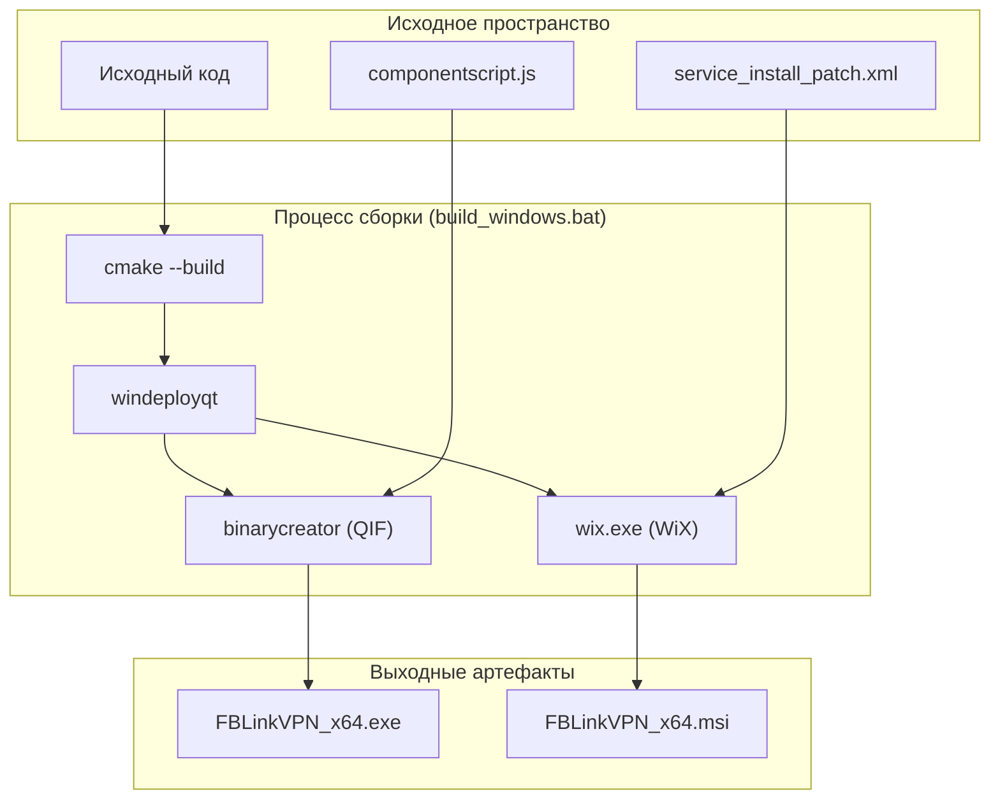
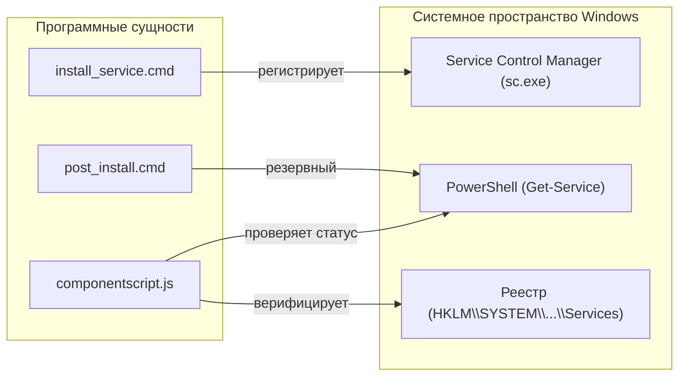

# Windows-инсталлятор и регистрация сервиса

Соответствующие исходные файлы

Следующие файлы были использованы в качестве контекста для создания этой wiki-страницы:

- [.github/workflows/tag-deploy.yml](.github/workflows/tag-deploy.yml)
- [.github/workflows/tag-upload.yml](.github/workflows/tag-upload.yml)
- [.gitignore](.gitignore)
- [deploy/build_windows.bat](deploy/build_windows.bat)
- [deploy/data/windows/x32/cleanup_services.cmd](deploy/data/windows/x32/cleanup_services.cmd)
- [deploy/data/windows/x32/install_service.cmd](deploy/data/windows/x32/install_service.cmd)
- [deploy/data/windows/x32/post_install.cmd](deploy/data/windows/x32/post_install.cmd)
- [deploy/data/windows/x32/post_uninstall.cmd](deploy/data/windows/x32/post_uninstall.cmd)
- [deploy/data/windows/x64/cleanup_services.cmd](deploy/data/windows/x64/cleanup_services.cmd)
- [deploy/data/windows/x64/install_service.cmd](deploy/data/windows/x64/install_service.cmd)
- [deploy/data/windows/x64/post_install.cmd](deploy/data/windows/x64/post_install.cmd)
- [deploy/data/windows/x64/post_uninstall.cmd](deploy/data/windows/x64/post_uninstall.cmd)
- [deploy/deploy_s3.sh](deploy/deploy_s3.sh)
- [deploy/installer/config.cmake](deploy/installer/config.cmake)
- [deploy/installer/config/FBLinkVPN.desktop.in](deploy/installer/config/FBLinkVPN.desktop.in)
- [deploy/installer/config/controlscript.js](deploy/installer/config/controlscript.js)
- [deploy/installer/config/linux.xml.in](deploy/installer/config/linux.xml.in)
- [deploy/installer/config/windows.xml.in](deploy/installer/config/windows.xml.in)
- [deploy/installer/packages/org.fblinkvpn.package/meta/componentscript.js](deploy/installer/packages/org.fblinkvpn.package/meta/componentscript.js)
- [deploy/installer/packages/org.fblinkvpn.package/meta/package.xml.in](deploy/installer/packages/org.fblinkvpn.package/meta/package.xml.in)
- [deploy/installer/packages/org.fblinkvpn.package/meta/readytoinstallwidget.ui](deploy/installer/packages/org.fblinkvpn.package/meta/readytoinstallwidget.ui)
- [deploy/installer/wix/close_client_patch.xml](deploy/installer/wix/close_client_patch.xml)
- [deploy/installer/wix/service_install_patch.xml](deploy/installer/wix/service_install_patch.xml)
- [vpn-backend/internal/handlers/ssh_peer.go](vpn-backend/internal/handlers/ssh_peer.go)

Эта страница документирует конвейер развёртывания Windows, фокусируясь на автоматизированном процессе сборки, многоуровневом механизме регистрации сервиса и конфигурации инсталлятора с использованием Qt Installer Framework (QIF) и WiX.

## Конвейер сборки (`build_windows.bat`)

Процесс сборки Windows оркестрируется скриптом `deploy/build_windows.bat`. Он управляет верификацией окружения, конфигурацией CMake, компиляцией и генерацией как исполняемого инсталлятора (через QIF), так и MSI-пакета (через WiX).

### Этапы сборки и окружение
1.  **Валидация зависимостей**: Проверяет, что `QT_BIN_DIR`, `QIF_BIN_DIR` и `WIX_BIN_DIR` установлены и содержат необходимые бинарные файлы (`qt-cmake`, `binarycreator`, `wix.exe`) [deploy/build_windows.bat:8-98]().
2.  **Конфигурация CMake**: Определяет доступный компилятор (Visual Studio 2022 или Ninja) и настраивает проект с `CMAKE_BUILD_TYPE=Release` [deploy/build_windows.bat:150-184]().
3.  **Подготовка бинарных файлов**: Переименовывает артефакты сборки в стандартизированные имена (`FBLinkVPN.exe` и `FBLinkVPN-service.exe`) и применяет `windeployqt` для сбора runtime-зависимостей [deploy/build_windows.bat:105-109, 219-225]().
4.  **Генерация инсталлятора**:
    *   **QIF**: Использует `binarycreator.exe` с конфигурацией из `deploy/installer/` для создания автономного `.exe`-инсталлятора [deploy/build_windows.bat:310-316]().
    *   **WiX**: Генерирует MSI с помощью `wix.exe`, включая XML-патчи для управления сервисом [deploy/build_windows.bat:320-330]().

### Поток данных сборки
Следующая диаграмма иллюстрирует трансформацию от исходного кода до распространяемых Windows-инсталляторов.

**Поток артефактов сборки Windows**

Источники: [deploy/build_windows.bat:105-330](), [deploy/installer/wix/service_install_patch.xml:1-57]()

## Регистрация сервиса и отказоустойчивость

Система использует многоуровневый подход для регистрации `FBLinkVPN-service`. Это гарантирует, что даже при неудаче стандартных команд Service Control Manager (SCM), резервные механизмы через PowerShell или запросы к реестру обеспечивают целостность установки.

### Логика установки (`install_service.cmd`)
Основной скрипт регистрации выполняет следующие шаги:
1.  **Очистка**: Вызывает `cleanup_services.cmd` для удаления устаревших регистраций текущих или унаследованных имён сервисов (напр., `AmneziaVPN-service`, `FBLink-service`) [deploy/data/windows/x64/install_service.cmd:38, 49-50]().
2.  **Создание**: Пытается выполнить `sc create` для регистрации сервиса с `start= auto` [deploy/data/windows/x64/install_service.cmd:62]().
3.  **Конфигурация восстановления**: Устанавливает действия при сбое — перезапуск сервиса через 2000 мс для первых трёх неудач [deploy/data/windows/x64/install_service.cmd:78]().
4.  **Верификация**: Опрашивает статус сервиса через PowerShell до достижения состояния `Running` [deploy/data/windows/x64/install_service.cmd:81-88]().

### Резервный механизм (`post_install.cmd`)
Если `install_service.cmd` завершается неудачей, `post_install.cmd` выполняет резервный сценарий на PowerShell, непосредственно используя `New-Service` или `sc.exe config` для принудительной установки пути к бинарному файлу и типа запуска [deploy/data/windows/x64/post_install.cmd:22-24]().

**Карта сущностей регистрации сервиса**

Источники: [deploy/data/windows/x64/install_service.cmd:60-112](), [deploy/data/windows/x64/post_install.cmd:22-24](), [deploy/installer/packages/org.fblinkvpn.package/meta/componentscript.js:117-137]()

## Скрипты инсталлятора (`componentscript.js`)

QIF `componentscript.js` предоставляет runtime-логику во время процесса установки, включая нормализацию путей и верификацию окружения.

### Ключевые функции
| Функция | Назначение |
| :--- | :--- |
| `serviceName()` | Возвращает внутренний идентификатор `FBLinkVPN-service` [deploy/installer/packages/org.fblinkvpn.package/meta/componentscript.js:21](). |
| `vcRuntimeIsInstalled()` | Проверяет наличие `msvcp140.dll` в `System32` для подтверждения наличия C++ redistributables [deploy/installer/packages/org.fblinkvpn.package/meta/componentscript.js:106-109](). |
| `currentServiceBinaryPathWindows()` | Получает зарегистрированный путь к бинарному файлу через `Win32_Service` с помощью CIM/PowerShell, с резервным вариантом через `sc qc` [deploy/installer/packages/org.fblinkvpn.package/meta/componentscript.js:205-236](). |
| `normalizeWindowsPath(path)` | Очищает пути путём замены прямых слешей, удаления кавычек и обработки UNC-префиксов [deploy/installer/packages/org.fblinkvpn.package/meta/componentscript.js:163-177](). |

Источники: [deploy/installer/packages/org.fblinkvpn.package/meta/componentscript.js:21-236]()

## Конфигурация WiX MSI

MSI-инсталлятор настраивается через XML-патчи для управления жизненным циклом привилегированного сервиса.

### Управление жизненным циклом сервиса (`service_install_patch.xml`)
Патч определяет узлы `ServiceInstall` и `ServiceControl`:
*   **ServiceInstall**: Настраивает `FBLinkVPN-service` как `ownProcess` с автоматическим (`auto`) запуском [deploy/installer/wix/service_install_patch.xml:4-12]().
*   **ServiceControl**: Оркестрирует остановку и удаление унаследованных сервисов (напр., `AmneziaWGTunnel$FBLink`, `FBLinkSplitTunnel`) во время установки для предотвращения конфликтов драйверов [deploy/installer/wix/service_install_patch.xml:13-55]().

Источники: [deploy/installer/wix/service_install_patch.xml:1-57]()

## Очистка после удаления (`post_uninstall.cmd`)

Для обеспечения чистого состояния для будущих установок деинсталлятор удаляет логи и директории конфигурации:
*   **Системные логи**: Удаляет `%ProgramData%\FBLinkVPN\log` [deploy/data/windows/x64/post_uninstall.cmd:10-11]().
*   **Пользовательские данные**: Удаляет `%AppData%\FBLinkVPN.ORG\FBLinkVPN` и родительские директории, если они пусты [deploy/data/windows/x64/post_uninstall.cmd:16-20]().
*   **Удаление сервиса**: Вызывает `cleanup_services.cmd` для полной очистки записи в SCM [deploy/data/windows/x64/post_uninstall.cmd:7]().

Источники: [deploy/data/windows/x64/post_uninstall.cmd:1-22]()

---
