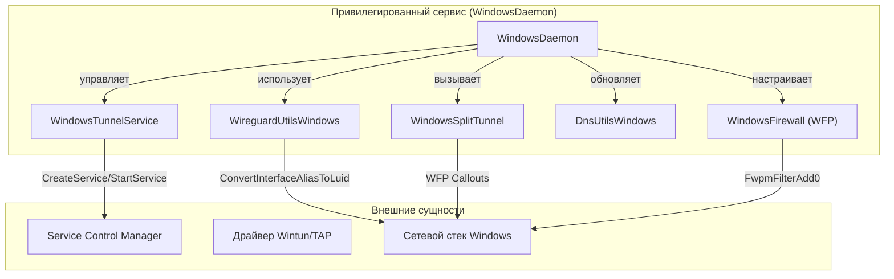
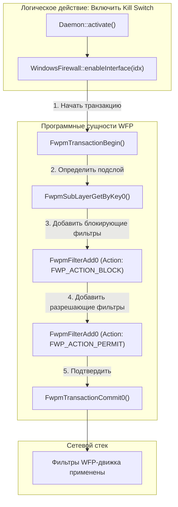

# Платформа Windows

Соответствующие исходные файлы

Следующие файлы были использованы в качестве контекста для создания этой wiki-страницы:

- [client/configurators/ssh_configurator.cpp](client/configurators/ssh_configurator.cpp)
- [client/daemon/daemon.cpp](client/daemon/daemon.cpp)
- [client/daemon/daemon.h](client/daemon/daemon.h)
- [client/daemon/daemonlocalserverconnection.cpp](client/daemon/daemonlocalserverconnection.cpp)
- [client/daemon/interfaceconfig.cpp](client/daemon/interfaceconfig.cpp)
- [client/daemon/interfaceconfig.h](client/daemon/interfaceconfig.h)
- [client/daemon/wireguardutils.h](client/daemon/wireguardutils.h)
- [client/mozilla/localsocketcontroller.cpp](client/mozilla/localsocketcontroller.cpp)
- [client/platforms/linux/daemon/linuxdaemon.h](client/platforms/linux/daemon/linuxdaemon.h)
- [client/platforms/linux/daemon/wireguardutilslinux.cpp](client/platforms/linux/daemon/wireguardutilslinux.cpp)
- [client/platforms/macos/daemon/macosdaemon.h](client/platforms/macos/daemon/macosdaemon.h)
- [client/platforms/macos/daemon/wireguardutilsmacos.cpp](client/platforms/macos/daemon/wireguardutilsmacos.cpp)
- [client/platforms/windows/daemon/dnsutilswindows.h](client/platforms/windows/daemon/dnsutilswindows.h)
- [client/platforms/windows/daemon/mingw_compat.h](client/platforms/windows/daemon/mingw_compat.h)
- [client/platforms/windows/daemon/windowsdaemon.cpp](client/platforms/windows/daemon/windowsdaemon.cpp)
- [client/platforms/windows/daemon/windowsdaemon.h](client/platforms/windows/daemon/windowsdaemon.h)
- [client/platforms/windows/daemon/windowsfirewall.cpp](client/platforms/windows/daemon/windowsfirewall.cpp)
- [client/platforms/windows/daemon/windowsfirewall.h](client/platforms/windows/daemon/windowsfirewall.h)
- [client/platforms/windows/daemon/windowsroutemonitor.h](client/platforms/windows/daemon/windowsroutemonitor.h)
- [client/platforms/windows/daemon/windowssplittunnel.cpp](client/platforms/windows/daemon/windowssplittunnel.cpp)
- [client/platforms/windows/daemon/windowssplittunnel.h](client/platforms/windows/daemon/windowssplittunnel.h)
- [client/platforms/windows/daemon/windowstunnelservice.cpp](client/platforms/windows/daemon/windowstunnelservice.cpp)
- [client/platforms/windows/daemon/windowstunnelservice.h](client/platforms/windows/daemon/windowstunnelservice.h)
- [client/platforms/windows/daemon/wireguardutilswindows.cpp](client/platforms/windows/daemon/wireguardutilswindows.cpp)
- [client/platforms/windows/daemon/wireguardutilswindows.h](client/platforms/windows/daemon/wireguardutilswindows.h)
- [client/protocols/ikev2_vpn_protocol_windows.cpp](client/protocols/ikev2_vpn_protocol_windows.cpp)
- [client/server_scripts/ipsec/configure_container.sh](client/server_scripts/ipsec/configure_container.sh)
- [client/server_scripts/ipsec/mobileconfig.plist](client/server_scripts/ipsec/mobileconfig.plist)
- [client/server_scripts/ipsec/strongswan.profile](client/server_scripts/ipsec/strongswan.profile)
- [service/server/xray.cpp](service/server/xray.cpp)
- [service/server/xray.h](service/server/xray.h)

Реализация FBLink VPN для Windows опирается на архитектуру с привилегированным сервисом для управления сетевыми конфигурациями, правилами файрвола и низкоуровневыми драйверами туннелей. Она использует Windows Filtering Platform (WFP) для безопасности и раздельного туннелирования, а также взаимодействует с Service Control Manager (SCM) для управления жизненным циклом процессов туннелей.

## Привилегированная архитектура

На Windows приложение разделено на пользовательский клиент и привилегированный фоновый сервис. Коммуникация осуществляется через именованный канал (`\\.\pipe\fblink`) [client/mozilla/localsocketcontroller.cpp:104-104](). Класс `WindowsDaemon` выступает центральным оркестратором в привилегированном сервисе, управляя DNS, файрволом и утилитами туннелей.

### WindowsDaemon
Класс `WindowsDaemon` [client/platforms/windows/daemon/windowsdaemon.h:19-19]() наследуется от базового `Daemon` и инициализирует Windows-специфичные менеджеры:
*   **WindowsFirewall**: Управляет WFP-фильтрами для Kill Switch [client/platforms/windows/daemon/windowsdaemon.cpp:36-36]().
*   **WireguardUtilsWindows**: Обрабатывает жизненный цикл туннеля AmneziaWG/WireGuard [client/platforms/windows/daemon/windowsdaemon.cpp:41-41]().
*   **WindowsSplitTunnel**: Управляет раздельным туннелированием по приложениям [client/platforms/windows/daemon/windowsdaemon.cpp:47-47]().
*   **DnsUtilsWindows**: Обрабатывает системные переопределения DNS-резолвера [client/platforms/windows/daemon/windowsdaemon.cpp:46-46]().

### Диаграмма взаимодействия компонентов
Эта диаграмма показывает, как `WindowsDaemon` координирует различные программные сущности для установки подключения.

**Источники:** [client/platforms/windows/daemon/windowsdaemon.cpp:34-53](), [client/platforms/windows/daemon/windowstunnelservice.cpp:149-153](), [client/platforms/windows/daemon/wireguardutilswindows.cpp:45-45]()

## Управление туннелями

### WindowsTunnelService
`WindowsTunnelService` [client/platforms/windows/daemon/windowstunnelservice.h:25-25]() управляет жизненным циклом туннеля AmneziaWG путём регистрации его как временной Windows-службы с именем `AmneziaWGTunnel$FBLink` [client/platforms/windows/daemon/windowsdaemon.h:17-17]().

*   **Регистрация службы**: Использует `CreateService` с `SERVICE_WIN32_OWN_PROCESS` и `SERVICE_DEMAND_START` [client/platforms/windows/daemon/windowstunnelservice.cpp:149-153]().
*   **Коммуникация**: Использует защищённый именованный канал для UAPI-команд: `\\.\pipe\ProtectedPrefix\Administrators\AmneziaWG\FBLink` [client/platforms/windows/daemon/windowstunnelservice.cpp:19-21]().
*   **Мониторинг**: Таймер `QTimer` проверяет статус службы каждые 2000 мс [client/platforms/windows/daemon/windowstunnelservice.cpp:23-23](). Если служба неожиданно останавливается, испускается сигнал `backendFailure()` [client/platforms/windows/daemon/windowstunnelservice.cpp:104-105]().

### WireguardUtilsWindows
Этот класс реализует интерфейс `WireguardUtils` для Windows [client/platforms/windows/daemon/wireguardutilswindows.h:26-26]().
1.  **Создание интерфейса**: Генерирует строку конфигурации WireGuard и запускает `WindowsTunnelService` [client/platforms/windows/daemon/wireguardutilswindows.cpp:166-171]().
2.  **Поиск LUID**: Ожидает появления интерфейса в ОС и получает его `NET_LUID` через `ConvertInterfaceAliasToLuid` [client/platforms/windows/daemon/wireguardutilswindows.cpp:177-181]().
3.  **Мониторинг маршрутов**: Запускает `WindowsRouteMonitor` [client/platforms/windows/daemon/wireguardutilswindows.cpp:187-187]() для отслеживания изменений таблицы маршрутизации и обеспечения приоритета VPN-шлюза.

**Источники:** [client/platforms/windows/daemon/windowstunnelservice.cpp:34-105](), [client/platforms/windows/daemon/wireguardutilswindows.cpp:122-216]()

## Файрвол и безопасность (WFP)

Класс `WindowsFirewall` [client/platforms/windows/daemon/windowsfirewall.h:29-29]() взаимодействует с **Windows Filtering Platform (WFP)** для реализации Kill Switch и обеспечения раздельного туннелирования.

### Детали реализации
*   **Динамические сессии**: Движок файрвола открывается с `FWPM_SESSION_FLAG_DYNAMIC` [client/platforms/windows/daemon/windowsfirewall.cpp:123-123](), гарантируя автоматическую очистку правил при аварийном завершении демона.
*   **Подслои**: Создаёт выделенный подслой с идентификатором `ST_FW_WINFW_BASELINE_SUBLAYER_KEY` [client/platforms/windows/daemon/windowsfirewall.cpp:38-39]() для размещения VPN-специфичных фильтров.
*   **Kill Switch**: При включении блокирует весь трафик на не-VPN интерфейсах, разрешая трафик через индекс VPN-адаптера (`vpnAdapterIndex`) [client/platforms/windows/daemon/windowsfirewall.cpp:220-223]().

### Поток данных файрвола
Эта диаграмма связывает концепцию «Kill Switch» с конкретными функциями WFP, используемыми в коде.

**Источники:** [client/platforms/windows/daemon/windowsfirewall.cpp:157-218](), [client/platforms/windows/daemon/windowsfirewall.cpp:220-230]()

## Раздельное туннелирование

Раздельное туннелирование на Windows обрабатывается `WindowsSplitTunnel` [client/platforms/windows/daemon/windowssplittunnel.h:22-22](). Позволяет исключать конкретные приложения из VPN-туннеля.

*   **Исключение приложений**: Функция `excludeApps` [client/platforms/windows/daemon/windowsdaemon.cpp:113-113]() принимает список имён исполняемых файлов и настраивает WFP-фильтры для маршрутизации их трафика через физический сетевой адаптер (`m_inetAdapterIndex`) вместо VPN-интерфейса.
*   **Определение адаптера**: `WindowsDaemon::prepareActivation` использует `NetworkUtilities::AdapterIndexTo` [client/platforms/windows/daemon/windowsdaemon.cpp:101-101]() для нахождения корректного индекса физического адаптера на основе IP-адреса VPN-сервера.

**Источники:** [client/platforms/windows/daemon/windowsdaemon.cpp:84-117]()

## Протокол IKEv2 (нативный Windows)

Реализация `Ikev2Protocol` [client/protocols/ikev2_vpn_protocol_windows.h:20-20]() использует нативный Windows API **Remote Access Service (RAS)**.

1.  **Установка сертификата**: Использует `IpcClient::CreatePrivilegedProcess()` для запуска `certutil.exe` [client/protocols/ikev2_vpn_protocol_windows.cpp:195-209]() для импорта PFX-сертификата.
2.  **Управление подключением**: Вызывает `RasDial` (через обёртки совместимости) для инициации подключения [client/protocols/ikev2_vpn_protocol_windows.cpp:22-24]().
3.  **Отслеживание состояния**: Callback `RasDialFuncCallback` [client/protocols/ikev2_vpn_protocol_windows.cpp:22-25]() отслеживает состояния RAS-подключения (напр., `RASCS_ConnectDevice`, `RASCS_Authenticated`, `RASCS_Connected`) и сопоставляет их с внутренним `Vpn::ConnectionState` [client/protocols/ikev2_vpn_protocol_windows.cpp:54-174]().

**Источники:** [client/protocols/ikev2_vpn_protocol_windows.cpp:54-174](), [client/protocols/ikev2_vpn_protocol_windows.cpp:195-216]()

---
