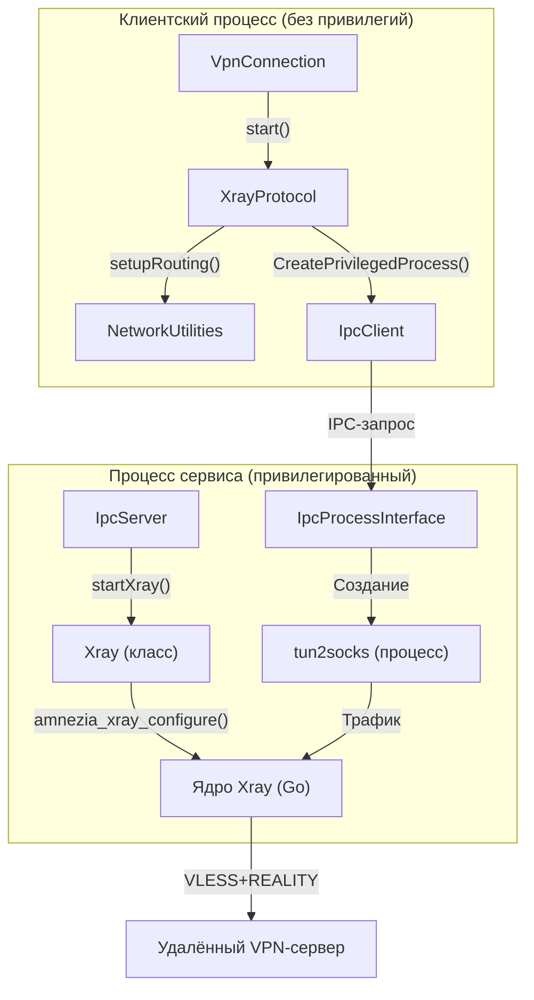
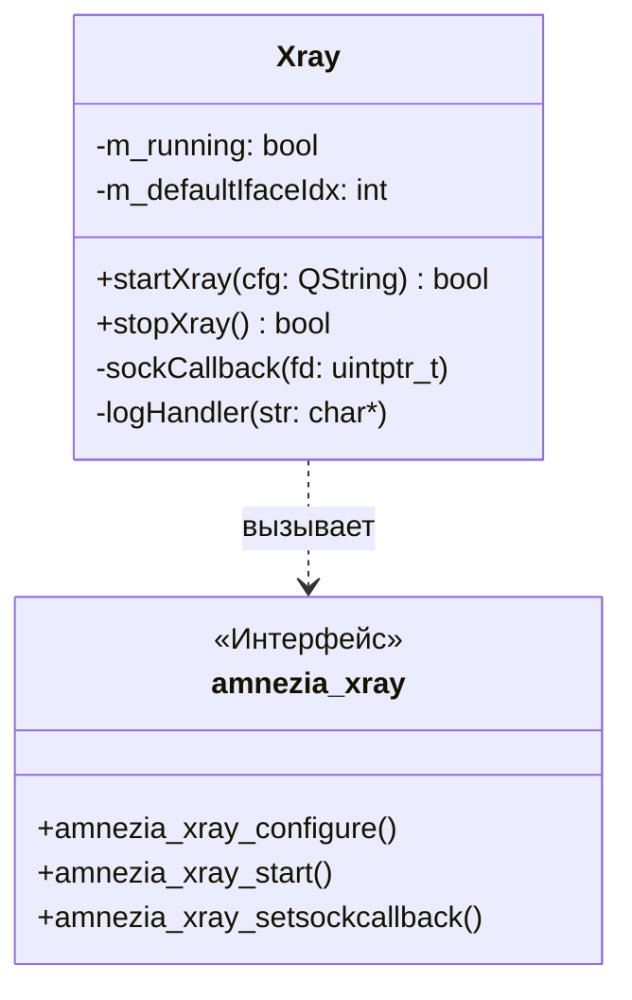

# Xray / VLESS / REALITY

Соответствующие исходные файлы

Следующие файлы были использованы в качестве контекста для создания этой wiki-страницы:

- [client/core/ipcclient.cpp](client/core/ipcclient.cpp)
- [client/core/ipcclient.h](client/core/ipcclient.h)
- [client/core/serialization/transfer.h](client/core/serialization/transfer.h)
- [client/core/serialization/vless.cpp](client/core/serialization/vless.cpp)
- [client/platforms/windows/daemon/windowsdaemon.cpp](client/platforms/windows/daemon/windowsdaemon.cpp)
- [client/platforms/windows/daemon/windowsdaemon.h](client/platforms/windows/daemon/windowsdaemon.h)
- [client/platforms/windows/daemon/windowstunnelservice.cpp](client/platforms/windows/daemon/windowstunnelservice.cpp)
- [client/platforms/windows/daemon/windowstunnelservice.h](client/platforms/windows/daemon/windowstunnelservice.h)
- [client/protocols/openvpnprotocol.cpp](client/protocols/openvpnprotocol.cpp)
- [client/protocols/openvpnprotocol.h](client/protocols/openvpnprotocol.h)
- [client/protocols/xrayprotocol.cpp](client/protocols/xrayprotocol.cpp)
- [client/protocols/xrayprotocol.h](client/protocols/xrayprotocol.h)
- [client/server_scripts/awg/configure_container.sh](client/server_scripts/awg/configure_container.sh)
- [client/server_scripts/xray/SELFHOSTED_SETUP.md](client/server_scripts/xray/SELFHOSTED_SETUP.md)
- [client/server_scripts/xray/install_selfhosted.sh](client/server_scripts/xray/install_selfhosted.sh)
- [client/server_scripts/xray/template.json](client/server_scripts/xray/template.json)
- [client/ui/models/protocols/awgConfigModel.cpp](client/ui/models/protocols/awgConfigModel.cpp)
- [client/ui/models/protocols/awgConfigModel.h](client/ui/models/protocols/awgConfigModel.h)
- [client/ui/models/protocols/wireguardConfigModel.cpp](client/ui/models/protocols/wireguardConfigModel.cpp)
- [client/ui/models/protocols/wireguardConfigModel.h](client/ui/models/protocols/wireguardConfigModel.h)
- [client/ui/qml/Pages2/PageProtocolAwgClientSettings.qml](client/ui/qml/Pages2/PageProtocolAwgClientSettings.qml)
- [client/ui/qml/Pages2/PageProtocolAwgSettings.qml](client/ui/qml/Pages2/PageProtocolAwgSettings.qml)
- [client/ui/qml/Pages2/PageProtocolWireGuardClientSettings.qml](client/ui/qml/Pages2/PageProtocolWireGuardClientSettings.qml)
- [client/ui/qml/Pages2/PageProtocolWireGuardSettings.qml](client/ui/qml/Pages2/PageProtocolWireGuardSettings.qml)
- [client/ui/qml/Pages2/PageProtocolXraySettings.qml](client/ui/qml/Pages2/PageProtocolXraySettings.qml)
- [client/vpnconnection.cpp](client/vpnconnection.cpp)
- [client/vpnconnection.h](client/vpnconnection.h)
- [service/server/xray.cpp](service/server/xray.cpp)
- [service/server/xray.h](service/server/xray.h)
- [vpn-backend/internal/handlers/xray_bootstrap.go](vpn-backend/internal/handlers/xray_bootstrap.go)

На этой странице описана реализация протокола Xray в FBLink VPN, в частности конфигурация VLESS+REALITY, интеграция моста `tun2socks` для системного прозрачного проксирования и управление процессом Xray на стороне сервиса.

## Обзор реализации протокола

Реализация Xray разделена между клиентской логикой протокола (управление конфигурацией и мостом TUN-интерфейса) и серверным управлением процессами (запуск ядра Xray). В отличие от WireGuard, работающего на сетевом уровне (Layer 3), Xray функционирует как SOCKS/HTTP-прокси. Для обеспечения полноценного VPN-опыта FBLink использует мост `tun2socks` для маршрутизации всего системного трафика через прокси Xray.

### Поток данных и архитектура

Следующая диаграмма иллюстрирует взаимосвязь между конечным автоматом `VpnConnection`, обработчиком `XrayProtocol` и компонентами привилегированного сервиса.

**Взаимодействие компонентов Xray**

Источники: [client/vpnconnection.cpp:48-50](), [client/protocols/xrayprotocol.cpp:17-18](), [service/server/xray.cpp:31-75](), [client/core/ipcclient.cpp:43-82]()

## Клиентская реализация: `XrayProtocol`

Класс `XrayProtocol` наследуется от `VpnProtocol` и управляет жизненным циклом подключения Xray.

### Санитизация конфигурации и маршрутизация
Перед запуском клиент выполняет несколько шагов санитизации JSON-конфигурации Xray:
1.  **Переупорядочивание исходящих соединений**: Система обеспечивает приоритет исходящего соединения «proxy» в зависимости от выбранного `RouteMode` [client/protocols/xrayprotocol.cpp:94-132]().
2.  **Разрешение адресов**: Принудительное разрешение адреса исходящего соединения в IPv4 для предотвращения DNS-петель на этапе начальной загрузки [client/protocols/xrayprotocol.cpp:152-182]().
3.  **Резервный порт**: При недоступности основного порта возможен откат на порт 443 [client/protocols/xrayprotocol.cpp:221-250]().

### Мост tun2socks
Поскольку Xray является прокси, FBLink запускает процесс `tun2socks` для создания виртуального TUN-адаптера.
-   **Имя TUN**: Используется `utun22` на macOS и `tun2` на других платформах [client/protocols/xrayprotocol.cpp:30-33]().
-   **Управление процессом**: Процесс `tun2socks` запускается как привилегированный процесс через IPC [client/protocols/xrayprotocol.cpp:21-35]().

### Ключевые функции
| Функция | Назначение |
| :--- | :--- |
| `start()` | Координирует настройку маршрутизации, запускает Xray через IPC и запускает `tun2socks` [client/protocols/xrayprotocol.cpp:17-18](). |
| `setupRouting()` | Настраивает системные маршруты для обеспечения обхода TUN-интерфейса трафиком Xray во избежание петель [client/protocols/xrayprotocol.h:21](). |
| `alignManagedRoutingDefaultOutbound()` | Настраивает внутренние правила маршрутизации Xray на основе пользовательских настроек раздельного туннелирования [client/protocols/xrayprotocol.cpp:94-132](). |

Источники: [client/protocols/xrayprotocol.cpp:1-250](), [client/protocols/xrayprotocol.h:1-39]()

## Серверная реализация: класс `Xray`

Класс `Xray` на уровне сервиса выступает обёрткой над встроенным ядром Xray (подключённым через `amnezia_xray.h`).

### Управление процессом
Сервис управляет жизненным циклом Xray с помощью следующих C-привязок:
-   `amnezia_xray_configure(bytes)`: Загружает JSON-конфигурацию [service/server/xray.cpp:60-64]().
-   `amnezia_xray_start()`: Запускает ядро Xray [service/server/xray.cpp:66-71]().
-   `amnezia_xray_stop()`: Корректно останавливает ядро [service/server/xray.cpp:124-143]().

### Защита сокетов (предотвращение петель маршрутизации)
Для предотвращения петли обратно в TUN-интерфейс собственного исходящего трафика Xray сервис реализует обратный вызов для сокетов. Этот обратный вызов привязывает исходящие сокеты Xray непосредственно к физическому сетевому интерфейсу:
-   **Windows**: Использует `IP_UNICAST_IF` [service/server/xray.cpp:104-109]().
-   **Linux**: Использует `SO_BINDTODEVICE` [service/server/xray.cpp:111-115]().
-   **macOS**: Использует `IP_BOUND_IF` [service/server/xray.cpp:98-103]().

**Сопоставление серверных сущностей**

Источники: [service/server/xray.cpp:31-147](), [service/server/xray.h:1-20]()

## Уровень сериализации (VLESS)

Проект включает уровень сериализации для конфигураций VLESS, основанный на логике Qv2ray. Он обрабатывает преобразование внутренних объектов конфигурации в специфические форматы URI или JSON-структуры, требуемые ядром Xray.

Ключевые компоненты:
-   **Сериализация VLESS**: Реализует логику построения заголовков VLESS и настроек безопасности REALITY [client/core/serialization/vless.cpp]().
-   **Логика передачи**: Управляет сопоставлением транспортных протоколов (TCP, GRPC, WebSocket) с настройками потока Xray [client/core/serialization/transfer.h]().

Источники: [client/core/serialization/vless.cpp:1-50](), [client/core/serialization/transfer.h:1-20]()

## Маршрутизация и интеграция DNS

Сессии Xray требуют особой обработки в конечном автомате `VpnConnection`, чтобы избежать ненужных сбросов IP-стека, характерных для протоколов Layer 3, таких как WireGuard.

-   **Пропуск сброса IP-стека**: В `VpnConnection::onConnectionStateChanged` сброс IP-стека явно пропускается для протоколов на базе Xray для сохранения стабильности моста `tun2socks` [client/vpnconnection.cpp:160-164]().
-   **Сброс DNS**: DNS по-прежнему сбрасывается при подключении и отключении для обеспечения применения DNS-настроек прокси [client/vpnconnection.cpp:166-171]().

Источники: [client/vpnconnection.cpp:56-70](), [client/vpnconnection.cpp:160-171]()

---
