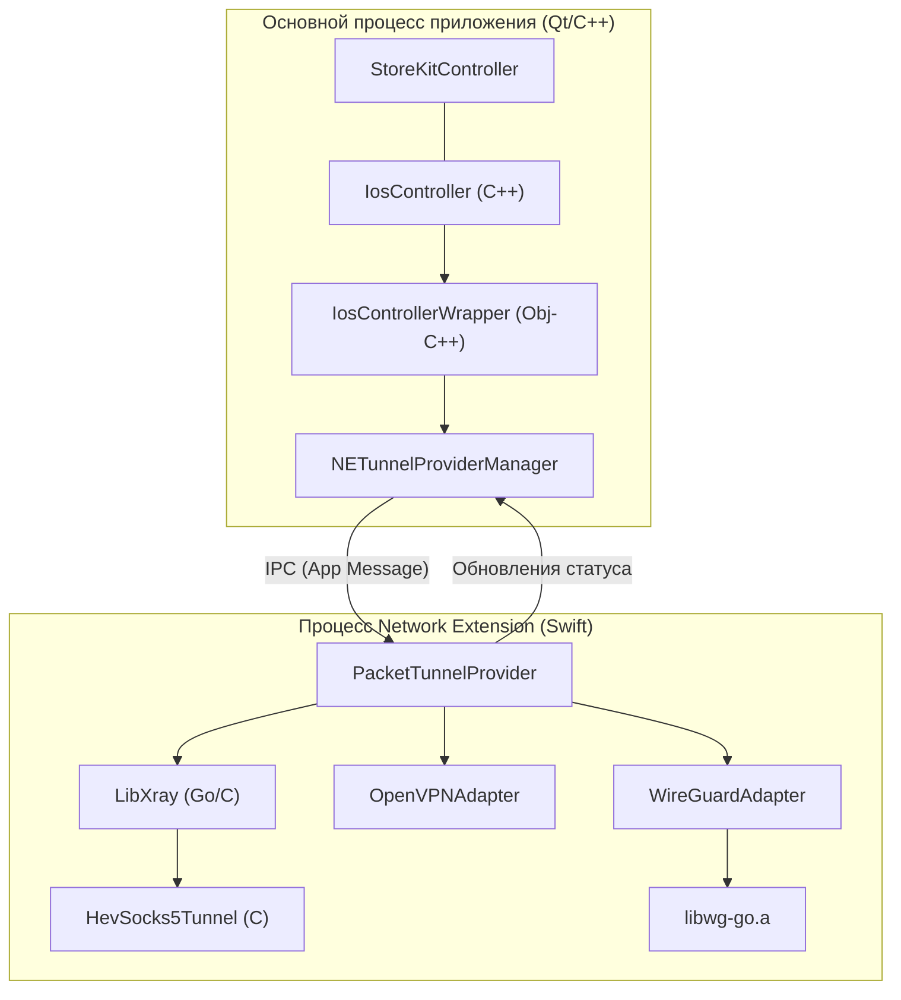

# Платформа iOS и macOS

Соответствующие исходные файлы

Следующие файлы были использованы в качестве контекста для создания этой wiki-страницы:

- [.gitmodules](.gitmodules)
- [client/cmake/ios-arch-fixup.cmake](client/cmake/ios-arch-fixup.cmake)
- [client/cmake/ios-filter-linkfile.cmake](client/cmake/ios-filter-linkfile.cmake)
- [client/cmake/ios.cmake](client/cmake/ios.cmake)
- [client/cmake/macos_ne.cmake](client/cmake/macos_ne.cmake)
- [client/cmake/osxtools.cmake](client/cmake/osxtools.cmake)
- [client/ios/networkextension/CMakeLists.txt](client/ios/networkextension/CMakeLists.txt)
- [client/ios/networkextension/WireGuardNetworkExtension-Bridging-Header.h](client/ios/networkextension/WireGuardNetworkExtension-Bridging-Header.h)
- [client/macos/networkextension/CMakeLists.txt](client/macos/networkextension/CMakeLists.txt)
- [client/macos/networkextension/WireGuardNetworkExtension-Bridging-Header.h](client/macos/networkextension/WireGuardNetworkExtension-Bridging-Header.h)
- [client/platforms/ios/Log.swift](client/platforms/ios/Log.swift)
- [client/platforms/ios/LogController.swift](client/platforms/ios/LogController.swift)
- [client/platforms/ios/LogRecord.swift](client/platforms/ios/LogRecord.swift)
- [client/platforms/ios/NELogController.swift](client/platforms/ios/NELogController.swift)
- [client/platforms/ios/PacketTunnelProvider+OpenVPN.swift](client/platforms/ios/PacketTunnelProvider+OpenVPN.swift)
- [client/platforms/ios/PacketTunnelProvider+WireGuard.swift](client/platforms/ios/PacketTunnelProvider+WireGuard.swift)
- [client/platforms/ios/PacketTunnelProvider+Xray.swift](client/platforms/ios/PacketTunnelProvider+Xray.swift)
- [client/platforms/ios/PacketTunnelProvider.swift](client/platforms/ios/PacketTunnelProvider.swift)
- [client/platforms/ios/QtAppDelegate-C-Interface.h](client/platforms/ios/QtAppDelegate-C-Interface.h)
- [client/platforms/ios/QtAppDelegate.h](client/platforms/ios/QtAppDelegate.h)
- [client/platforms/ios/QtAppDelegate.mm](client/platforms/ios/QtAppDelegate.mm)
- [client/platforms/ios/ScreenProtection.swift](client/platforms/ios/ScreenProtection.swift)
- [client/platforms/ios/StoreKitController.h](client/platforms/ios/StoreKitController.h)
- [client/platforms/ios/StoreKitController.mm](client/platforms/ios/StoreKitController.mm)
- [client/platforms/ios/VPNCController.swift](client/platforms/ios/VPNCController.swift)
- [client/platforms/ios/WGConfig.swift](client/platforms/ios/WGConfig.swift)
- [client/platforms/ios/WireGuard-Bridging-Header.h](client/platforms/ios/WireGuard-Bridging-Header.h)
- [client/platforms/ios/fblink_ios_bridge.h](client/platforms/ios/fblink_ios_bridge.h)
- [client/platforms/ios/fblink_ios_bridge.mm](client/platforms/ios/fblink_ios_bridge.mm)
- [client/platforms/ios/ios_controller.h](client/platforms/ios/ios_controller.h)
- [client/platforms/ios/ios_controller.mm](client/platforms/ios/ios_controller.mm)
- [deploy/build_ios.sh](deploy/build_ios.sh)
- [deploy/build_ios_sim.sh](deploy/build_ios_sim.sh)
- [deploy/build_macos_ne.sh](deploy/build_macos_ne.sh)
- [deploy/open_ios_xcode.sh](deploy/open_ios_xcode.sh)
- [deploy/run_ios_sim.sh](deploy/run_ios_sim.sh)

Реализации FBLink VPN для iOS и macOS используют фреймворк Apple **Network Extension** для обеспечения общесистемных VPN-возможностей. Архитектура разделена на UI-приложение (построенное на Qt/QML) и привилегированное расширение **PacketTunnelProvider**, обрабатывающее низкоуровневую маршрутизацию пакетов и инкапсуляцию протоколов.

## Обзор архитектуры

Архитектура платформы Apple следует модели «провайдер-потребитель». Основное приложение использует `NETunnelProviderManager` для настройки и управления VPN-туннелем, тогда как `PacketTunnelProvider` работает в отдельном процессе для поддержания подключения даже когда приложение находится в фоне.

### Диаграмма системной архитектуры

Эта диаграмма иллюстрирует связь между Qt-приложением и Swift-расширением Network Extension.

**Источники:** [client/platforms/ios/ios_controller.h:42-129](), [client/platforms/ios/PacketTunnelProvider.swift:39-174](), [client/platforms/ios/ios_controller.mm:142-212]()

## Основные компоненты

### IosController (основное приложение)
`IosController` — основной мост между бизнес-логикой Qt и нативными API iOS. Он управляет жизненным циклом VPN-конфигурации и координируется с `NETunnelProviderManager` для запуска или остановки туннеля.

- **Инициализация**: Загружает существующие VPN-профили из системных настроек через `loadAllFromPreferencesWithCompletionHandler` [client/platforms/ios/ios_controller.mm:176-209]().
- **Управление подключением**: Сопоставляет внутренние типы `fblink::Proto` с нативными конфигурациями [client/platforms/ios/ios_controller.mm:214-250]().
- **Мониторинг статуса**: Наблюдает за `NEVPNStatusDidChangeNotification` для обновления состояния Qt UI [client/platforms/ios/ios_controller.mm:152-156]().

### PacketTunnelProvider (расширение)
`PacketTunnelProvider` — подкласс `NEPacketTunnelProvider`. Он служит точкой входа для сетевого расширения и направляет трафик к специфичным адаптерам протоколов.

- **`startTunnel(options:completionHandler:)`**: Определяет тип протокола (WireGuard, OpenVPN или Xray) из конфигурации провайдера и инициализирует соответствующий адаптер [client/platforms/ios/PacketTunnelProvider.swift:176-192]().
- **`handleAppMessage(_:completionHandler:)`**: Получает JSON-сообщения от основного приложения для действий типа `status` или `getTunnelId` [client/platforms/ios/PacketTunnelProvider.swift:130-174]().
- **Мониторинг интерфейса**: Использует `NWPathMonitor` для отслеживания изменений сети и обновления индекса активного интерфейса для привязки сокетов [client/platforms/ios/PacketTunnelProvider.swift:66-94]().

**Источники:** [client/platforms/ios/ios_controller.h:42-129](), [client/platforms/ios/PacketTunnelProvider.swift:39-116]()

## Адаптеры протоколов

FBLink VPN поддерживает множество протоколов на iOS/macOS через специализированные Swift-адаптеры внутри Network Extension.

### WireGuard и AmneziaWG
Поддержка WireGuard обеспечивается `PacketTunnelProvider+WireGuard.swift`, который использует Go-реализацию (`libwg-go.a`).
- **Конфигурация**: Использует `WGConfig` для разбора параметров обфускации AmneziaWG, таких как `Jc` (Junk count), `Jmin`, `Jmax` и магические заголовки `H1`-`H4` [client/platforms/ios/WGConfig.swift:3-42]().
- **Адаптер**: Оборачивает `WireGuardAdapter` из библиотеки `amneziawg-apple` [client/ios/networkextension/CMakeLists.txt:91-104]().

### Xray (VLESS/REALITY)
Поддержка Xray включает сложный мост между Go-ядром Xray и C-реализацией tun2socks.
- **Поток данных**: 
    1. `PacketTunnelProvider` запускает `LibXray` [client/platforms/ios/PacketTunnelProvider+Xray.swift:167-171]().
    2. Xray слушает на локальном SOCKS5-порте (по умолчанию `10808`) [client/platforms/ios/PacketTunnelProvider+Xray.swift:93-100]().
    3. `HevSocks5Tunnel` (tun2socks) запускается для связи `packetFlow` с локальным SOCKS5-прокси [client/platforms/ios/PacketTunnelProvider+Xray.swift:120-124]().
- **Защита сокетов**: C-callback `LibXraySetSockCallback` используется для привязки исходящих сокетов Xray к физическому сетевому интерфейсу (например, WiFi или сотовая сеть) во избежание петель маршрутизации [client/platforms/ios/PacketTunnelProvider+Xray.swift:138-165]().

### OpenVPN
Управляется через `PacketTunnelProvider+OpenVPN.swift` с использованием фреймворка `OpenVPNAdapter` [client/platforms/ios/PacketTunnelProvider.swift:6-7]().

**Источники:** [client/platforms/ios/WGConfig.swift:44-121](), [client/platforms/ios/PacketTunnelProvider+Xray.swift:24-125](), [client/ios/networkextension/CMakeLists.txt:146-155]()

## Конфигурация сборки (CMake)

Проект использует сложную CMake-конфигурацию для генерации Xcode-проектов для iOS и macOS (вариант с Network Extension).

### Сборка iOS (`ios.cmake`)
- **Языки**: Включает `OBJC`, `OBJCXX` и `Swift` [client/cmake/ios.cmake:16-18]().
- **Фреймворки**: Подключает основные Apple-фреймворки, включая `NetworkExtension`, `StoreKit` и `AuthenticationServices` [client/cmake/ios.cmake:25-49]().
- **Свойства цели**: Настраивает атрибуты Xcode, такие как `PRODUCT_BUNDLE_IDENTIFIER`, `CODE_SIGN_ENTITLEMENTS` и `DEVELOPMENT_TEAM` [client/cmake/ios.cmake:85-116]().

### Цель Network Extension
Расширение собирается как отдельный исполняемый файл с типом продукта `com.apple.product-type.app-extension` [client/ios/networkextension/CMakeLists.txt:5-9]().
- **Bridging Header**: Определяет `WireGuardNetworkExtension-Bridging-Header.h` для доступа Swift-кода к C/Obj-C заголовкам [client/ios/networkextension/CMakeLists.txt:60]().
- **Статические библиотеки**: Подключает предсобранные бинарники, такие как `libwg-go.a` и `libhev-socks5-tunnel.a` [client/ios/networkextension/CMakeLists.txt:146-155]().

### Скрипты сборки
- **`open_ios_xcode.sh`**: Основная точка входа для разработчиков. Настраивает окружение, находит нужную версию Qt и запускает `qt-cmake` с генератором Xcode [deploy/open_ios_xcode.sh:194-213]().
- **`build_ios.sh`**: Используется для CI/CD. Обрабатывает настройку связки ключей, импорт сертификатов, архивирование и экспорт IPA [deploy/build_ios.sh:41-141]().

**Источники:** [client/cmake/ios.cmake:1-151](), [client/ios/networkextension/CMakeLists.txt:1-155](), [deploy/open_ios_xcode.sh:1-213](), [deploy/build_ios.sh:1-152]()

## Интеграция StoreKit

FBLink VPN реализует нативные внутриприложенческие покупки через `StoreKitController`.

- **Паттерн Singleton**: Управляется через `[StoreKitController sharedInstance]` [client/platforms/ios/ios_controller.mm:148]().
- **Операции**:
    - `fetchProducts`: Получает детали продуктов (цена, описание) из App Store [client/platforms/ios/ios_controller.h:76-79]().
    - `purchaseProduct`: Инициирует транзакцию для конкретного `productId` [client/platforms/ios/ios_controller.h:65-70]().
    - `restorePurchases`: Восстанавливает предыдущие транзакции пользователя [client/platforms/ios/ios_controller.h:71-73]().

**Источники:** [client/platforms/ios/ios_controller.h:65-80](), [client/platforms/ios/ios_controller.mm:148]()

---
